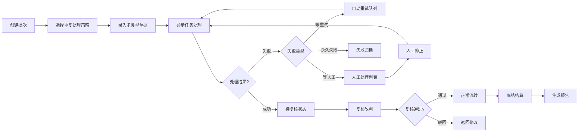

## 1. 产品概述

服装打版样衣异常回执状态机系统，用于管理服装打版过程中各类异常单据的流转、追溯和审计。解决同一款多轮修改后面料去向不明确、操作轨迹不可追溯、异步任务失败无法恢复等核心问题。

- **核心问题解决**：面料领用去向追踪、操作审计、异常状态管理
- **目标用户**：样衣管理员、复核人员、品牌企划、系统管理员

## 2. 核心功能

### 2.1 用户角色

| 角色 | 注册方式 | 核心权限 |
|------|----------|----------|
| 样衣管理员 | 系统账号 | 批次创建、附件补传、单据录入 |
| 复核人员 | 系统账号 | 复核改判、异常修正、人工处理 |
| 品牌企划 | 系统账号 | 冻结结算、查看报告、导出汇总 |
| 系统管理员 | 系统账号 | 撤回归档、系统配置、任务监控 |

### 2.2 功能模块

1. **状态机仪表盘**：任务概览、异常统计、快捷操作
2. **批次管理**：批次创建、附件补传、数据导入、重复处理策略
3. **单据管理**：样衣流转单、尺码修改意见、面料出入库、临时补录单、班次记录
4. **复核改判**：异常审核、状态改判、人工理由记录
5. **冻结结算**：冻结操作、前后状态对比、结算处理
6. **审计追踪**：操作历史、修改记录、差异对比
7. **任务监控**：异步任务状态、重试管理、失败分类
8. **报告中心**：汇总报告、导出Excel、冻结前后对比

### 2.3 页面详情

| 页面名称 | 模块名称 | 功能描述 |
|----------|----------|----------|
| 仪表盘 | 统计概览 | 待处理任务数、异常分布、冻结状态统计 |
| 仪表盘 | 快捷操作 | 快速创建批次、导入单据、查看异常 |
| 批次管理 | 批次列表 | 批次查询、筛选、状态查看 |
| 批次管理 | 批次创建 | 录入批次信息、选择重复处理策略（忽略/覆盖/追加） |
| 批次管理 | 附件补传 | 上传单据附件、关联已有批次 |
| 单据管理 | 单据列表 | 多类型单据统一展示、筛选、详情查看 |
| 单据管理 | 面料追踪 | 同一款多轮修改旧版面料去向追踪 |
| 复核改判 | 待复核列表 | 异常单据审核、改判操作 |
| 复核改判 | 人工修正 | 异常数据修正、理由记录、前后对比 |
| 冻结结算 | 冻结操作 | 批次冻结、状态快照记录 |
| 冻结结算 | 结算处理 | 结算确认、数据汇总 |
| 审计追踪 | 操作日志 | 完整操作历史：谁在什么时候改了什么 |
| 审计追踪 | 差异对比 | 异常修正前后字段级差异展示 |
| 任务监控 | 任务列表 | 异步任务状态：等重试/等人工/永久失败 |
| 任务监控 | 重试管理 | 手动触发重试、任务恢复 |
| 报告中心 | 报告列表 | 按品牌/时间段筛选报告 |
| 报告中心 | 报告详情 | 冻结前后状态对比、人工理由、汇总数据 |
| 报告中心 | 导出功能 | Excel格式导出、数据溯源标注 |
| 撤回归档 | 撤回操作 | 操作撤回、状态回滚 |
| 撤回归档 | 归档管理 | 历史数据归档、查询 |

## 3. 核心流程

### 3.1 单据录入与处理流程

样衣管理员创建批次，选择重复处理策略（忽略/覆盖/追加），录入各类单据（样衣流转单、尺码修改意见、面料出入库、临时补录单、班次记录），系统异步处理，成功则进入待复核，失败则根据类型分类（等重试/等人工/永久失败）。

### 3.2 面料追踪流程

同一款式多轮修改时，系统记录每版面料的领用记录，明确标注旧版面料去向（退回仓库/报废/留用）。

### 3.3 审计追踪流程

所有操作均记录日志，包含操作人、时间、前后值，支持字段级差异对比。

## 4. 用户界面设计

### 4.1 设计风格

- **主色调**：深蓝色 (#1e3a5f) - 体现专业、稳重的企业级系统
- **辅助色**：橙色 (#f59e0b) - 强调异常状态、操作按钮
- **状态色**：绿色 (#10b981) 成功、红色 (#ef4444) 失败、黄色 (#f59e0b) 警告、灰色 (#6b7280) 归档
- **按钮风格**：直角设计、轻微阴影、hover时上浮效果
- **字体**：Noto Sans SC - 中文显示清晰，专业感强
- **布局风格**：左侧导航 + 顶部工具栏 + 主内容区卡片式布局
- **图标风格**：线性图标，简洁统一

### 4.2 页面设计概览

| 页面名称 | 模块名称 | UI元素 |
|----------|----------|--------|
| 仪表盘 | 统计卡片 | 渐变背景、数字动画、状态标签 |
| 批次管理 | 数据表格 | 斑马纹、悬浮高亮、行内操作 |
| 单据详情 | 信息面板 | 分组卡片、时间线、标签系统 |
| 差异对比 | 对比视图 | 左右分栏、删除线标记、高亮新增 |
| 任务监控 | 状态看板 | 泳道布局、拖拽操作、实时刷新 |
| 报告详情 | 数据可视化 | 对比柱状图、状态饼图、导出按钮 |

### 4.3 响应式设计

- **桌面优先**：1200px+ 完整功能展示
- **平板适配**：768-1200px 折叠次要菜单
- **触控优化**：最小点击区域44px，重要操作按钮放大

## 5. 非功能需求

### 5.1 数据一致性

- 同一批数据重复导入时必须明确策略：忽略（保留原有）、覆盖（替换原有）、追加（合并新增）
- 所有操作必须可追溯、可回滚

### 5.2 可靠性

- 异步任务失败分类：等重试（自动重试3次）、等人工（需人工介入）、永久失败（不再重试）
- 服务重启后未完成任务可恢复执行

### 5.3 可复现性

- 提供完整的本地演示流程：初始化数据库 → 导入样例 → 触发坏数据 → 人工修正 → 生成报告
- 所有步骤均可脚本化复现

### 5.4 数据溯源

- 报告和导出数据必须可追溯到原始单据
- 异常修正前后差异必须在详情、报告、导出中一致展示
