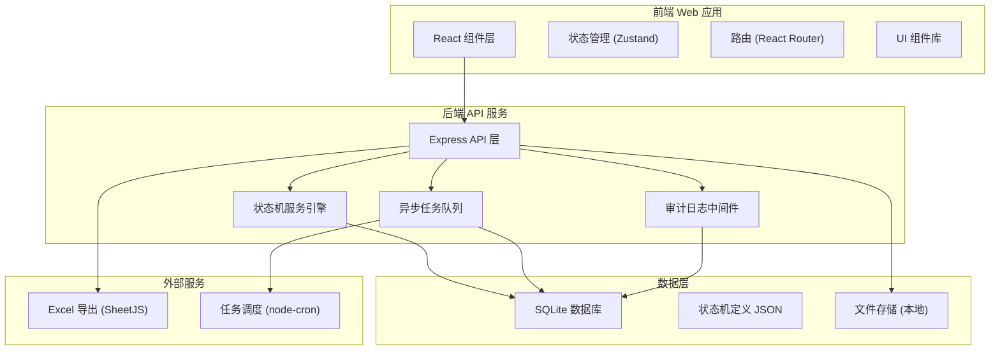
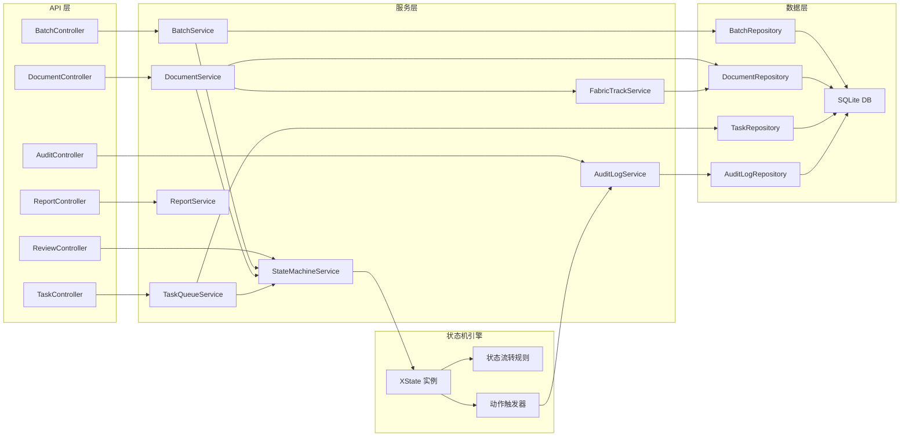
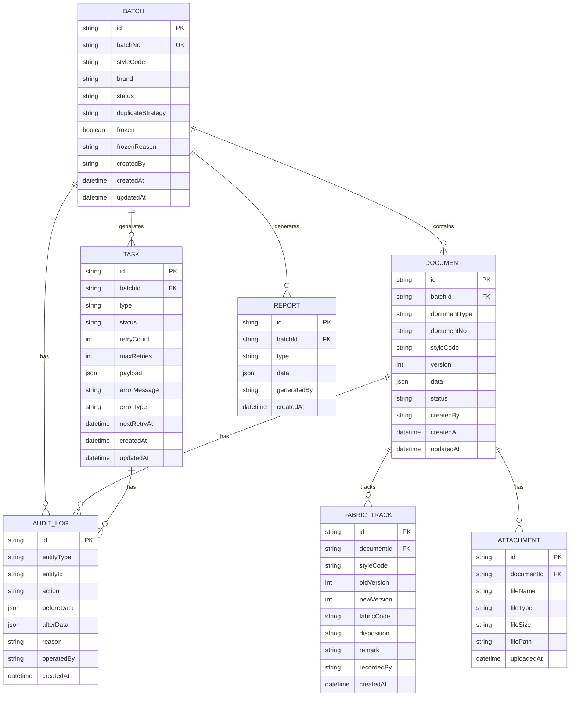

## 1. 架构设计



## 2. 技术选型说明

- **前端**：React@18 + TypeScript + Vite + TailwindCSS@3
- **状态管理**：Zustand - 轻量级，适合复杂状态机场景
- **后端**：Express@4 + TypeScript
- **数据库**：SQLite3 - 本地运行无需额外服务，便于演示复现
- **任务队列**：BullMQ (基于SQLite模拟) - 异步任务处理，支持重试机制
- **Excel导出**：SheetJS (xlsx) - 客户端/服务端均可使用
- **UI组件**：Lucide React 图标库 + 自定义组件
- **状态机**：XState - 专业状态机管理库

## 3. 路由定义

| 路由 | 页面 | 功能 |
|------|------|------|
| / | 仪表盘 | 任务概览、统计数据 |
| /batches | 批次列表 | 批次管理、创建、筛选 |
| /batches/create | 创建批次 | 新建批次、选择重复策略 |
| /batches/:id | 批次详情 | 批次信息、关联单据、操作历史 |
| /documents | 单据列表 | 多类型单据统一管理 |
| /documents/:id | 单据详情 | 单据信息、面料追踪、修改历史 |
| /review | 复核改判 | 待复核单据列表、改判操作 |
| /review/:id | 复核详情 | 单据审核、人工修正、差异对比 |
| /freeze | 冻结结算 | 冻结操作、结算处理 |
| /audit | 审计追踪 | 操作日志、修改记录 |
| /tasks | 任务监控 | 异步任务状态、重试管理 |
| /reports | 报告中心 | 报告列表、查看、导出 |
| /reports/:id | 报告详情 | 冻结前后对比、汇总数据 |
| /archive | 撤回归档 | 历史数据管理 |
| /demo | 演示流程 | 本地复现步骤引导 |

## 4. API 定义

### 4.1 批次管理

```typescript
// 批次创建
POST /api/batches
Request: {
  batchNo: string;
  styleCode: string;
  brand: string;
  duplicateStrategy: 'IGNORE' | 'OVERWRITE' | 'APPEND';
  createdBy: string;
  remark?: string;
}
Response: Batch & { message: string }

// 批次列表
GET /api/batches?page=1&pageSize=20&status=&brand=
Response: { data: Batch[], total: number, page: number, pageSize: number }

// 批次详情
GET /api/batches/:id
Response: Batch & { documents: Document[], auditLogs: AuditLog[] }

// 附件补传
POST /api/batches/:id/attachments
Request: FormData { files, documentType }
Response: { success: boolean, attachments: Attachment[] }
```

### 4.2 单据管理

```typescript
// 单据类型
type DocumentType = 'SAMPLE_FLOW' | 'SIZE_MODIFY' | 'FABRIC_STOCK' | 'SUPPLEMENT' | 'SHIFT_RECORD';

// 创建单据
POST /api/documents
Request: {
  batchId: string;
  documentType: DocumentType;
  documentNo: string;
  styleCode: string;
  version: number;
  data: Record<string, any>;
  attachments?: string[];
  createdBy: string;
}
Response: Document

// 面料去向记录
POST /api/fabric/track
Request: {
  styleCode: string;
  oldVersion: number;
  newVersion: number;
  fabricCode: string;
  disposition: 'RETURN' | 'SCRAP' | 'REUSE';
  remark: string;
  recordedBy: string;
}
Response: FabricTrack
```

### 4.3 复核改判

```typescript
// 获取待复核列表
GET /api/review/pending?page=1&pageSize=20
Response: { data: Document[], total: number }

// 复核改判
POST /api/review/:id/decision
Request: {
  decision: 'APPROVE' | 'REJECT' | 'MODIFY';
  reason: string;
  modifiedData?: Record<string, any>;
  decidedBy: string;
}
Response: { success: boolean, document: Document, auditLog: AuditLog }
```

### 4.4 冻结结算

```typescript
// 冻结批次
POST /api/batches/:id/freeze
Request: { reason: string; operatedBy: string; }
Response: { 
  success: boolean; 
  snapshot: { before: Batch, after: Batch };
  auditLog: AuditLog;
}

// 结算批次
POST /api/batches/:id/settle
Request: { remark?: string; operatedBy: string; }
Response: { success: boolean; report: Report; }
```

### 4.5 任务管理

```typescript
// 任务状态
type TaskStatus = 'PENDING' | 'PROCESSING' | 'SUCCESS' | 'WAITING_RETRY' | 'WAITING_MANUAL' | 'PERMANENT_FAILED';

// 获取任务列表
GET /api/tasks?status=&page=1&pageSize=20
Response: { data: Task[], total: number }

// 重试任务
POST /api/tasks/:id/retry
Response: { success: boolean; task: Task; }

// 人工处理任务
POST /api/tasks/:id/manual
Request: { action: 'FIX' | 'SKIP' | 'CANCEL'; remark: string; operatedBy: string; }
Response: { success: boolean; task: Task; }
```

### 4.6 报告与导出

```typescript
// 生成报告
POST /api/reports/generate
Request: { batchId: string; type: 'FREEZE' | 'SETTLE' | 'SUMMARY'; }
Response: Report

// 导出Excel
GET /api/reports/:id/export
Response: Buffer (Excel file)

// 差异对比
GET /api/documents/:id/diff?fromVersion=&toVersion=
Response: {
  fields: Array<{
    field: string;
    oldValue: any;
    newValue: any;
    changeType: 'ADD' | 'MODIFY' | 'DELETE';
  }>;
  modifiedBy: string;
  modifiedAt: string;
  reason: string;
}
```

## 5. 服务端架构图



## 6. 数据模型

### 6.1 ER 图



### 6.2 数据库初始化脚本 (SQL)

```sql
-- 批次表
CREATE TABLE batches (
  id TEXT PRIMARY KEY,
  batch_no TEXT UNIQUE NOT NULL,
  style_code TEXT NOT NULL,
  brand TEXT NOT NULL,
  status TEXT NOT NULL DEFAULT 'DRAFT',
  duplicate_strategy TEXT NOT NULL DEFAULT 'IGNORE',
  frozen BOOLEAN NOT NULL DEFAULT 0,
  frozen_reason TEXT,
  frozen_at DATETIME,
  created_by TEXT NOT NULL,
  created_at DATETIME NOT NULL DEFAULT CURRENT_TIMESTAMP,
  updated_at DATETIME NOT NULL DEFAULT CURRENT_TIMESTAMP
);

-- 单据表
CREATE TABLE documents (
  id TEXT PRIMARY KEY,
  batch_id TEXT NOT NULL,
  document_type TEXT NOT NULL,
  document_no TEXT NOT NULL,
  style_code TEXT NOT NULL,
  version INTEGER NOT NULL DEFAULT 1,
  data TEXT NOT NULL,
  status TEXT NOT NULL DEFAULT 'PENDING',
  review_reason TEXT,
  created_by TEXT NOT NULL,
  created_at DATETIME NOT NULL DEFAULT CURRENT_TIMESTAMP,
  updated_at DATETIME NOT NULL DEFAULT CURRENT_TIMESTAMP,
  FOREIGN KEY (batch_id) REFERENCES batches(id),
  UNIQUE(batch_id, document_type, document_no, version)
);

-- 面料追踪表
CREATE TABLE fabric_tracks (
  id TEXT PRIMARY KEY,
  document_id TEXT NOT NULL,
  style_code TEXT NOT NULL,
  old_version INTEGER NOT NULL,
  new_version INTEGER NOT NULL,
  fabric_code TEXT NOT NULL,
  disposition TEXT NOT NULL,
  remark TEXT,
  recorded_by TEXT NOT NULL,
  created_at DATETIME NOT NULL DEFAULT CURRENT_TIMESTAMP,
  FOREIGN KEY (document_id) REFERENCES documents(id)
);

-- 附件表
CREATE TABLE attachments (
  id TEXT PRIMARY KEY,
  document_id TEXT,
  batch_id TEXT,
  file_name TEXT NOT NULL,
  file_type TEXT NOT NULL,
  file_size INTEGER NOT NULL,
  file_path TEXT NOT NULL,
  uploaded_by TEXT NOT NULL,
  uploaded_at DATETIME NOT NULL DEFAULT CURRENT_TIMESTAMP
);

-- 任务表
CREATE TABLE tasks (
  id TEXT PRIMARY KEY,
  batch_id TEXT,
  document_id TEXT,
  type TEXT NOT NULL,
  status TEXT NOT NULL DEFAULT 'PENDING',
  retry_count INTEGER NOT NULL DEFAULT 0,
  max_retries INTEGER NOT NULL DEFAULT 3,
  payload TEXT NOT NULL,
  error_message TEXT,
  error_type TEXT,
  next_retry_at DATETIME,
  created_at DATETIME NOT NULL DEFAULT CURRENT_TIMESTAMP,
  updated_at DATETIME NOT NULL DEFAULT CURRENT_TIMESTAMP
);

-- 审计日志表
CREATE TABLE audit_logs (
  id TEXT PRIMARY KEY,
  entity_type TEXT NOT NULL,
  entity_id TEXT NOT NULL,
  action TEXT NOT NULL,
  before_data TEXT,
  after_data TEXT,
  reason TEXT,
  operated_by TEXT NOT NULL,
  created_at DATETIME NOT NULL DEFAULT CURRENT_TIMESTAMP
);

-- 报告表
CREATE TABLE reports (
  id TEXT PRIMARY KEY,
  batch_id TEXT NOT NULL,
  type TEXT NOT NULL,
  data TEXT NOT NULL,
  generated_by TEXT NOT NULL,
  created_at DATETIME NOT NULL DEFAULT CURRENT_TIMESTAMP,
  FOREIGN KEY (batch_id) REFERENCES batches(id)
);

-- 创建索引
CREATE INDEX idx_batches_status ON batches(status);
CREATE INDEX idx_batches_style_code ON batches(style_code);
CREATE INDEX idx_documents_batch_id ON documents(batch_id);
CREATE INDEX idx_documents_type ON documents(document_type);
CREATE INDEX idx_documents_status ON documents(status);
CREATE INDEX idx_tasks_status ON tasks(status);
CREATE INDEX idx_tasks_next_retry ON tasks(next_retry_at);
CREATE INDEX idx_audit_entity ON audit_logs(entity_type, entity_id);
CREATE INDEX idx_audit_created ON audit_logs(created_at);
```

## 7. 状态机定义

```typescript
// 单据状态流转
type DocumentState = 'DRAFT' | 'PENDING_REVIEW' | 'UNDER_REVIEW' | 'APPROVED' | 'REJECTED' | 'MODIFIED' | 'FROZEN' | 'ARCHIVED';

type DocumentEvent = 
  | { type: 'SUBMIT' }
  | { type: 'START_REVIEW' }
  | { type: 'APPROVE'; reason: string }
  | { type: 'REJECT'; reason: string }
  | { type: 'MODIFY'; modifiedData: any; reason: string }
  | { type: 'FREEZE'; reason: string }
  | { type: 'UNFREEZE'; reason: string }
  | { type: 'ARCHIVE' };
```

## 8. 本地演示流程脚本

```bash
# 1. 初始化数据库
npm run db:init

# 2. 导入示例数据
npm run db:seed

# 3. 启动服务
npm run dev

# 4. 触发坏数据场景
npm run demo:bad-data

# 5. 人工修正演示
npm run demo:fix-data

# 6. 生成报告
npm run demo:generate-report
```
