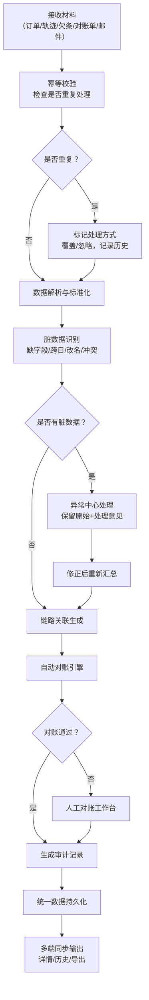

# 农资门店配送验收回放链路 API - 产品需求文档

## 1. 产品概述

农资门店配送验收回放链路系统，解决农忙时期赊销与缺货替代混杂导致回款对账困难的问题。通过整合门店订单、司机轨迹、签收欠条、供应商对账单和审批邮件，生成可审计的完整处理链路记录。

- **核心问题**：车辆二次返厂时，手工解释赊销与替代商品混杂的业务场景效率低、易出错
- **目标用户**：片区经理、财务审计人员、业务操作人员
- **市场价值**：实现业务全链路可追溯，减少人工对账时间80%，降低回款差异率

## 2. 核心功能

### 2.1 用户角色

| 角色 | 注册方式 | 核心权限 |
|------|----------|----------|
| 片区经理 | 系统分配 | 查看命令脚本、HTTP读写日志、本地持久化记录、链路回放、导出报表 |
| 财务审计 | 系统分配 | 对账差异分析、历史查询、导出审计报告、数据修正审批 |
| 业务操作 | 系统分配 | 数据导入、发起对账、标记异常、修正脏数据 |
| 系统管理员 | 系统分配 | 用户管理、配置管理、日志查询 |

### 2.2 功能模块

1. **数据导入模块**：门店订单、司机轨迹、签收欠条、供应商对账单、审批邮件的批量导入与单条录入
2. **链路生成模块**：自动关联多源数据生成完整配送验收链路
3. **脏数据处理模块**：识别缺字段、跨日、改名、金额/数量冲突，保留原始内容和处理意见
4. **对账引擎模块**：自动对账、差异标记、人工复核、重新汇总
5. **回放审计模块**：时间线回放、状态变更追踪、操作日志查询
6. **导出报表模块**：统一数据源导出，确保详情、历史、报表数据一致性
7. **历史管理模块**：重复材料处理（覆盖/忽略）、幂等校验、历史版本对比

### 2.3 页面详情

| 页面名称 | 模块名称 | 功能描述 |
|----------|----------|----------|
| 链路总览 | 仪表板 | 今日对账进度、异常统计、待处理事项、快速操作入口 |
| 数据导入 | 导入中心 | 多类型文件上传、导入预览、错误提示、历史导入记录 |
| 链路列表 | 链路管理 | 按日期/门店/司机筛选、链路状态标签、批量操作 |
| 链路详情 | 链路回放 | 时间线展示、状态变更节点、原始材料快照、操作日志 |
| 异常中心 | 脏数据处理 | 异常分类（缺字段/跨日/改名/金额冲突）、修正建议、人工处理 |
| 对账工作台 | 对账管理 | 自动对账结果、差异明细、人工调账、重新汇总 |
| 报表导出 | 导出中心 | 统一数据源导出、导出历史、报表预览、格式选择 |
| 历史查询 | 版本管理 | 处理历史追溯、重复处理标记（覆盖/忽略）、版本对比 |
| 技术视图 | 开发面板 | 命令脚本输出、HTTP请求/响应日志、SQL持久化语句 |

## 3. 核心流程

### 3.1 主业务流程



### 3.2 状态变化追踪流程

每个状态变更必须包含三要素：时间、操作者、变更原因。

```mermaid
stateDiagram-v2
    [*] --> 待处理: 材料导入
    待处理 --> 处理中: 操作员启动
    处理中 --> 异常: 脏数据识别
    异常 --> 处理中: 修正后重试
    处理中 --> 对账中: 链路生成完成
    对账中 --> 已对账: 自动对账通过
    对账中 --> 待复核: 发现差异
    待复核 --> 已对账: 人工确认
    已对账 --> 已导出: 生成报表
    已导出 --> [*]
    
    note right of 异常: 变更原因：缺字段(3项)<br/>操作者：张三<br/>时间：2024-05-20 14:30
```

## 4. 用户界面设计

### 4.1 设计风格

- **主色调**：深蓝 #1e3a5f（专业、可信），辅以橙色 #f97316（农业属性、警示）
- **辅助色**：成功绿 #10b981，警告黄 #f59e0b，错误红 #ef4444
- **按钮风格**：直角或微圆角（2px），边框清晰，点击反馈明显
- **字体**：思源黑体（中文）+ Roboto Mono（数字/代码），等宽字体用于技术视图
- **布局风格**：信息密度高，卡片式分组，左侧导航+右侧内容的经典管理后台布局
- **图标风格**：线性图标，保持一致的线条粗细（2px）

### 4.2 页面设计概述

| 页面名称 | 模块名称 | UI 元素 |
|----------|----------|---------|
| 链路总览 | 仪表板 | 统计卡片（KPI数字+趋势箭头）、异常环形图、待处理列表、快捷操作栏 |
| 链路详情 | 链路回放 | 垂直时间线（带状态节点）、材料卡片组、操作日志侧栏、技术视图切换Tab |
| 异常中心 | 脏数据处理 | 分类标签页、异常列表（带原始值/建议值对比）、批量修正工具栏 |
| 技术视图 | 开发面板 | 三栏布局（命令脚本/HTTP日志/SQL语句）、语法高亮、复制按钮 |

### 4.3 响应式设计

- **桌面优先**：1280px及以上为主要设计尺寸
- **平板适配**：1024px时折叠侧栏为图标模式
- **移动端**：768px以下采用单列布局，重点展示核心数据

### 4.4 交互设计重点

- **时间线动画**：链路回放时状态节点依次点亮，显示平滑过渡动画
- **异常高亮**：脏数据行采用斑马条纹+背景色双重标记
- **悬停详情**：鼠标悬停在材料卡片上显示缩略预览
- **进度可视化**：对账过程显示实时进度条和当前处理步骤

## 5. 核心业务规则

### 5.1 数据一致性规则

1. **单一数据源原则**：所有展示（详情页/历史查询/导出报表）必须来自同一份持久化数据
2. **变更审计**：任何数据修正必须生成新的版本记录，禁止直接修改原始数据
3. **导出锁定**：导出时生成数据快照，同一批次多次导出结果必须一致
4. **缓存失效**：数据变更后立即失效相关缓存，确保界面实时更新

### 5.2 脏数据分类规则

| 异常类型 | 识别规则 | 处理方式 |
|----------|----------|----------|
| 缺字段 | 必填字段为空或格式非法 | 标记缺失，建议补全，不参与汇总 |
| 跨日 | 订单日期与签收日期差>1天 | 高亮提示，人工确认是否正常 |
| 改名 | 商品名称在不同材料中不一致 | 建立映射表，支持别名匹配 |
| 金额冲突 | 订单金额≠签收金额≠对账单金额 | 三栏对比，人工确认最终值 |
| 数量冲突 | 订货数量≠配送数量≠实收数量 | 显示差异，支持多级审批调整 |

### 5.3 幂等处理规则

1. **重复识别**：通过（门店+日期+商品批次）组合键识别重复材料
2. **处理策略**：
   - **忽略**：保留首次处理结果，后续导入仅记录日志
   - **覆盖**：生成新版本，旧版本移入历史，重新计算汇总
3. **汇总保护**：重复处理不会导致汇总数字累加，按最新版本计算

## 6. 非功能需求

| 需求类型 | 具体要求 |
|----------|----------|
| 性能 | 单链路查询<500ms，批量导出1000条<3s |
| 可用性 | 系统可用性99.5%，数据持久化采用双写机制 |
| 安全 | 所有操作留痕，敏感数据脱敏，支持操作回滚 |
| 可审计 | 状态变更三要素齐全，支持完整链路追溯 |
| 可扩展性 | 支持新的材料类型接入，异常规则可配置 |
