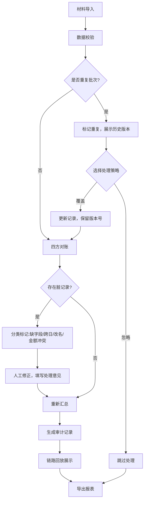

# 农资门店配送验收回放链路系统 - PRD

## 1. 产品概述
本系统解决农资门店二次返厂时农忙赊销与缺货替代混合导致回款对账困难的问题，通过整合门店订单、司机轨迹、签收欠条、供应商对账单及审批邮件，形成可审计的配送验收全链路回放服务。
- **核心目标**：将分散的多源数据转化为统一的审计处理记录，实现对账透明化、异常可追溯
- **目标用户**：片区经理、财务对账人员、门店管理员
- **核心价值**：减少手工解释成本，提高回款对账效率，确保数据一致性

## 2. 核心功能

### 2.1 用户角色
| 角色 | 注册方式 | 核心权限 |
|------|----------|----------|
| 片区经理 | 系统分配 | 查看全链路、导出报表、审核处理意见 |
| 财务对账员 | 系统分配 | 数据录入、对账操作、处理脏记录 |
| 门店管理员 | 系统分配 | 查看门店订单、确认签收 |

### 2.2 功能模块
1. **数据导入控制台**：造数工具、材料上传、批量导入
2. **链路回放中心**：时间线展示、状态流转追踪、操作日志
3. **对账审计工作台**：对账处理、脏记录分类、异常修正
4. **历史查询系统**：版本对比、重复处理标记、汇总统计
5. **导出报表中心**：审计报告、对账明细、异常清单

### 2.3 页面详情
| 页面名称 | 模块名称 | 功能描述 |
|----------|----------|----------|
| 数据导入控制台 | 造数工具 | 模拟门店订单、司机轨迹、签收欠条样例数据 |
| 数据导入控制台 | 材料上传 | 支持JSON/Excel/邮件附件格式导入 |
| 数据导入控制台 | 服务控制 | 启动/停止链路服务、查看服务状态 |
| 链路回放中心 | 时间线视图 | 按时间顺序展示全链路事件流 |
| 链路回放中心 | 状态卡片 | 展示每个节点的时间、操作者、原因 |
| 链路回放中心 | 原始材料 | 关联展示原始数据内容 |
| 对账审计工作台 | 对账面板 | 订单-轨迹-欠条-账单四方对账 |
| 对账审计工作台 | 脏记录分类 | 缺字段/跨日/改名/金额冲突分类展示 |
| 对账审计工作台 | 修正处理 | 保留原始内容、填写处理意见、重新汇总 |
| 历史查询系统 | 版本追踪 | 同一批材料多次处理的覆盖/忽略标记 |
| 历史查询系统 | 汇总统计 | 防重复计算的汇总数字展示 |
| 导出报表中心 | 审计报告 | 包含命令脚本、HTTP读写、本地持久化详情 |
| 导出报表中心 | 数据一致性校验 | 导出文件/详情接口/历史查询数据一致性验证 |

## 3. 核心流程

### 3.1 主业务流程
1. 财务对账员导入门店订单、司机轨迹、签收欠条、供应商对账单材料
2. 系统自动进行四方对账，标记脏记录类型（缺字段/跨日/改名/金额冲突）
3. 对账员处理脏记录：保留原始内容，填写处理意见，触发重新汇总
4. 片区经理查看链路回放，审核处理意见，确认对账结果
5. 导出审计报告，包含完整操作轨迹和数据来源

### 3.2 重复数据处理流程
1. 检测同一批材料再次进入系统
2. 标记为"重复处理"，展示历史版本对比
3. 用户选择"覆盖"或"忽略"策略
4. 汇总数字防重复计算，确保统计准确

## 4. 用户界面设计

### 4.1 设计风格
- **主色调**：深绿色 (#1B5E20) - 代表农业、信任、专业
- **辅助色**：橙色 (#FF9800) - 用于警示、异常标记
- **中性色**：深灰 (#37474F) - 文字、边框；浅灰 (#F5F5