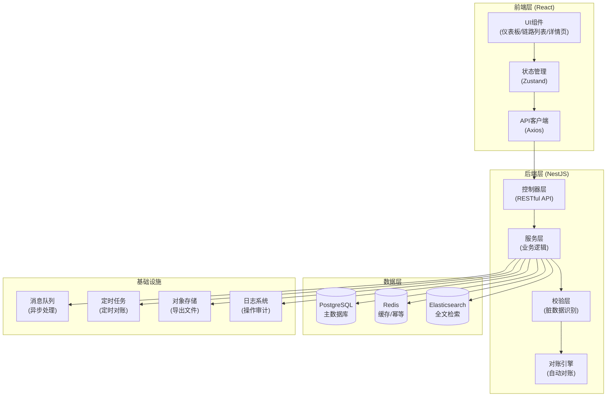
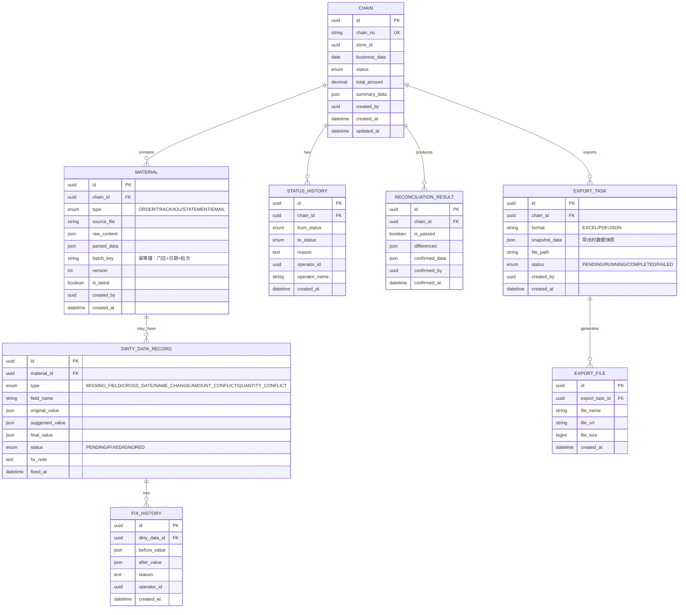

# 农资门店配送验收回放链路 API - 技术架构文档

## 1. 架构设计



## 2. 技术栈描述

| 层级 | 技术选型 | 版本 | 说明 |
|------|----------|------|------|
| 前端 | React | 18.x | 用户界面框架 |
| 前端 | TypeScript | 5.x | 类型安全 |
| 前端 | Vite | 5.x | 构建工具 |
| 前端 | Tailwind CSS | 3.x | 样式框架 |
| 前端 | Zustand | 4.x | 状态管理 |
| 前端 | React Query | 5.x | 服务端状态 |
| 前端 | Mermaid | 10.x | 流程图渲染 |
| 后端 | NestJS | 10.x | Node.js 框架 |
| 后端 | TypeScript | 5.x | 类型安全 |
| 数据库 | PostgreSQL | 15.x | 关系型数据库 |
| 数据库 | Prisma | 5.x | ORM 框架 |
| 缓存 | Redis | 7.x | 缓存和幂等控制 |
| 搜索 | Elasticsearch | 8.x | 全文检索 |
| 测试 | Jest | 29.x | 单元测试 |
| 测试 | Supertest | 6.x | API 测试 |

## 3. 目录结构

### 3.1 后端目录结构

```
backend/
├── src/
│   ├── common/                 # 公共模块
│   │   ├── decorators/         # 自定义装饰器
│   │   ├── filters/            # 异常过滤器
│   │   ├── guards/             # 守卫
│   │   ├── interceptors/       # 拦截器（日志、转换）
│   │   └── pipes/              # 管道（校验、转换）
│   ├── modules/
│   │   ├── chain/              # 链路模块
│   │   │   ├── chain.controller.ts
│   │   │   ├── chain.service.ts
│   │   │   ├── chain.module.ts
│   │   │   └── dto/
│   │   ├── material/           # 材料模块（订单/轨迹/欠条/对账单）
│   │   │   ├── material.controller.ts
│   │   │   ├── material.service.ts
│   │   │   ├── material.module.ts
│   │   │   └── parsers/        # 各类材料解析器
│   │   ├── reconciliation/     # 对账模块
│   │   │   ├── reconciliation.controller.ts
│   │   │   ├── reconciliation.service.ts
│   │   │   ├── reconciliation.engine.ts
│   │   │   └── rules/          # 对账规则
│   │   ├── dirty-data/         # 脏数据处理模块
│   │   │   ├── dirty-data.controller.ts
│   │   │   ├── dirty-data.service.ts
│   │   │   └── detectors/      # 异常检测器
│   │   ├── audit/              # 审计日志模块
│   │   │   ├── audit.controller.ts
│   │   │   └── audit.service.ts
│   │   ├── export/             # 导出模块
│   │   │   ├── export.controller.ts
│   │   │   └── export.service.ts
│   │   └── tech-view/          # 技术视图模块
│   │       ├── http-logger.middleware.ts
│   │       ├── command.service.ts
│   │       └── sql-logger.service.ts
│   ├── prisma/                 # 数据库模型
│   │   ├── schema.prisma
│   │   └── seed.ts
│   ├── config/                 # 配置
│   └── main.ts
├── test/
│   ├── e2e/
│   └── unit/
└── package.json
```

### 3.2 前端目录结构

```
frontend/
├── src/
│   ├── components/             # 公共组件
│   │   ├── Timeline/           # 时间线组件
│   │   ├── DataTable/          # 数据表格
│   │   ├── StatusBadge/        # 状态标签
│   │   └── CodeViewer/         # 代码查看器
│   ├── pages/                  # 页面组件
│   │   ├── Dashboard/
│   │   ├── ChainList/
│   │   ├── ChainDetail/
│   │   ├── DirtyDataCenter/
│   │   ├── Reconciliation/
│   │   ├── ExportCenter/
│   │   ├── HistoryQuery/
│   │   └── TechView/
│   ├── store/                  # 状态管理
│   │   ├── useChainStore.ts
│   │   ├── useMaterialStore.ts
│   │   └── useAuditStore.ts
│   ├── services/               # API 服务
│   │   ├── api.ts
│   │   ├── chain.service.ts
│   │   ├── material.service.ts
│   │   └── reconciliation.service.ts
│   ├── types/                  # 类型定义
│   ├── utils/                  # 工具函数
│   ├── App.tsx
│   └── main.tsx
├── public/
└── package.json
```

## 4. 路由定义

### 4.1 API 路由

| 方法 | 路由 | 用途 |
|------|------|------|
| POST | `/api/v1/materials/import` | 批量导入材料 |
| GET | `/api/v1/materials` | 材料列表查询 |
| GET | `/api/v1/materials/:id` | 材料详情 |
| PUT | `/api/v1/materials/:id` | 更新材料（修正脏数据） |
| POST | `/api/v1/chains/generate` | 生成配送链路 |
| GET | `/api/v1/chains` | 链路列表 |
| GET | `/api/v1/chains/:id` | 链路详情（含时间线） |
| GET | `/api/v1/chains/:id/timeline` | 链路时间线数据 |
| POST | `/api/v1/reconciliation/start` | 启动对账流程 |
| GET | `/api/v1/reconciliation/:chainId` | 对账结果 |
| POST | `/api/v1/reconciliation/:chainId/confirm` | 人工确认对账 |
| GET | `/api/v1/dirty-data` | 脏数据列表 |
| GET | `/api/v1/dirty-data/:id` | 脏数据详情 |
| POST | `/api/v1/dirty-data/:id/fix` | 修正脏数据 |
| GET | `/api/v1/audit/logs` | 审计日志查询 |
| GET | `/api/v1/audit/status-history/:chainId` | 状态变更历史 |
| POST | `/api/v1/export/generate` | 生成导出文件 |
| GET | `/api/v1/export/download/:taskId` | 下载导出文件 |
| GET | `/api/v1/tech-view/http-logs` | HTTP 请求日志 |
| GET | `/api/v1/tech-view/sql-logs` | SQL 执行日志 |
| GET | `/api/v1/tech-view/commands` | 命令执行记录 |

### 4.2 前端路由

| 路由 | 页面 |
|------|------|
| `/` | 仪表板总览 |
| `/chains` | 链路列表 |
| `/chains/:id` | 链路详情（含回放） |
| `/dirty-data` | 异常中心 |
| `/reconciliation` | 对账工作台 |
| `/export` | 导出中心 |
| `/history` | 历史查询 |
| `/tech-view` | 技术视图 |

## 5. 数据模型设计

### 5.1 ER 图



### 5.2 Prisma Schema 核心定义

```prisma
model Chain {
  id          String   @id @default(uuid())
  chainNo     String   @unique @map("chain_no")
  storeId     String   @map("store_id")
  storeName   String   @map("store_name")
  businessDate DateTime @map("business_date")
  status      ChainStatus
  totalAmount Decimal  @map("total_amount") @db.Decimal(12, 2)
  summaryData Json     @map("summary_data")
  
  materials    Material[]
  statusHistory StatusHistory[]
  reconciliation ReconciliationResult[]
  exportTasks  ExportTask[]
  
  createdBy String   @map("created_by")
  createdAt DateTime @default(now()) @map("created_at")
  updatedAt DateTime @updatedAt @map("updated_at")
  
  @@map("chains")
}

model Material {
  id          String         @id @default(uuid())
  chainId     String?        @map("chain_id")
  chain       Chain?         @relation(fields: [chainId], references: [id])
  type        MaterialType
  sourceFile  String?        @map("source_file")
  rawContent  Json           @map("raw_content")
  parsedData  Json           @map("parsed_data")
  batchKey    String         @map("batch_key")
  version     Int            @default(1)
  isLatest    Boolean        @default(true) @map("is_latest")
  handleMode  HandleMode?    @map("handle_mode")
  
  dirtyDataRecords DirtyDataRecord[]
  
  createdBy String   @map("created_by")
  createdAt DateTime @default(now()) @map("created_at")
  
  @@index([batchKey, version])
  @@map("materials")
}

model StatusHistory {
  id         String   @id @default(uuid())
  chainId    String   @map("chain_id")
  chain      Chain    @relation(fields: [chainId], references: [id])
  fromStatus ChainStatus?
  toStatus   ChainStatus
  reason     String
  operatorId String   @map("operator_id")
  operatorName String @map("operator_name")
  createdAt  DateTime @default(now()) @map("created_at")
  
  @@map("status_history")
}

model DirtyDataRecord {
  id             String           @id @default(uuid())
  materialId     String           @map("material_id")
  material       Material         @relation(fields: [materialId], references: [id])
  type           DirtyDataType
  fieldName      String           @map("field_name")
  originalValue  Json             @map("original_value")
  suggestedValue Json?            @map("suggested_value")
  finalValue     Json?            @map("final_value")
  status         DirtyDataStatus
  fixNote        String?          @map("fix_note")
  
  fixHistory     FixHistory[]
  
  fixedAt DateTime? @map("fixed_at")
  createdAt DateTime @default(now()) @map("created_at")
  
  @@map("dirty_data_records")
}
```

## 6. API 定义示例

### 6.1 材料导入接口

```typescript
// 请求 DTO
interface ImportMaterialsRequest {
  type: 'ORDER' | 'TRACK' | 'IOU' | 'STATEMENT' | 'EMAIL';
  files: File[];
  handleMode: 'AUTO' | 'OVERWRITE' | 'IGNORE';
}

// 响应 DTO
interface ImportMaterialsResponse {
  taskId: string;
  totalCount: number;
  successCount: number;
  duplicateCount: number;
  failedCount: number;
  duplicates: Array<{
    batchKey: string;
    existingVersion: number;
    handleMode: 'OVERWRITE' | 'IGNORE';
  }>;
  errors: Array<{
    fileName: string;
    message: string;
  }>;
}
```

### 6.2 链路详情接口

```typescript
interface ChainDetailResponse {
  id: string;
  chainNo: string;
  storeName: string;
  businessDate: string;
  status: ChainStatus;
  totalAmount: number;
  
  materials: Array<{
    id: string;
    type: MaterialType;
    sourceFile: string;
    version: number;
    isLatest: boolean;
    parsedData: Record<string, any>;
  }>;
  
  timeline: Array<{
    timestamp: string;
    status: ChainStatus;
    operator: string;
    reason: string;
  }>;
  
  dirtyData: Array<{
    id: string;
    type: DirtyDataType;
    fieldName: string;
    status: DirtyDataStatus;
  }>;
  
  reconciliation: {
    isPassed: boolean;
    differences: any[];
    confirmedAt: string | null;
  };
  
  // 技术视图数据（仅特定角色可见）
  techView?: {
    httpRequests: Array<{
      method: string;
      url: string;
      statusCode: number;
      duration: number;
      requestBody: string;
      responseBody: string;
    }>;
    sqlStatements: Array<{
      sql: string;
      params: any[];
      duration: number;
    }>;
    commands: Array<{
      command: string;
      output: string;
      exitCode: number;
      executedAt: string;
    }>;
  };
}
```

### 6.3 对账结果接口

```typescript
interface ReconciliationResultResponse {
  chainId: string;
  chainNo: string;
  isPassed: boolean;
  
  orderAmount: number;
  iouAmount: number;
  statementAmount: number;
  finalAmount: number;
  
  differences: Array<{
    type: 'AMOUNT' | 'QUANTITY' | 'ITEM';
    source: string;
    target: string;
    sourceValue: number | string;
    targetValue: number | string;
    description: string;
    severity: 'WARNING' | 'ERROR';
  }>;
  
  status: 'PENDING' | 'CONFIRMED' | 'REJECTED';
  confirmedBy: string | null;
  confirmedAt: string | null;
}
```

## 7. 核心业务实现

### 7.1 幂等处理机制

```typescript
// 幂等校验服务
class IdempotencyService {
  async checkAndLock(batchKey: string, handleMode: HandleMode) {
    const cacheKey = `idempotent:${batchKey}`;
    const existing = await this.redis.get(cacheKey);
    
    if (existing) {
      if (handleMode === 'IGNORE') {
        return { isDuplicate: true, handleMode: 'IGNORE' };
      }
      // 覆盖模式：标记旧版本为非最新
      await this.materialService.markOldVersions(batchKey);
    }
    
    await this.redis.set(cacheKey, Date.now(), 'EX', 3600);
    return { isDuplicate: false };
  }
}
```

### 7.2 脏数据检测器

```typescript
// 脏数据检测管道
class DirtyDataDetector {
  private detectors = [
    new MissingFieldDetector(),
    new CrossDateDetector(),
    new NameChangeDetector(),
    new AmountConflictDetector(),
    new QuantityConflictDetector(),
  ];
  
  async detect(material: Material): Promise<DirtyDataRecord[]> {
    const records: DirtyDataRecord[] = [];
    
    for (const detector of this.detectors) {
      if (detector.shouldDetect(material.type)) {
        const result = await detector.detect(material);
        records.push(...result);
      }
    }
    
    return records;
  }
}
```

### 7.3 状态变更审计

```typescript
// 状态变更装饰器
@Injectable()
class StatusChangeInterceptor implements NestInterceptor {
  intercept(context: ExecutionContext, next: CallHandler) {
    return next.handle().pipe(
      tap(async (data) => {
        if (data.statusChanged) {
          await this.auditService.logStatusChange({
            chainId: data.chainId,
            fromStatus: data.fromStatus,
            toStatus: data.toStatus,
            reason: data.reason,
            operatorId: context.switchToHttp().getRequest().user.id,
            operatorName: context.switchToHttp().getRequest().user.name,
          });
        }
      }),
    );
  }
}
```

## 8. 样例数据

### 8.1 样例门店订单

```json
{
  "orderNo": "DD20240520001",
  "storeName": "丰收农资店",
  "orderDate": "2024-05-20",
  "items": [
    { "productName": "尿素46%", "quantity": 50, "unit": "袋", "price": 120, "amount": 6000 },
    { "productName": "复合肥15-15-15", "quantity": 30, "unit": "袋", "price": 180, "amount": 5400 }
  ],
  "totalAmount": 11400,
  "salesman": "张三"
}
```

### 8.2 样例签收欠条

```json
{
  "iouNo": "QT20240520001",
  "storeName": "丰收农资店",
  "signDate": "2024-05-21",
  "driver": "李四",
  "truckNo": "鲁A12345",
  "items": [
    { "productName": "尿素", "quantity": 50, "unit": "袋", "price": 120, "amount": 6000 },
    { "productName": "二铵", "quantity": 30, "unit": "袋", "price": 180, "amount": 5400 }
  ],
  "totalAmount": 11400,
  "signature": "王丰收",
  "remark": "农忙赊销"
}
```

### 8.3 样例脏数据 - 改名冲突

```json
{
  "type": "NAME_CHANGE",
  "fieldName": "productName",
  "originalValue": {
    "order": "复合肥15-15-15",
    "iou": "二铵"
  },
  "suggestedValue": "二铵（复合肥15-15-15）",
  "status": "PENDING",
  "description": "订单与欠条商品名称不一致"
}
```

## 9. 测试用例

### 9.1 核心测试场景

| 测试场景 | 测试步骤 | 预期结果 |
|----------|----------|----------|
| 重复材料导入-忽略模式 | 1. 导入订单A 2. 再次导入订单A（忽略模式） | 第二次导入标记为重复，汇总数据不变 |
| 重复材料导入-覆盖模式 | 1. 导入订单A 2. 修改后再次导入（覆盖模式） | 生成新版本，旧版本移入历史，汇总重新计算 |
| 脏数据识别-缺字段 | 导入缺少商品数量的订单 | 自动标记为缺字段异常 |
| 脏数据识别-跨日 | 订单日期5-20，签收日期5-22 | 标记为跨日异常 |
| 脏数据识别-改名 | 订单商品名"复合肥"，欠条"二铵" | 标记为改名冲突 |
| 对账-金额冲突 | 订单11400，欠条11600，对账单11400 | 标记金额差异，人工确认 |
| 数据一致性验证 | 1. 查看详情页 2. 导出报表 3. 历史查询 | 三者数据完全一致 |
| 状态变更审计 | 修改链路状态 | 状态历史记录时间、操作者、原因三要素 |
| 技术视图验证 | 片区经理登录查看技术视图 | 显示HTTP日志、SQL语句、命令脚本 |
