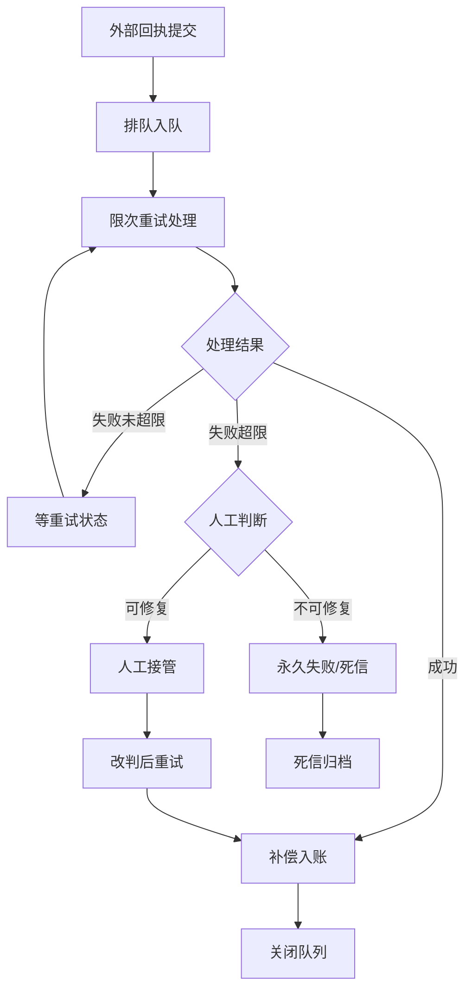
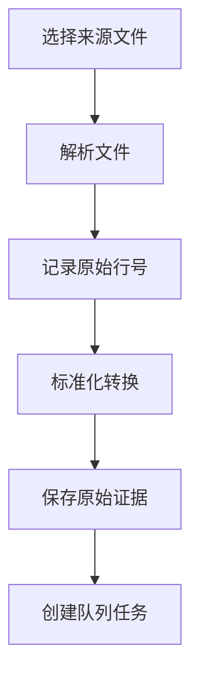

# 门店会员储值重试补偿队列 API - 产品需求文档

## 1. 产品概述

解决跨店消费和撤销交易导致余额历史断裂问题，减少人工核对证据的工作量。通过自动化队列和重试机制实现储值交易的补偿入账，保留完整证据链供财务审计。

- **核心价值**: 自动化处理储值交易异常，提供完整审计追溯能力
- **目标用户**: 财务人员、门店运营、系统管理员

## 2. 核心功能

### 2.1 用户角色

| 角色 | 核心权限 |
|------|----------|
| 财务主管 | 查看可重试分类、死信处理、恢复后续跑统计 |
| 运营人员 | 提交回执、人工接管、查看历史差异 |
| 系统管理员 | 重启服务、管理队列配置 |

### 2.2 功能模块

1. **回执导入模块**: 支持充值流水、退款申请、门店交接表、供应商对账单导入
2. **队列管理模块**: 排队、限次重试、状态管理
3. **人工接管模块**: 人工审核、改判、补偿入账
4. **审计追溯模块**: 前后差异对比、原始证据保留、操作历史
5. **财务看板模块**: 可重试分类、死信处理、恢复后续跑统计

### 2.3 功能详情

| 模块名称 | 功能描述 |
|-----------|----------|
| 回执导入 | 保留来源文件、原始行号、解析后标准值，改判不覆盖原始证据 |
| 队列处理 | 外部回执提交 → 排队 → 限次重试 → 人工接管 → 补偿入账 → 关闭 |
| 状态区分 | 等重试、等人工、永久失败三种失败状态 |
| 断点续传 | 服务恢复后自动接着处理未完成任务 |
| 差异回看 | 每一步操作记录前后差异，支持审计追溯 |

## 3. 核心流程

### 3.1 主业务流程

### 3.2 导入流程

## 4. 用户界面设计

### 4.1 设计风格
- **主色调**: 深蓝 (#1e3a8a) - 专业稳重
- **辅助色**: 琥珀橙 (#d97706) - 警告状态 / 翠绿 (#059669) - 成功状态
- **布局风格**: 左侧导航 + 右侧内容区，卡片式布局
- **字体**: 系统无衬线字体，清晰层级

### 4.2 页面设计

| 页面名称 | 核心模块 | UI 元素 |
|-----------|----------|---------|
| 财务看板 | 统计卡片、趋势图表、分类列表 | 数据卡片、柱状图、状态标签 |
| 队列列表 | 任务列表、筛选器、状态统计 | 表格、状态徽章、分页 |
| 任务详情 | 基本信息、操作历史、差异对比 | Tab 切换、时间线、差异高亮 |
| 回执导入 | 文件上传、预览、解析结果 | 拖拽上传、进度条、预览表格 |
| 死信队列 | 死信列表、批量操作、归档 | 红色警示、批量选择、恢复按钮 |

### 4.3 响应式
- 桌面端优先，支持 1280px 以上分辨率
- 表格区域支持水平滚动
- 移动端简化为卡片堆叠布局

## 5. 验收标准

### 5.1 正常链路验收
1. 导入充值流水文件 → 成功创建队列任务
2. 任务自动处理 → 补偿入账 → 状态变为已关闭
3. 查看任务详情 → 可看到完整操作历史和差异

### 5.2 异常场景验收
1. 重复提交同一回执 → 系统识别并提示，不重复创建
2. 导入坏数据 → 解析失败，记录错误，进入等人工状态
3. 重试超限 → 自动进入等人工状态

### 5.3 服务恢复验收
1. 服务重启后 → 未完成任务自动继续处理
2. 历史数据完整可查
3. 财务看板数据一致
