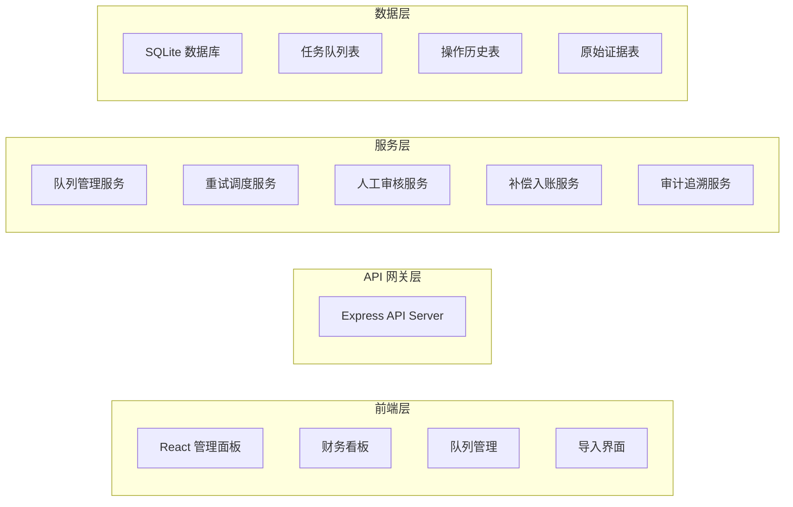
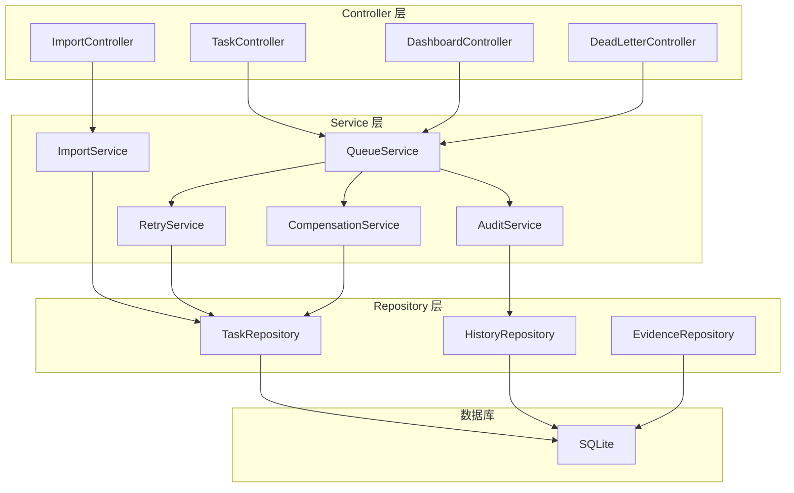
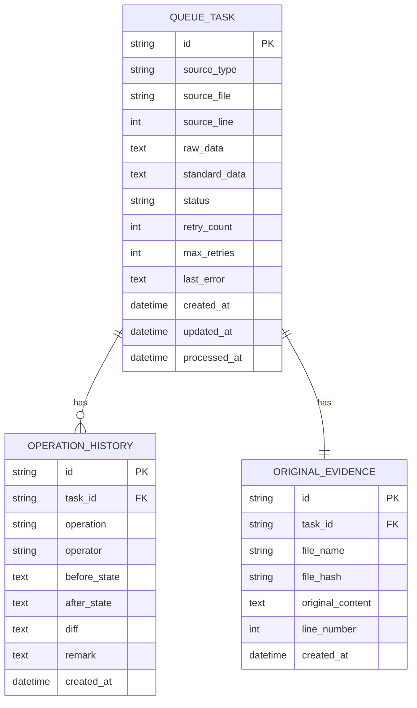

# 门店会员储值重试补偿队列 API - 技术架构文档

## 1. 系统架构



## 2. 技术栈

### 2.1 前端技术
- **框架**: React 18 + TypeScript
- **构建工具**: Vite
- **样式**: Tailwind CSS 3
- **状态管理**: Zustand
- **路由**: React Router DOM
- **图标**: Lucide React
- **图表**: Recharts

### 2.2 后端技术
- **框架**: Express 4 + TypeScript
- **数据库**: SQLite (文件数据库
- **队列**: 内存队列 + 持久化
- **文件解析**: CSV/Excel 解析库

### 2.3 开发工具
- **语言: **: **: **: TypeScript 5
- **代码检查**: ESLint
- **格式化**: Prettier

## 3. 路由定义

| 路由 | 页面 | 功能 |
|-------|------|------|
| /dashboard | 财务看板 | 统计概览、分类统计、趋势图 |
| /queue | 队列列表 | 任务列表、筛选、状态统计 |
| /queue/:id | 任务详情 | 基本信息、操作历史、差异对比 |
| /import | 回执导入 | 文件上传、预览、解析结果 |
| /dead-letter | 死信队列 | 死信列表、批量操作 |
| /settings | 系统设置 | 重试配置、参数管理 |

## 4. API 定义

### 4.1 数据类型定义

```typescript
// 任务状态
type TaskStatus = 'pending' | 'processing' | 'waiting_retry' | 'waiting_manual' | 'permanent_failed' | 'success' | 'closed';

// 来源类型
type SourceType = 'recharge' | 'refund' | 'store_transfer' | 'supplier_statement';

// 队列任务
interface QueueTask {
  id: string;
  sourceType: SourceType;
  sourceFile: string;
  sourceLine: number;
  rawData: Record<string, any>;
  standardData: Record<string, any>;
  status: TaskStatus;
  retryCount: number;
  maxRetries: number;
  lastError?: string;
  createdAt: Date;
  updatedAt: Date;
  processedAt?: Date;
}

// 操作历史
interface OperationHistory {
  id: string;
  taskId: string;
  operation: string;
  operator: string;
  beforeState: Record<string, any>;
  afterState: Record<string, any>;
  diff: Record<string, any>;
  remark?: string;
  createdAt: Date;
}
```

### 4.2 API 端点

| 方法 | 路径 | 描述 |
|------|------|------|
| GET | /api/tasks | 获取任务列表 |
| GET | /api/tasks/:id | 获取任务详情 |
| POST | /api/tasks | 创建任务 |
| PUT | /api/tasks/:id/retry | 手动重试 |
| PUT | /api/tasks/:id/manual | 人工接管 |
| PUT | /api/tasks/:id/compensate | 补偿入账 |
| PUT | /api/tasks/:id/close | 关闭任务 |
| GET | /api/tasks/:id/history | 获取操作历史 |
| POST | /api/import | 导入回执文件 |
| GET | /api/dashboard/stats | 获取看板统计 |
| GET | /api/dashboard/retry-categories | 可重试分类 |
| GET | /api/dead-letter | 死信列表 |
| POST | /api/dead-letter/:id/revive | 死信恢复 |
| POST | /api/admin/resume | 恢复服务处理 |

## 5. 服务架构



## 6. 数据模型

### 6.1 ER 图



### 6.2 DDL 语句

```sql
-- 队列任务表
CREATE TABLE queue_task (
    id VARCHAR(36) PRIMARY KEY,
    source_type VARCHAR(50) NOT NULL,
    source_file VARCHAR(255) NOT NULL,
    source_line INTEGER NOT NULL,
    raw_data TEXT NOT NULL,
    standard_data TEXT NOT NULL,
    status VARCHAR(30) NOT NULL DEFAULT 'pending',
    retry_count INTEGER NOT NULL DEFAULT 0,
    max_retries INTEGER NOT NULL DEFAULT 3,
    last_error TEXT,
    created_at DATETIME NOT NULL DEFAULT CURRENT_TIMESTAMP,
    updated_at DATETIME NOT NULL DEFAULT CURRENT_TIMESTAMP,
    processed_at DATETIME,
    INDEX idx_status (status),
    INDEX idx_source (source_type, source_file)
);

-- 操作历史表
CREATE TABLE operation_history (
    id VARCHAR(36) PRIMARY KEY,
    task_id VARCHAR(36) NOT NULL,
    operation VARCHAR(50) NOT NULL,
    operator VARCHAR(100) NOT NULL,
    before_state TEXT,
    after_state TEXT,
    diff TEXT,
    remark TEXT,
    created_at DATETIME NOT NULL DEFAULT CURRENT_TIMESTAMP,
    INDEX idx_task_id (task_id),
    FOREIGN KEY (task_id) REFERENCES queue_task(id)
);

-- 原始证据表
CREATE TABLE original_evidence (
    id VARCHAR(36) PRIMARY KEY,
    task_id VARCHAR(36) NOT NULL,
    file_name VARCHAR(255) NOT NULL,
    file_hash VARCHAR(64) NOT NULL,
    original_content TEXT NOT NULL,
    line_number INTEGER NOT NULL,
    created_at DATETIME NOT NULL DEFAULT CURRENT_TIMESTAMP,
    INDEX idx_task_id (task_id),
    FOREIGN KEY (task_id) REFERENCES queue_task(id)
);
```

## 7. 重试调度机制

### 7.1 重试策略
- **最大重试次数**: 默认为 3 次
- **重试间隔**: 指数退避 (1min, 5min, 15min)
- **状态流转**:
  - pending → processing → success
  - pending → processing → waiting_retry (失败未超限)
  - waiting_retry → processing (定时触发)
  - waiting_retry → waiting_manual (重试超限)
  - waiting_manual → processing (人工触发)
  - processing → permanent_failed (人工确认不可修复)

### 7.2 服务恢复
- 启动时扫描 status 为 'pending' 或 'waiting_retry' 的任务
- 恢复处理队列
- 记录恢复日志供审计
