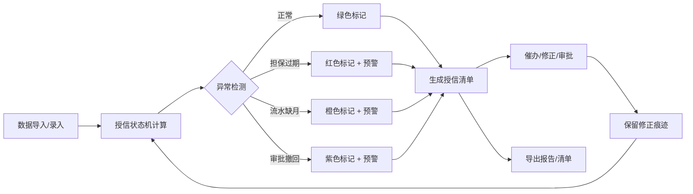

## 1. 产品概述

小微贷款续授信管理工具，解决支行客户经理靠表格跟进续授信、老板关注本周断档客户的痛点。整合客户资料、还款流水、担保状态、审批意见等多源数据，自动计算授信状态、标注异常、生成可下载报告，并保留所有数据来源和修正痕迹。

- 目标用户：支行客户经理（日常操作）、管理层（查看统计与风险）
- 核心价值：降低担保过期、流水缺月、审批撤回等风险，提升续授信效率

## 2. 核心功能

### 2.1 用户角色

| 角色 | 登录方式 | 核心权限 |
|------|----------|----------|
| 客户经理 | 本地登录 | 数据导入、状态查询、异常处理、催办记录、导出报告 |
| 管理层 | 本地登录 | 全局概览、风险统计、本周断档查看、导出清单 |

### 2.2 功能模块

1. **总览看板**：本周断档预警、异常统计、状态分布
2. **授信清单**：客户列表、状态标签、异常高亮、筛选搜索
3. **客户详情**：多源数据聚合、审批历史、修正痕迹、催办记录
4. **数据导入**：样例数据加载、单条录入、批量导入
5. **报告导出**：Excel/CSV 格式、风险清单、审批历史

### 2.3 页面详情

| 页面名称 | 模块名称 | 功能描述 |
|----------|----------|----------|
| 总览看板 | 风险概览 | 本周断档客户数、各类异常统计、状态分布饼图 |
| 总览看板 | 本周预警 | 未来7天内到期/断档的客户列表，按紧急程度排序 |
| 授信清单 | 客户列表 | 分页展示所有客户，支持按状态/风险等级/到期日筛选 |
| 授信清单 | 异常标识 | 担保过期红色、流水缺月橙色、审批撤回紫色、正常绿色 |
| 客户详情 | 基本信息 | 客户资料、授信额度、到期日、担保信息 |
| 客户详情 | 还款流水 | 按月展示还款记录，缺月标记醒目提示 |
| 客户详情 | 审批历史 | 时间线展示所有审批记录，撤回记录特殊标记 |
| 客户详情 | 催办记录 | 去重展示催办历史，支持新增催办 |
| 客户详情 | 修正痕迹 | 保留每次修改的前后值、操作人、时间戳 |
| 数据导入 | 样例加载 | 一键加载3条样例数据（正常/边界/坏数据） |
| 数据导入 | 批量导入 | 支持 CSV 格式批量导入客户数据 |
| 报告导出 | 导出清单 | 导出当前筛选条件下的客户清单 |
| 报告导出 | 风险报告 | 导出包含所有异常客户的风险报告 |

## 3. 核心流程

**业务流程说明**：
1. 客户经理导入或录入客户多源数据
2. 系统通过授信状态机自动计算当前状态
3. 异常检测引擎识别担保过期、流水缺月、审批撤回等问题
4. 生成带状态标记的授信清单，异常客户醒目展示
5. 客户经理对异常客户进行催办、补充材料或申请审批
6. 所有操作保留修正痕迹，支持追溯
7. 支持导出各类报告和清单供管理层审阅

## 4. 用户界面设计

### 4.1 设计风格

- **主色调**：深蓝色 #1e3a5f（专业、稳重），搭配 #2563eb 作为交互色
- **风险色**：红色 #dc2626（严重异常）、橙色 #f59e0b（中等风险）、紫色 #7c3aed（审批异常）、绿色 #16a34a（正常）
- **字体**：标题使用 Noto Sans SC Bold，正文使用 Noto Sans SC Regular
- **布局**：左侧导航 + 右侧内容区，卡片式布局，信息层次分明
- **交互**：悬停浮起效果、状态标签圆角、表格斑马纹、时间线审批历史

### 4.2 页面设计概述

| 页面名称 | 模块名称 | UI 元素 |
|----------|----------|---------|
| 总览看板 | 风险概览 | 数据卡片、统计饼图、数字动画、状态色块 |
| 总览看板 | 本周预警 | 倒计时标签、风险等级色条、紧急程度排序 |
| 授信清单 | 客户列表 | 状态标签、筛选下拉框、搜索框、分页器 |
| 客户详情 | 多源数据 | 选项卡切换、时间线、流水月历、修正痕迹 diff |
| 数据导入 | 导入区域 | 拖拽上传、样例数据按钮、导入预览 |

### 4.3 响应式

- 桌面端优先设计（1280px+）
- 平板端（768px-1279px）：导航收起为图标，表格横向滚动
- 移动端（<768px）：底部导航，卡片堆叠展示

### 4.4 数据样例设计

样例数据包含3条典型记录，覆盖完整处理链：

1. **正常记录**：客户A，还款流水完整，担保有效，审批通过，授信正常
2. **边界记录**：客户B，3天后到期，流水缺最近1个月，担保即将到期，处于续授信审批中
3. **明显坏数据**：客户C，担保已过期60天，流水缺3个月，审批记录显示"已通过"后又"撤回"，状态异常
