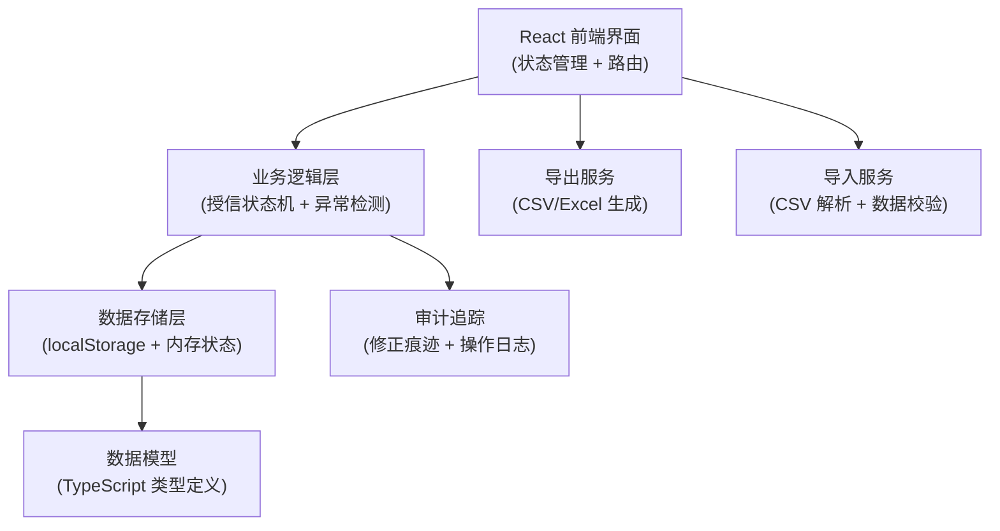
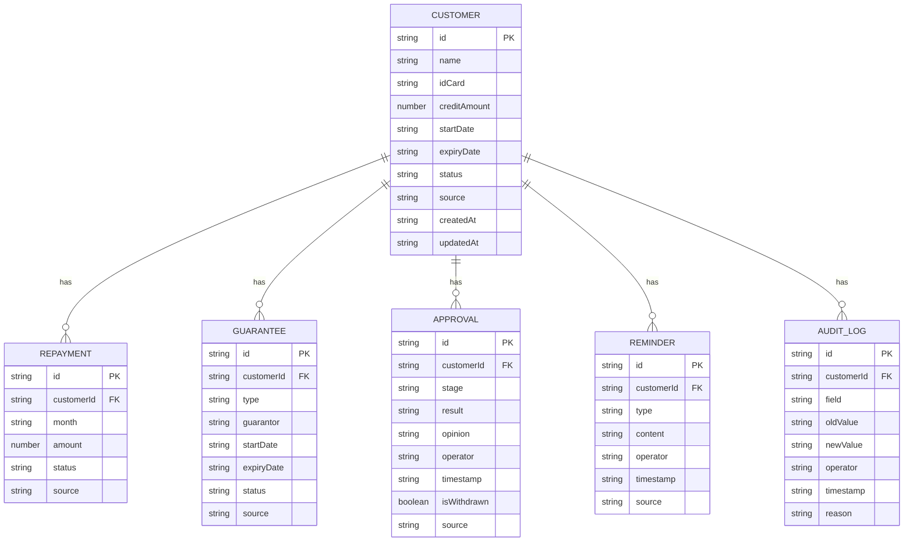

## 1. 架构设计



## 2. 技术描述

- **前端框架**：React@18 + TypeScript
- **构建工具**：Vite@5
- **样式方案**：TailwindCSS@3 + CSS 变量
- **状态管理**：React Context + useReducer
- **路由**：React Router@6
- **UI 组件**：Headless UI（下拉框、模态框）+ Lucide React（图标）
- **导出功能**：SheetJS (xlsx) + 原生 CSV 导出
- **图表**：Recharts（轻量级图表库）
- **数据持久化**：localStorage（本地存储）
- **无后端设计**：纯前端应用，所有逻辑在浏览器端执行

## 3. 路由定义

| 路由 | 页面 | 用途 |
|------|------|------|
| `/` | 总览看板 | 风险概览、本周预警、统计图表 |
| `/loans` | 授信清单 | 客户列表、筛选搜索、状态标识 |
| `/loans/:id` | 客户详情 | 多源数据、审批历史、修正痕迹 |
| `/import` | 数据导入 | 样例加载、批量导入、数据预览 |
| `/export` | 报告导出 | 清单导出、风险报告导出 |

## 4. 数据模型

### 4.1 核心数据模型



### 4.2 TypeScript 类型定义

```typescript
// 客户状态
type LoanStatus = 'normal' | 'warning' | 'expiring_soon' | 'expired' | 'abnormal';

// 异常类型
type AnomalyType = 'guarantee_expired' | 'missing_repayment' | 'approval_withdrawn' | 'expiring_soon';

// 审批结果
type ApprovalResult = 'approved' | 'rejected' | 'pending' | 'withdrawn';

interface Customer {
  id: string;
  name: string;
  idCard: string;
  creditAmount: number;
  startDate: string;
  expiryDate: string;
  status: LoanStatus;
  source: string;
  createdAt: string;
  updatedAt: string;
  anomalies: Anomaly[];
}

interface Repayment {
  id: string;
  customerId: string;
  month: string;
  amount: number;
  status: 'normal' | 'overdue' | 'missing';
  source: string;
}

interface Guarantee {
  id: string;
  customerId: string;
  type: 'mortgage' | 'pledge' | 'guarantor';
  guarantor: string;
  startDate: string;
  expiryDate: string;
  status: 'valid' | 'expiring_soon' | 'expired';
  source: string;
}

interface Approval {
  id: string;
  customerId: string;
  stage: string;
  result: ApprovalResult;
  opinion: string;
  operator: string;
  timestamp: string;
  isWithdrawn: boolean;
  source: string;
}

interface Reminder {
  id: string;
  customerId: string;
  type: 'phone' | 'sms' | 'visit';
  content: string;
  operator: string;
  timestamp: string;
  source: string;
}

interface AuditLog {
  id: string;
  customerId: string;
  field: string;
  oldValue: string;
  newValue: string;
  operator: string;
  timestamp: string;
  reason: string;
}

interface Anomaly {
  type: AnomalyType;
  severity: 'high' | 'medium' | 'low';
  message: string;
  detectedAt: string;
}
```

## 5. 核心模块设计

### 5.1 授信状态机

```typescript
// 状态转换规则
const statusTransitions = {
  normal: ['warning', 'expiring_soon', 'expired', 'abnormal'],
  warning: ['normal', 'expiring_soon', 'expired', 'abnormal'],
  expiring_soon: ['normal', 'expired', 'abnormal'],
  expired: ['normal', 'abnormal'],
  abnormal: ['normal', 'warning']
};

// 状态计算逻辑
function calculateLoanStatus(customer: Customer, guarantees: Guarantee[], repayments: Repayment[], approvals: Approval[]): LoanStatus {
  // 1. 检查审批撤回
  const hasWithdrawnApproval = approvals.some(a => a.isWithdrawn);
  if (hasWithdrawnApproval) return 'abnormal';
  
  // 2. 检查担保过期
  const hasExpiredGuarantee = guarantees.some(g => g.status === 'expired');
  if (hasExpiredGuarantee) return 'abnormal';
  
  // 3. 检查流水缺月
  const missingMonths = repayments.filter(r => r.status === 'missing').length;
  if (missingMonths >= 3) return 'abnormal';
  if (missingMonths >= 1) return 'warning';
  
  // 4. 检查即将到期
  const daysToExpiry = calculateDaysToExpiry(customer.expiryDate);
  if (daysToExpiry <= 0) return 'expired';
  if (daysToExpiry <= 7) return 'expiring_soon';
  if (daysToExpiry <= 30) return 'warning';
  
  return 'normal';
}
```

### 5.2 异常检测引擎

```typescript
function detectAnomalies(customer: Customer, guarantees: Guarantee[], repayments: Repayment[], approvals: Approval[]): Anomaly[] {
  const anomalies: Anomaly[] = [];
  
  // 担保过期检测
  guarantees.forEach(g => {
    if (g.status === 'expired') {
      anomalies.push({
        type: 'guarantee_expired',
        severity: 'high',
        message: `担保已过期（${g.type}），过期日期：${g.expiryDate}`,
        detectedAt: new Date().toISOString()
      });
    }
  });
  
  // 流水缺月检测
  const missing = repayments.filter(r => r.status === 'missing');
  if (missing.length > 0) {
    anomalies.push({
      type: 'missing_repayment',
      severity: missing.length >= 3 ? 'high' : 'medium',
      message: `还款流水缺失 ${missing.length} 个月：${missing.map(m => m.month).join('、')}`,
      detectedAt: new Date().toISOString()
    });
  }
  
  // 审批撤回检测
  approvals.forEach(a => {
    if (a.isWithdrawn) {
      anomalies.push({
        type: 'approval_withdrawn',
        severity: 'high',
        message: `审批记录已撤回：${a.stage} - ${a.result}（${a.operator}，${a.timestamp}）`,
        detectedAt: new Date().toISOString()
      });
    }
  });
  
  return anomalies;
}
```

### 5.3 催办去重逻辑

```typescript
function deduplicateReminders(reminders: Reminder[]): Reminder[] {
  const seen = new Map<string, Reminder>();
  
  reminders.forEach(r => {
    const key = `${r.customerId}-${r.type}-${r.timestamp.substring(0, 10)}`;
    const existing = seen.get(key);
    
    if (!existing || new Date(r.timestamp) > new Date(existing.timestamp)) {
      seen.set(key, r);
    }
  });
  
  return Array.from(seen.values()).sort((a, b) => 
    new Date(b.timestamp).getTime() - new Date(a.timestamp).getTime()
  );
}
```

### 5.4 数据导入导出

- **导入**：支持 CSV 格式，解析后进行数据校验，生成预览，确认后入库
- **导出**：支持 CSV 和 Excel 格式，可导出当前筛选结果或全部数据
- **样例数据**：内置 3 条典型样例，一键加载用于演示和测试

## 6. 项目目录结构

```
src/
├── components/          # UI 组件
│   ├── layout/         # 布局组件
│   ├── common/         # 通用组件（表格、卡片、标签等）
│   └── features/       # 业务组件
├── pages/              # 页面组件
├── types/              # TypeScript 类型定义
├── store/              # 状态管理
├── utils/              # 工具函数
│   ├── statusMachine.ts    # 授信状态机
│   ├── anomalyDetector.ts  # 异常检测
│   ├── export.ts           # 导出功能
│   ├── import.ts           # 导入功能
│   └── audit.ts            # 审计追踪
├── data/               # 样例数据
├── hooks/              # 自定义 Hooks
└── App.tsx             # 应用入口
```
