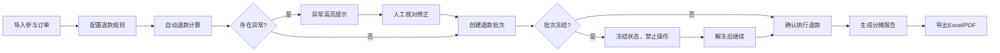

## 1. 产品概述

众筹退款分摊工具是一款面向项目运营人员的Web应用，解决众筹项目失败后批量退款的复杂计算问题。核心处理手续费分摊、权益抵扣、赠品清算、早鸟价调整等场景，确保退款金额准确可追溯。

- 目标用户：项目发起人、运营人员、财务人员
- 核心价值：将原本需要手工计算的复杂退款流程自动化，保留完整审计痕迹，避免人为错误
- 解决痛点：同用户多档位合并、渠道手续费差异、赠品已发货抵扣、历史数据一致性

## 2. 核心功能

### 2.1 用户角色
| 角色 | 注册方式 | 核心权限 |
|------|---------|---------|
| 运营人员 | 本地登录 | 数据导入、退款计算、批次管理、导出报告 |
| 审核人员 | 本地登录 | 查看数据、确认退款、冻结批次 |

### 2.2 功能模块
1. **概览面板**：项目状态、退款进度、异常预警、关键指标
2. **参与人管理**：订单列表、筛选搜索、单人详情、档位展示
3. **退款计算**：规则配置、自动计算、手动修正、差异提示
4. **批次管理**：批次创建、冻结/解冻、执行记录、重复提交校验
5. **导出中心**：分摊报告、退款明细、操作日志

### 2.3 页面详情
| 页面名称 | 模块名称 | 功能描述 |
|---------|---------|---------|
| 概览面板 | 项目概览 | 展示项目基本信息、退款总金额、参与人数、异常数量 |
| 概览面板 | 进度卡片 | 按状态分组显示：待计算、计算中、已确认、已冻结、已完成 |
| 参与人管理 | 筛选区 | 支持按档位、支付渠道、退款状态、是否异常、用户ID搜索 |
| 参与人管理 | 列表区 | 展示参与人基本信息、支付金额、应退金额、状态标签、异常标识 |
| 参与人管理 | 详情抽屉 | 展示完整订单信息、档位权益、手续费明细、修改历史 |
| 退款计算 | 规则配置 | 配置退款规则：是否扣手续费、赠品抵扣比例、早鸟价处理方式 |
| 退款计算 | 自动计算 | 一键批量计算，实时展示计算结果和异常项 |
| 退款计算 | 手动修正 | 支持单人/批量修正金额，记录修正原因和操作人 |
| 退款计算 | 差异高亮 | 异常场景醒目提示：同用户多档位、赠品已发货、渠道手续费差异 |
| 批次管理 | 批次列表 | 展示批次信息、状态、包含人数、总金额、创建时间 |
| 批次管理 | 批次操作 | 创建批次、冻结/解冻、确认执行、导出批次报告 |
| 导出中心 | 报告列表 | 历史导出记录、下载链接、导出时间、操作人 |

## 3. 核心流程

**异常场景处理流程：**
1. 同用户多档位：自动合并计算，标注"多档位合并"标签，展示各档位明细
2. 赠品已发货：自动计算赠品价值，从退款中抵扣，标注"赠品抵扣"，支持人工调整
3. 渠道手续费差异：按实际支付渠道费率计算，展示手续费明细，标注"渠道差异"
4. 重复提交：批次创建后自动校验，同一用户同一订单禁止重复加入批次

## 4. 用户界面设计

### 4.1 设计风格
- **主色调**：深灰蓝 (#1e3a5f) - 专业、稳重，适合金融类工具
- **辅助色**：警示橙 (#ff6b35) 用于异常提示，成功绿 (#22c55e) 用于正常状态，冻结灰 (#6b7280) 用于冻结状态
- **按钮风格**：圆角4px，简洁扁平，主按钮深蓝色填充，次要按钮边框
- **字体**：Inter 作为主要字体，等宽字体用于金额展示
- **布局风格**：卡片式布局，左侧导航 + 顶部操作栏 + 主内容区
- **图标风格**：简洁线性图标，避免过度装饰

### 4.2 页面设计概述
| 页面名称 | 模块名称 | UI 元素 |
|---------|---------|---------|
| 概览面板 | 指标卡片 | 大数字 + 环比趋势 + 状态色块，hover显示详情 |
| 参与人管理 | 筛选区 | 标签式筛选器 + 搜索框，支持多条件组合 |
| 参与人管理 | 数据表格 | 斑马纹行，异常行橙色边框，状态标签圆角胶囊 |
| 参与人管理 | 详情抽屉 | 右侧滑入，分区域展示：基本信息、档位明细、手续费、修改历史 |
| 退款计算 | 规则配置 | 表单式配置，开关 + 数字输入 + 下拉选择 |
| 退款计算 | 计算结果 | 分组展示：正常项、异常项、待确认项，每组可展开 |
| 批次管理 | 批次卡片 | 每个批次独立卡片，顶部状态条，底部操作按钮 |
| 导出中心 | 报告列表 | 时间线布局，左侧图标 + 中间信息 + 右侧操作 |

### 4.3 响应式
- 桌面端优先，最小支持1280px宽度
- 平板端：侧边栏可收起，表格支持水平滚动
- 移动端：简化视图，核心操作保留，非关键信息折叠

### 4.4 交互细节
- 异常项：入场时轻微抖动动画，边框呼吸灯效果
- 金额变化：数字滚动动画，差值用红绿箭头标注
- 批次冻结：整行灰化，添加锁图标，所有操作按钮禁用
- 操作反馈：提交后显示loading状态，成功/失败toast提示
- 历史记录：时间轴展示，每次修改高亮差异部分
