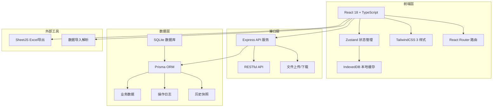
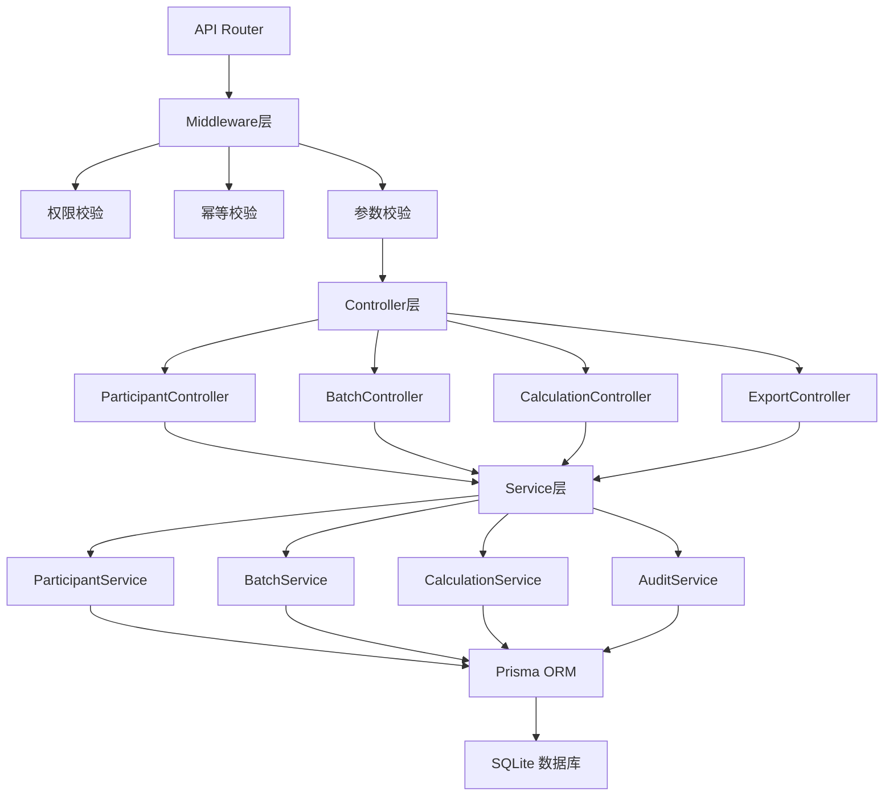
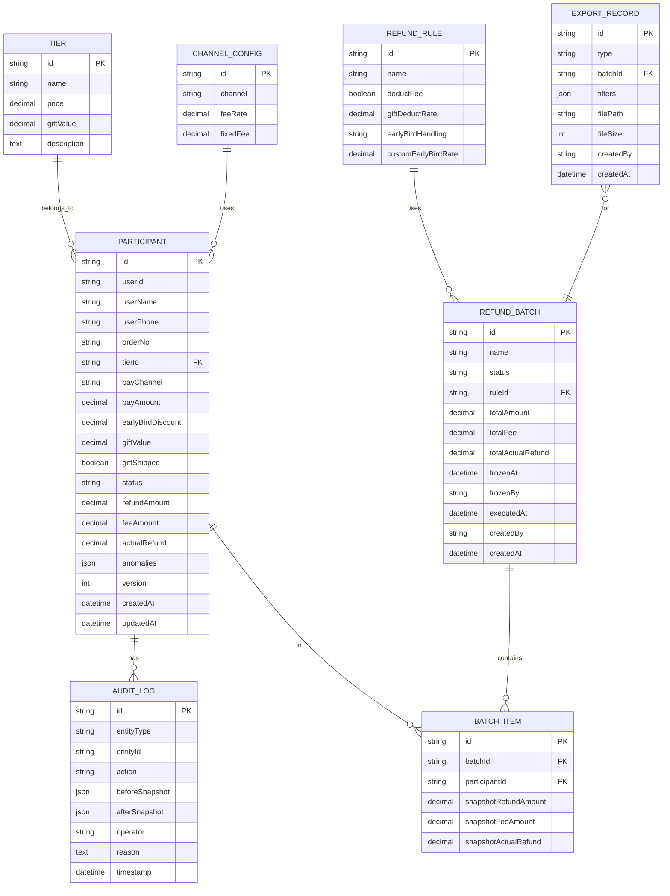

## 1. 架构设计



## 2. 技术描述

### 2.1 技术栈选择
- **前端**：React 18 + TypeScript + Vite + TailwindCSS 3
- **状态管理**：Zustand（轻量级，支持中间件和持久化）
- **路由**：React Router v6
- **后端**：Express 4 + TypeScript
- **数据库**：SQLite 3（文件型，便于部署迁移）
- **ORM**：Prisma（类型安全，迁移管理）
- **Excel处理**：SheetJS (xlsx)
- **本地缓存**：IndexedDB + Dexie.js

### 2.2 关键设计决策
1. **SQLite + 文件存储**：保证数据可移植，重启项目数据不丢失
2. **完整审计痕迹**：每次修改都写入历史快照表，保留修改前后值、操作人、时间戳
3. **幂等性设计**：所有写操作带幂等键，防止重复提交
4. **乐观锁**：更新时校验版本号，避免并发修改冲突
5. **前端计算 + 后端校验**：前端实时计算提升体验，后端最终校验保证数据准确

## 3. 路由定义

| 路由 | 页面/组件 | 功能 |
|------|----------|------|
| / | 概览面板 | 项目总览、指标卡片、异常预警 |
| /participants | 参与人列表 | 订单列表、筛选搜索、详情查看 |
| /participants/:id | 参与人详情 | 单人完整信息、修改历史、手动修正 |
| /calculation | 退款计算 | 规则配置、自动计算、批量操作 |
| /batches | 批次管理 | 批次列表、创建批次、冻结/解冻 |
| /batches/:id | 批次详情 | 批次内订单、执行记录、导出 |
| /exports | 导出中心 | 历史报告、下载、重新生成 |
| /settings | 系统设置 | 规则模板、渠道配置、权益配置 |

## 4. API 定义

### 4.1 TypeScript 类型定义

```typescript
// 参与订单
interface Participant {
  id: string;
  userId: string;
  userName: string;
  userPhone: string;
  orderNo: string;
  tierId: string;
  tierName: string;
  payAmount: number;
  payChannel: 'alipay' | 'wechat' | 'card';
  payTime: string;
  earlyBirdDiscount: number;
  giftValue: number;
  giftShipped: boolean;
  status: 'pending' | 'calculated' | 'confirmed' | 'frozen' | 'refunded';
  refundAmount: number;
  feeAmount: number;
  actualRefund: number;
  anomalies: string[];
  createdAt: string;
  updatedAt: string;
  version: number;
}

// 档位权益
interface Tier {
  id: string;
  name: string;
  price: number;
  giftValue: number;
  description: string;
}

// 支付渠道配置
interface ChannelConfig {
  id: string;
  channel: string;
  feeRate: number;
  fixedFee: number;
}

// 退款规则
interface RefundRule {
  id: string;
  name: string;
  deductFee: boolean;
  giftDeductRate: number;
  earlyBirdHandling: 'full_refund' | 'deduct_discount' | 'custom';
  customEarlyBirdRate: number;
}

// 退款批次
interface RefundBatch {
  id: string;
  name: string;
  status: 'draft' | 'pending' | 'frozen' | 'executing' | 'completed' | 'cancelled';
  participantIds: string[];
  totalAmount: number;
  totalFee: number;
  totalActualRefund: number;
  frozenAt: string | null;
  frozenBy: string | null;
  executedAt: string | null;
  createdAt: string;
  createdBy: string;
}

// 操作日志
interface AuditLog {
  id: string;
  entityType: 'participant' | 'batch' | 'rule';
  entityId: string;
  action: 'create' | 'update' | 'delete' | 'freeze' | 'unfreeze' | 'calculate' | 'export';
  beforeSnapshot: any;
  afterSnapshot: any;
  operator: string;
  reason: string;
  timestamp: string;
}

// 导出记录
interface ExportRecord {
  id: string;
  type: 'refund_detail' | 'allocation_report' | 'audit_log';
  batchId: string | null;
  filters: any;
  filePath: string;
  fileSize: number;
  createdBy: string;
  createdAt: string;
}
```

### 4.2 API 接口列表

| 方法 | 路径 | 描述 |
|------|------|------|
| GET | /api/participants | 获取参与人列表（支持筛选、分页） |
| GET | /api/participants/:id | 获取参与人详情 |
| PUT | /api/participants/:id | 更新参与人退款信息（带幂等键） |
| GET | /api/participants/:id/history | 获取参与人修改历史 |
| POST | /api/calculation/calculate | 批量计算退款 |
| GET | /api/rules | 获取退款规则列表 |
| POST | /api/rules | 创建退款规则 |
| PUT | /api/rules/:id | 更新退款规则 |
| GET | /api/batches | 获取批次列表 |
| POST | /api/batches | 创建批次 |
| GET | /api/batches/:id | 获取批次详情 |
| POST | /api/batches/:id/freeze | 冻结批次 |
| POST | /api/batches/:id/unfreeze | 解冻批次 |
| POST | /api/batches/:id/execute | 执行批次退款（标记） |
| POST | /api/exports | 创建导出任务 |
| GET | /api/exports | 获取导出记录列表 |
| GET | /api/exports/:id/download | 下载导出文件 |
| GET | /api/audit-logs | 获取操作日志（支持筛选） |

## 5. 服务器架构



## 6. 数据模型

### 6.1 ER 图



### 6.2 Prisma Schema 关键设计

```prisma
// 参与人表 - 核心业务表
model Participant {
  id              String   @id @default(cuid())
  userId          String
  userName        String
  userPhone       String
  orderNo         String   @unique
  tierId          String
  tierName        String
  payChannel      String
  payAmount       Decimal  @db.Decimal(10, 2)
  earlyBirdDiscount Decimal @db.Decimal(10, 2) @default(0)
  giftValue       Decimal  @db.Decimal(10, 2) @default(0)
  giftShipped     Boolean  @default(false)
  status          String   @default("pending")
  refundAmount    Decimal? @db.Decimal(10, 2)
  feeAmount       Decimal? @db.Decimal(10, 2)
  actualRefund    Decimal? @db.Decimal(10, 2)
  anomalies       Json?
  version         Int      @default(1)
  createdAt       DateTime @default(now())
  updatedAt       DateTime @updatedAt
  
  batchItems      BatchItem[]
  auditLogs       AuditLog[]
}

// 审计日志 - 保留所有修改痕迹
model AuditLog {
  id             String   @id @default(cuid())
  entityType     String   // participant, batch, rule
  entityId       String
  action         String   // create, update, delete, freeze, unfreeze, calculate
  beforeSnapshot Json?
  afterSnapshot  Json?
  operator       String
  reason         String?
  timestamp      DateTime @default(now())
  
  @@index([entityType, entityId])
}

// 批次表 - 支持冻结/解冻
model RefundBatch {
  id               String        @id @default(cuid())
  name             String
  status           String        @default("draft") // draft, pending, frozen, executing, completed, cancelled
  ruleId           String?
  totalAmount      Decimal       @db.Decimal(12, 2) @default(0)
  totalFee         Decimal       @db.Decimal(10, 2) @default(0)
  totalActualRefund Decimal     @db.Decimal(12, 2) @default(0)
  frozenAt         DateTime?
  frozenBy         String?
  executedAt       DateTime?
  createdBy        String
  createdAt        DateTime      @default(now())
  
  items            BatchItem[]
  exportRecords    ExportRecord[]
}

// 批次项目快照 - 保证导出数据一致性
model BatchItem {
  id                    String  @id @default(cuid())
  batchId               String
  participantId         String
  snapshotRefundAmount  Decimal @db.Decimal(10, 2)
  snapshotFeeAmount     Decimal @db.Decimal(10, 2)
  snapshotActualRefund  Decimal @db.Decimal(10, 2)
  
  batch                 RefundBatch @relation(fields: [batchId], references: [id])
  participant           Participant @relation(fields: [participantId], references: [id])
  
  @@unique([batchId, participantId])
}
```

## 7. 关键技术实现

### 7.1 数据一致性保证
1. **乐观锁**：更新时校验 `version` 字段，不匹配则拒绝更新
2. **快照机制**：批次创建时复制当前退款金额到 `BatchItem`，后续参与人修改不影响已创建批次
3. **审计日志**：所有修改写入 `AuditLog`，包含修改前后完整快照
4. **幂等键**：所有写操作请求头携带 `X-Idempotency-Key`，重复请求直接返回首次结果

### 7.2 异常场景识别
- 同用户多档位：查询同一 `userId` 下不同 `tierId` 的订单
- 赠品已发货：`giftShipped = true` 且 `giftValue > 0`
- 渠道手续费差异：根据 `payChannel` 匹配不同费率计算
- 重复提交：`BatchItem` 表的唯一索引 `(batchId, participantId)`

### 7.3 退款计算逻辑
```
应退金额 = 支付金额 - 早鸟折扣处理
手续费 = 应退金额 × 渠道费率 + 固定手续费
赠品抵扣 = 赠品价值 × 抵扣比例（已发货时）
实际退款 = 应退金额 - 手续费 - 赠品抵扣
```
