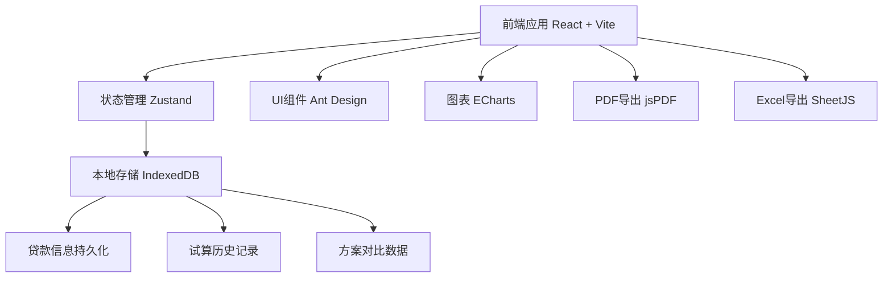
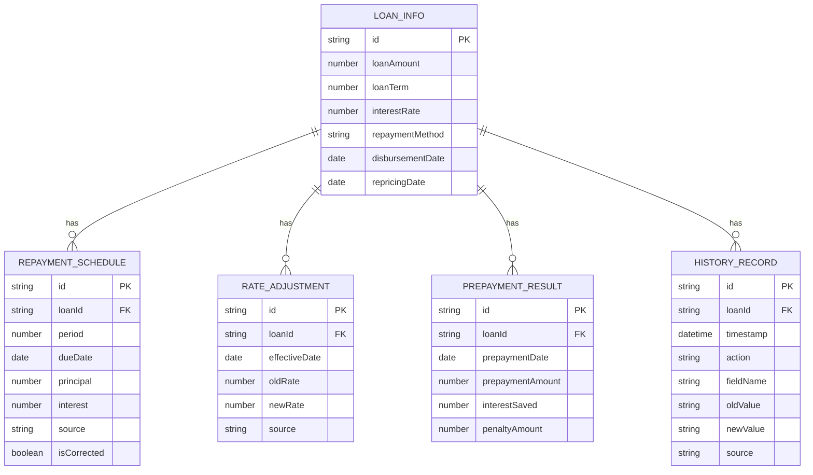

## 1. 架构设计



## 2. 技术描述

- **前端框架**：React@18 + TypeScript + Vite
- **状态管理**：Zustand（轻量级，支持中间件持久化）
- **UI组件库**：Ant Design（专业金融级组件）
- **图表库**：ECharts（功能强大的可视化图表）
- **样式方案**：TailwindCSS 3 + CSS Modules
- **PDF导出**：jsPDF + html2canvas
- **Excel导出**：SheetJS (xlsx)
- **本地存储**：IndexedDB（存储大量历史数据）
- **日期处理**：date-fns

## 3. 路由定义

| 路由 | 页面 | 主要功能 |
|-------|------|----------|
| / | 首页/导航 | 功能入口、快速操作 |
| /loan-info | 贷款信息录入 | 基础信息、还款计划、利率调整、违约金 |
| /calculator | 提前还款试算 | 试算参数、计算结果、图表、风险提示 |
| /compare | 方案对比 | 多方案并排对比、差异分析 |
| /history | 历史记录 | 版本列表、变更追溯、恢复功能 |
| /export | 报告导出 | PDF预览、数据导出 |

## 4. 数据模型

### 4.1 核心数据类型

```typescript
// 贷款基础信息
interface LoanBaseInfo {
  id: string;
  loanAmount: number;      // 贷款金额
  loanTerm: number;        // 贷款期限(月)
  interestRate: number;    // 初始年利率(%)
  repaymentMethod: 'equal_principal_interest' | 'equal_principal';
  disbursementDate: string; // 放款日
  repricingDate: string;   // 利率重定价日
  repricingCycle: number;  // 重定价周期(月)
  createdAt: string;
  updatedAt: string;
}

// 还款计划明细
interface RepaymentItem {
  period: number;          // 期数
  dueDate: string;         // 应还日期
  principal: number;       // 应还本金
  interest: number;        // 应还利息
  totalPayment: number;    // 应还总额
  remainingPrincipal: number; // 剩余本金
  status: 'pending' | 'paid' | 'overdue';
  source: string;          // 数据来源
  isCorrected: boolean;    // 是否已修正
  correctionNote?: string; // 修正说明
}

// 利率调整记录
interface RateAdjustment {
  id: string;
  effectiveDate: string;   // 生效日期
  oldRate: number;         // 调整前利率
  newRate: number;         // 调整后利率
  basis: 'lpr' | 'fixed';  // 定价基准
  spread?: number;         // 浮动点差
  source: string;          // 来源说明
  createdAt: string;
}

// 违约金规则
interface PenaltyRule {
  type: 'months_interest' | 'percentage' | 'fixed';
  value: number;           // 违约金数值
  freePeriod: number;      // 免罚期(月)
  minAmount?: number;      // 最低违约金
  maxAmount?: number;      // 最高违约金
  specialClauses?: string; // 特殊条款
}

// 提前还款试算参数
interface PrepaymentParams {
  prepaymentDate: string;  // 提前还款日
  prepaymentAmount: number; // 提前还款金额
  prepaymentType: 'partial' | 'full'; // 部分/全部还款
  partialOption?: 'reduce_payment' | 'reduce_term'; // 部分还款后选择
}

// 试算结果
interface PrepaymentResult {
  id: string;
  params: PrepaymentParams;
  originalTotalInterest: number;   // 原总利息
  newTotalInterest: number;        // 新总利息
  interestSaved: number;           // 节省利息
  penaltyAmount: number;           // 违约金
  netBenefit: number;              // 净收益
  newMonthlyPayment?: number;      // 新月供
  newTerm?: number;                // 新期限
  remainingPrincipal: number;      // 提前还款时剩余本金
  warnings: WarningItem[];         // 风险提示
  newRepaymentSchedule: RepaymentItem[]; // 新还款计划
  createdAt: string;
}

// 风险提示项
interface WarningItem {
  level: 'info' | 'warning' | 'error';
  type: 'repricing_date' | 'term_change' | 'grace_period' | 'manual_check';
  message: string;
  details: string;
}

// 历史版本记录
interface HistoryRecord {
  id: string;
  loanId: string;
  timestamp: string;
  action: 'create' | 'update' | 'calculate' | 'correct';
  fieldName?: string;
  oldValue?: any;
  newValue?: any;
  operatorNote?: string;
  source?: string;
}
```

### 4.2 存储结构



## 5. 核心算法

### 5.1 等额本息计算公式
```
月供 = 贷款本金 × [月利率×(1+月利率)^还款月数] ÷ [(1+月利率)^还款月数 - 1]
总利息 = 月供 × 还款月数 - 贷款本金
```

### 5.2 提前还款重算逻辑
1. 定位提前还款日所在期数
2. 计算该期应还利息和违约金
3. 计算剩余本金 = 当前剩余本金 - 提前还款金额
4. 根据用户选择（减月供/减期限）重算剩余期数
5. 生成新的还款计划表

### 5.3 风险检测规则
- **重定价日检测**：提前还款日前后30天内有利率调整 → 高亮提示
- **期数变化检测**：部分还款后期数减少超过原期数10% → 明确标注
- **宽限期检测**：还款日在宽限期内 → 提醒可能产生的利息差异
- **人工确认项**：涉及违约金特殊条款、跨计息周期等 → 标记需人工复核
