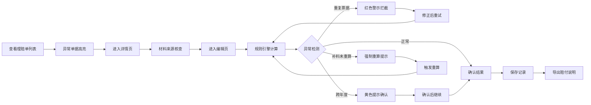

## 1. 产品概述
保险理赔免赔额复核工具，解决新同事在小额理赔复核时免赔额、共保比例计算错误，补充材料管理混乱的问题。
- 目标用户：保险理赔客服人员
- 核心价值：降低计算错误率，规范补料流程，留存审核痕迹

## 2. 核心功能

### 2.1 用户角色
| 角色 | 注册方式 | 核心权限 |
|------|----------|----------|
| 理赔客服 | 内部账号 | 查看列表、编辑理赔单、查看历史、导出结果 |

### 2.2 功能模块
1. **理赔单列表页**：分页列表、搜索筛选、快捷操作、异常标记
2. **理赔单详情页**：材料展示、来源追踪、赔付计算、异常提示
3. **理赔单编辑页**：规则引擎、票据去重、补料状态、赔付重算
4. **历史记录页**：版本对比、操作痕迹、修正原因
5. **导出功能**：赔付说明导出、计算明细导出

### 2.3 页面详情
| 页面名称 | 模块名称 | 功能描述 |
|----------|----------|----------|
| 理赔单列表 | 搜索筛选 | 按保单号、理赔状态、时间范围筛选 |
| 理赔单列表 | 异常标记 | 红色高亮重复报销、跨年度、未刷新结论的单据 |
| 理赔单列表 | 快捷操作 | 一键查看详情、快速编辑 |
| 理赔单详情 | 材料展示 | 保单、理赔单、票据、规则、结论卡片式展示 |
| 理赔单详情 | 来源追踪 | 每项数据标注来源（系统导入/人工录入） |
| 理赔单详情 | 异常提示 | 醒目警示条显示问题类型和处理建议 |
| 理赔单编辑 | 规则引擎 | 自动计算免赔额、共保比例、赔付金额 |
| 理赔单编辑 | 票据去重 | 实时检测票据号重复并拦截 |
| 理赔单编辑 | 补料状态 | 补料清单、待补/已补标记、催办提醒 |
| 理赔单编辑 | 赔付重算 | 补料后自动触发重算并提示确认 |
| 历史记录 | 版本对比 | 前后数据差异高亮显示 |
| 历史记录 | 操作痕迹 | 记录操作人、时间、修改原因 |
| 导出功能 | 说明导出 | 生成带计算过程的赔付说明文档 |

## 3. 核心流程
客服登录系统 → 查看理赔单列表（异常单据优先展示） → 进入详情页查看材料 → 进入编辑页复核计算 → 系统自动检测异常（重复票据/跨年/未重算） → 确认计算结果 → 补充材料/修正数据 → 重新计算 → 保存并导出赔付说明

## 4. 用户界面设计
### 4.1 设计风格
- 主色调：深蓝 #1e3a5f（专业可信），辅色：橙红 #e63946（异常警示）、浅绿 #2a9d8f（正常状态）
- 按钮风格：直角矩形，2px圆角，悬浮轻微上浮效果
- 字体：思源黑体（中文专业字体），标题18px，正文14px，备注12px
- 布局风格：卡片式分组，左侧导航+右侧内容，信息密度适中
- 图标风格：线性图标，异常状态用醒目的⚠️和🚫

### 4.2 页面设计概述
| 页面名称 | 模块名称 | UI元素 |
|----------|----------|--------|
| 理赔单列表 | 列表区域 | 表格布局，异常行红底，状态标签，快捷按钮 |
| 理赔单详情 | 材料卡片 | 分组卡片，来源标签（保单/票据/规则），数据字段对齐 |
| 理赔单编辑 | 计算面板 | 输入框即时计算，异常提示条，计算结果加粗显示 |
| 历史记录 | 版本对比 | 左右分栏，差异背景色高亮，操作时间线 |
| 导出弹窗 | 导出选项 | 复选框选择导出内容，预览按钮，下载按钮 |

### 4.3 响应性
- 桌面端优先，支持1920×1080及以上分辨率
- 左侧导航固定宽度240px，右侧内容自适应
- 表格支持横向滚动，关键列固定
