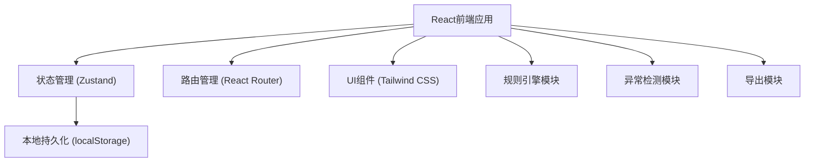
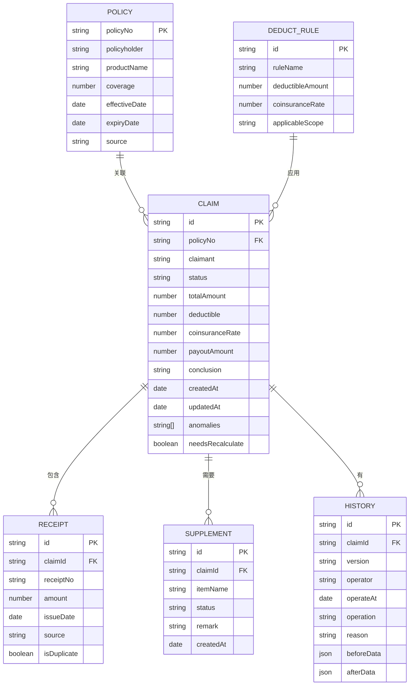

## 1. 架构设计



## 2. 技术描述
- 前端：React@18 + TypeScript + Tailwind CSS@3 + Vite
- 状态管理：Zustand（轻量，支持持久化）
- 路由：React Router@6
- 图标：Lucide React
- 数据存储：localStorage + 模拟数据（mock）
- 构建工具：Vite

## 3. 路由定义
| 路由 | 页面名称 | 功能描述 |
|------|----------|----------|
| / | 重定向到列表页 | 默认入口 |
| /claims | 理赔单列表页 | 展示所有理赔单，搜索筛选 |
| /claims/:id | 理赔单详情页 | 查看材料详情、计算结果、异常提示 |
| /claims/:id/edit | 理赔单编辑页 | 编辑数据、触发计算、异常检测 |
| /claims/:id/history | 历史记录页 | 查看版本历史和操作痕迹 |

## 4. 数据模型

### 4.1 数据模型定义



### 4.2 TypeScript 类型定义

```typescript
// 理赔单状态
type ClaimStatus = 'pending' | 'reviewing' | 'approved' | 'rejected' | 'supplement';

// 异常类型
type AnomalyType = 'duplicate_receipt' | 'cross_year' | 'not_recalculated' | 'missing_supplement';

interface Policy {
  policyNo: string;
  policyholder: string;
  productName: string;
  coverage: number;
  effectiveDate: string;
  expiryDate: string;
  source: 'system' | 'manual';
}

interface Receipt {
  id: string;
  receiptNo: string;
  amount: number;
  issueDate: string;
  source: 'system' | 'manual';
  isDuplicate?: boolean;
}

interface Supplement {
  id: string;
  itemName: string;
  status: 'pending' | 'provided' | 'waived';
  remark: string;
  createdAt: string;
}

interface DeductRule {
  id: string;
  ruleName: string;
  deductibleAmount: number;
  coinsuranceRate: number;
  applicableScope: string;
}

interface History {
  id: string;
  version: string;
  operator: string;
  operateAt: string;
  operation: 'create' | 'update' | 'calculate' | 'approve' | 'reject';
  reason: string;
  beforeData: Partial<Claim>;
  afterData: Partial<Claim>;
}

interface Claim {
  id: string;
  policyNo: string;
  claimant: string;
  status: ClaimStatus;
  totalAmount: number;
  deductible: number;
  coinsuranceRate: number;
  payoutAmount: number;
  conclusion: string;
  policy: Policy;
  receipts: Receipt[];
  supplements: Supplement[];
  deductRule: DeductRule;
  anomalies: AnomalyType[];
  needsRecalculate: boolean;
  createdAt: string;
  updatedAt: string;
  history: History[];
}
```

## 5. 核心模块设计

### 5.1 规则引擎
- 计算逻辑：赔付金额 = (总金额 - 免赔额) × 共保比例
- 跨年检测：比较票据日期与保单生效年度
- 自动应用规则：根据保单产品匹配免赔规则

### 5.2 异常检测
- 票据去重：维护全局票据号集合，实时检测重复
- 跨年检测：比较票据日期与保单年度
- 重算检测：补料后标记 needsRecalculate，保存前强制校验

### 5.3 持久化
- Zustand + localStorage 持久化整个状态树
- 页面刷新后自动恢复
- 支持版本迁移

### 5.4 导出模块
- 支持导出 JSON/CSV/PDF（前端生成）
- 导出内容包含计算明细和异常说明
