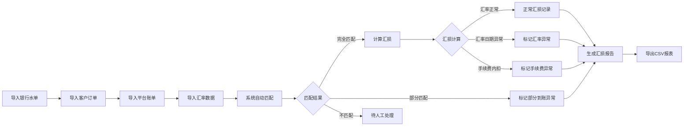

## 1. 产品概述

跨境收款汇损管理系统，专为外贸财务人员设计，解决多币种收款过程中汇率损失计算不清、数据追溯困难的核心痛点。通过自动化匹配、可视化分析和异常预警，让汇损一目了然。

- **目标用户**：外贸财务人员、跨境电商财务团队
- **核心价值**：告别表格拼接，实现汇损计算自动化、数据可追溯、异常透明化
- **解决问题**：汇率日期错用、部分到账、手续费内扣等场景下的汇损归因难题

## 2. 核心功能

### 2.1 用户角色

| 角色 | 登录方式 | 核心权限 |
|------|----------|----------|
| 财务人员 | 本地数据存储，无需登录 | 数据导入、汇损计算、报表导出、异常处理 |

### 2.2 功能模块

1. **数据导入中心**：银行水单、客户订单、平台账单、汇率数据、手续费记录的批量导入与查重
2. **到账匹配引擎**：自动匹配订单与到账记录，支持部分到账、多订单合并到账
3. **汇损计算核心**：多币种实时换算，支持汇率日期校验，区分正常汇损与异常差额
4. **异常预警中心**：汇率日期错用、部分到账、手续费内扣等场景的智能识别与标记
5. **可视化看板**：汇损趋势图、币种分布、异常统计，支持图表联动筛选
6. **数据追溯面板**：每笔汇损的来源链路、修正历史、操作痕迹完整记录
7. **报表导出**：支持 CSV 格式导出，包含完整的汇损明细与异常说明

### 2.3 页面详情

| 页面名称 | 模块名称 | 功能描述 |
|----------|----------|----------|
| 概览看板 | 数据统计卡片 | 展示总收款、总汇损、异常笔数、处理进度等关键指标 |
| 概览看板 | 趋势图表 | 汇损趋势折线图、币种分布饼图、异常类型柱状图，支持联动筛选 |
| 数据导入 | 导入区域 | 拖拽上传 CSV/Excel，支持银行水单、订单、平台账单等多种类型 |
| 数据导入 | 导入预览 | 数据预览、字段映射、重复数据检测与提示 |
| 到账匹配 | 匹配列表 | 展示订单与到账的匹配关系，支持手动调整 |
| 到账匹配 | 匹配详情 | 单条匹配的完整链路：订单→到账→手续费→汇损计算过程 |
| 汇损明细 | 汇损列表 | 按时间/币种/客户筛选的汇损明细表，支持排序 |
| 汇损明细 | 异常标记 | 异常汇损醒目展示，标注异常类型与原因说明 |
| 汇损明细 | 修正记录 | 展示每条记录的修改历史、操作人、修改时间 |
| 汇率管理 | 汇率列表 | 维护各币种历史汇率，支持手动修正 |
| 汇率管理 | 汇率校验 | 检测汇率日期与交易日期不匹配的情况 |

## 3. 核心流程

**主流程说明**：
1. 财务人员依次导入银行水单、客户订单、平台账单和汇率数据
2. 系统自动进行多维度匹配，识别完全匹配、部分匹配和不匹配的情况
3. 对匹配成功的记录进行汇损计算，同时检测汇率日期、手续费等异常
4. 所有计算结果和异常标记统一进入汇损报告
5. 支持人工复核、修正异常记录，所有操作留痕
6. 最终导出包含完整追溯信息的 CSV 报表

## 4. 用户界面设计

### 4.1 设计风格

- **主色调**：深蓝色 (#1e3a5f) - 专业稳重，契合金融财务场景
- **辅助色**：
  - 正常汇损：绿色 (#10b981)
  - 警告异常：橙色 (#f59e0b)
  - 严重异常：红色 (#ef4444)
  - 信息提示：蓝色 (#3b82f6)
- **背景**：浅灰渐变 (#f8fafc → #f1f5f9)，卡片白色圆角
- **按钮风格**：圆角 8px，轻微阴影，hover 时上浮效果
- **字体**：
  - 标题：Noto Sans SC Bold
  - 正文：Noto Sans SC Regular
  - 数字：JetBrains Mono（等宽字体，便于数值对比）
- **布局风格**：卡片式布局，顶部导航 + 侧边菜单 + 主内容区
- **图标**：Lucide 图标库，线条风格，统一 20px 尺寸

### 4.2 页面设计要点

| 页面名称 | 模块名称 | UI 元素 |
|----------|----------|---------|
| 概览看板 | 统计卡片 | 4张关键指标卡片，带趋势箭头，背景微渐变 |
| 概览看板 | 图表区 | 三栏布局，折线图+饼图+柱状图，点击筛选联动 |
| 数据导入 | 拖拽区域 | 虚线边框，蓝色高亮，支持文件预览 |
| 数据导入 | 导入预览 | 表格展示前10行，字段映射下拉选择 |
| 到账匹配 | 匹配列表 | 时间线样式展示匹配链路，异常项红色边框 |
| 汇损明细 | 数据表格 | 斑马纹，异常行背景色区分，悬停显示详情 |
| 汇损明细 | 详情抽屉 | 右侧滑出，展示完整计算过程和修正历史 |

### 4.3 响应式设计

- 桌面端（1280px+）：完整三栏布局，侧边菜单展开
- 平板（768px-1279px）：侧边菜单可折叠，图表两栏布局
- 移动端（<768px）：顶部导航，卡片单列展示，表格横向滚动

### 4.4 交互体验

- 数据导入时进度条动画，异常数据逐行高亮
- 图表支持框选放大，点击数据点跳转至对应明细
- 异常记录标记醒目，点击展开异常说明和处理建议
- 所有修改操作弹出确认框，记录操作日志
- 页面切换时淡入淡出过渡，卡片 hover 轻微上浮
