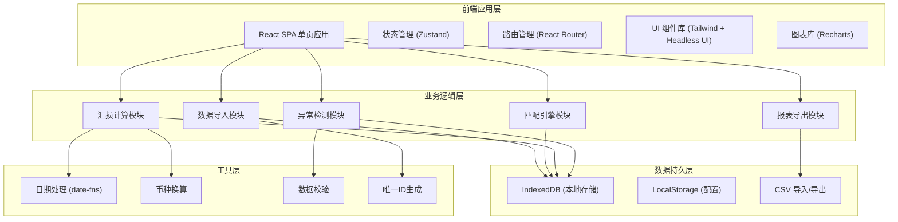
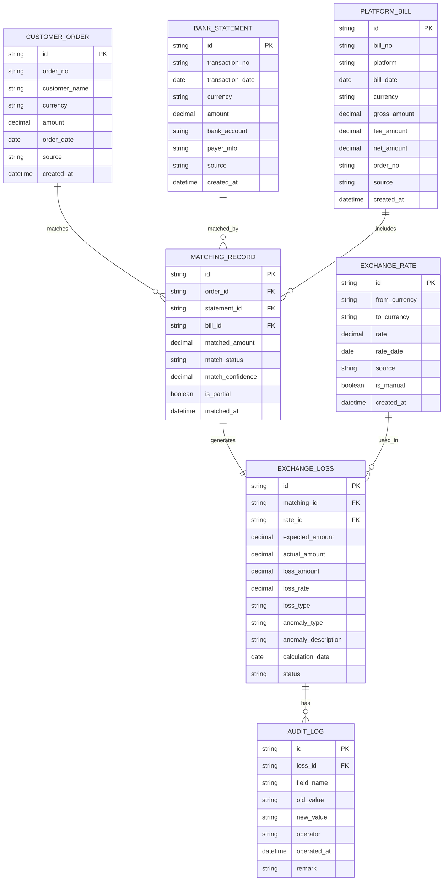

## 1. 架构设计



## 2. 技术选型

- **前端框架**：React@18 + TypeScript@5
- **构建工具**：Vite@5
- **样式方案**：TailwindCSS@3 + PostCSS
- **状态管理**：Zustand（轻量级，适合本地数据场景）
- **路由管理**：React Router@6
- **UI 组件**：Headless UI（无样式组件）+ Lucide React（图标）
- **图表库**：Recharts（React 友好，支持联动交互）
- **本地存储**：IndexedDB（dexie.js 封装）+ LocalStorage
- **日期处理**：date-fns（轻量，Tree-shaking 友好）
- **CSV 处理**：papaparse（解析）+ 自定义导出
- **数据校验**：zod（TypeScript 优先的校验库）

## 3. 目录结构

```
src/
├── components/          # 通用组件
│   ├── layout/         # 布局组件（侧边栏、顶部导航）
│   ├── ui/             # 基础UI组件（按钮、表格、卡片等）
│   ├── charts/         # 图表组件
│   └── forms/          # 表单组件
├── pages/              # 页面组件
│   ├── Dashboard.tsx   # 概览看板
│   ├── Import.tsx      # 数据导入
│   ├── Matching.tsx    # 到账匹配
│   ├── ExchangeLoss.tsx # 汇损明细
│   └── Rates.tsx       # 汇率管理
├── store/              # 状态管理
│   ├── useDataStore.ts # 核心数据store
│   └── useUIStore.ts   # UI状态store
├── services/           # 业务逻辑层
│   ├── importService.ts
│   ├── matchingService.ts
│   ├── exchangeService.ts
│   └── exportService.ts
├── db/                 # 数据库层
│   ├── dexie.ts        # IndexedDB 配置
│   └── schema.ts       # 数据模型定义
├── utils/              # 工具函数
│   ├── currency.ts     # 币种换算
│   ├── date.ts         # 日期处理
│   ├── validators.ts   # 数据校验
│   └── csv.ts          # CSV处理
├── types/              # TypeScript 类型定义
│   └── index.ts
├── hooks/              # 自定义Hooks
│   ├── useImport.ts
│   └── useExchange.ts
├── mock/               # Mock 数据
│   └── seed.ts         # 造数脚本
├── App.tsx
├── main.tsx
└── index.css
```

## 4. 路由定义

| 路由路径 | 页面名称 | 说明 |
|----------|----------|------|
| `/` | 概览看板 | 数据统计、趋势图表、异常概览 |
| `/import` | 数据导入 | 多类型数据导入、预览、查重 |
| `/matching` | 到账匹配 | 自动匹配结果、手动调整 |
| `/loss` | 汇损明细 | 汇损列表、异常标记、详情追溯 |
| `/rates` | 汇率管理 | 汇率维护、日期校验 |

## 5. 数据模型

### 5.1 ER 图



### 5.2 核心数据结构定义

```typescript
// 客户订单
interface CustomerOrder {
  id: string;
  orderNo: string;
  customerName: string;
  currency: string;
  amount: number;
  orderDate: string;
  source: string;
  createdAt: string;
}

// 银行水单
interface BankStatement {
  id: string;
  transactionNo: string;
  transactionDate: string;
  currency: string;
  amount: number;
  bankAccount: string;
  payerInfo: string;
  source: string;
  createdAt: string;
}

// 平台账单
interface PlatformBill {
  id: string;
  billNo: string;
  platform: string;
  billDate: string;
  currency: string;
  grossAmount: number;
  feeAmount: number;
  netAmount: number;
  orderNo: string;
  source: string;
  createdAt: string;
}

// 汇率
interface ExchangeRate {
  id: string;
  fromCurrency: string;
  toCurrency: string;
  rate: number;
  rateDate: string;
  source: string;
  isManual: boolean;
  createdAt: string;
}

// 匹配记录
type MatchStatus = 'full' | 'partial' | 'unmatched' | 'manual';

interface MatchingRecord {
  id: string;
  orderId: string;
  statementId: string;
  billId?: string;
  matchedAmount: number;
  matchStatus: MatchStatus;
  matchConfidence: number;
  isPartial: boolean;
  matchedAt: string;
}

// 汇损记录
type LossType = 'normal' | 'fee' | 'rate' | 'partial';
type AnomalyType = 'none' | 'rate_date_mismatch' | 'partial_receipt' | 'fee_deducted' | 'duplicate' | 'rate_abnormal';

interface ExchangeLoss {
  id: string;
  matchingId: string;
  rateId: string;
  expectedAmount: number;
  actualAmount: number;
  lossAmount: number;
  lossRate: number;
  lossType: LossType;
  anomalyType: AnomalyType;
  anomalyDescription: string;
  calculationDate: string;
  status: 'pending' | 'confirmed' | 'adjusted';
}

// 审计日志
interface AuditLog {
  id: string;
  lossId: string;
  fieldName: string;
  oldValue: string;
  newValue: string;
  operator: string;
  operatedAt: string;
  remark: string;
}
```

## 6. 核心算法说明

### 6.1 匹配算法
- **主键匹配**：通过订单号关联订单、水单、账单
- **金额匹配**：允许 ±1% 容差的金额模糊匹配
- **日期匹配**：交易日期前后7天内的时间窗口匹配
- **置信度计算**：多维度加权评分，超过80分自动匹配

### 6.2 汇损计算
```
预期到账金额 = 订单外币金额 × 订单日汇率
实际到账金额 = 水单到账金额 - 平台手续费
汇损金额 = 预期到账金额 - 实际到账金额
汇损率 = 汇损金额 / 预期到账金额 × 100%
```

### 6.3 异常检测规则
- **汇率日期异常**：使用的汇率日期与交易日期相差超过3天
- **部分到账**：实际到账金额 < 订单金额的95%
- **手续费内扣**：手续费占比超过正常范围（>5%）
- **重复导入**：相同交易号、金额、日期的记录已存在
- **汇率异常**：当日汇率与近30天平均汇率偏差超过10%
