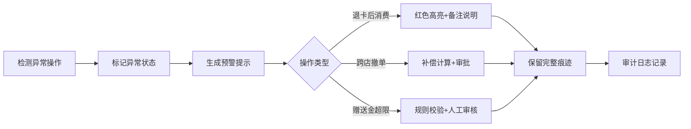

## 1. 产品概述

储值卡沉淀余额管理系统，用于连锁门店财务对账，理清会员卡、充值、赠送金、跨店消费、退卡等复杂场景的余额计算。

- **核心问题**：赠送金优先级、跨店撤单、退卡后再消费等场景导致统计偏差
- **目标用户**：连锁财务人员、门店店长
- **产品价值**：提供可追溯的余额账本，保留所有操作痕迹，支持审计导出

## 2. 核心功能

### 2.1 用户角色

| 角色 | 注册方式 | 核心权限 |
|------|---------|---------|
| 财务管理员 | 本地登录 | 全部功能、规则配置、审计导出 |
| 门店操作员 | 本地登录 | 充值、消费、退卡申请、余额查询 |

### 2.2 功能模块

1. **仪表盘**：余额概览、异常预警、月度统计图表
2. **会员卡管理**：卡信息、余额明细、状态管理
3. **充值流水**：充值记录、赠送金计算、来源追溯
4. **消费记账**：跨店消费、门店分摊、撤销补偿
5. **退卡管理**：退卡申请、审核、退款计算
6. **规则版本**：赠送金规则、版本管理、历史追溯
7. **审计中心**：操作日志、余额快照、导出报表

### 2.3 页面详情

| 页面名称 | 模块名称 | 功能描述 |
|---------|---------|---------|
| 仪表盘 | 概览卡片 | 总储值、沉淀余额、异常数量、本月新增 |
| 仪表盘 | 趋势图表 | 月度余额变化、门店占比饼图 |
| 仪表盘 | 异常预警 | 赠送金超限、退卡后消费、跨店撤单提醒 |
| 会员卡 | 卡列表 | 搜索、筛选、状态标签 |
| 会员卡 | 余额账本 | 每笔变动的借贷记录、来源追溯 |
| 充值流水 | 充值记录 | 本金/赠送金拆分、规则版本关联 |
| 消费记账 | 消费录入 | 门店选择、金额拆分（本金/赠送金） |
| 消费记账 | 撤单处理 | 撤销原因、补偿计算、痕迹保留 |
| 退卡管理 | 退卡申请 | 余额计算、退款金额、审核流程 |
| 规则配置 | 赠送金规则 | 充值档位、赠送比例、生效时间 |
| 审计中心 | 操作日志 | 所有操作的完整记录、操作者、时间 |
| 审计中心 | 余额快照 | 每日余额快照、对比差异 |

## 3. 核心流程

### 3.1 余额计算流程

### 3.2 异常处理流程

## 4. 用户界面设计

### 4.1 设计风格

- **主色调**：深海军蓝 (#0F2A4A) - 专业、可信赖
- **辅助色**：金色 (#D4AF37) - 财务、价值感
- **警示色**：珊瑚红 (#E74C3C) - 异常提醒、橙色 (#F39C12) - 警告
- **成功色**：翡翠绿 (#27AE60) - 正常状态
- **布局风格**：卡片式布局，左侧导航栏，顶部状态栏
- **按钮风格**：圆角4px，悬停微阴影，点击反馈
- **字体**：思源宋体（标题）+ 思源黑体（正文），财务报表专业感

### 4.2 页面设计概述

| 页面名称 | 模块名称 | UI元素 |
|---------|---------|--------|
| 仪表盘 | 概览卡片 | 渐变背景、数字放大动画、趋势小图标 |
| 仪表盘 | 异常预警 | 红色边框闪烁、展开查看详情、操作按钮 |
| 余额账本 | 时间线 | 借贷分色、来源标签、悬停显示详情 |
| 规则配置 | 版本对比 | 左右分栏、差异高亮、切换动画 |
| 审计中心 | 日志列表 | 搜索筛选、导出按钮、时间戳 |

### 4.3 响应式

- Desktop-first 设计
- 平板端：导航折叠，卡片自适应
- 移动端：单列布局，重要信息优先展示

### 4.4 交互细节

- 异常记录悬停时显示完整原因说明
- 账本记录点击展开完整上下文
- 规则修改时显示版本对比预览
- 导出时显示进度条和完成提示
