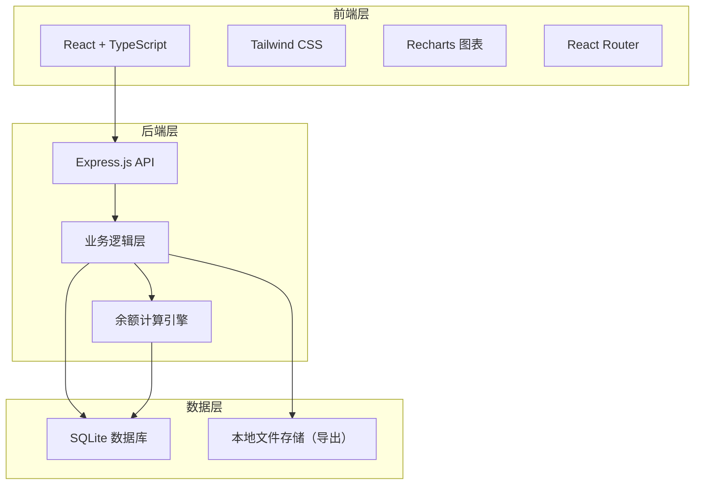
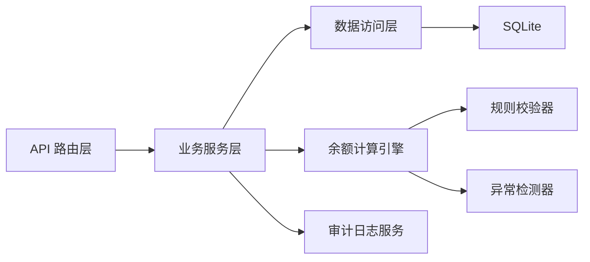
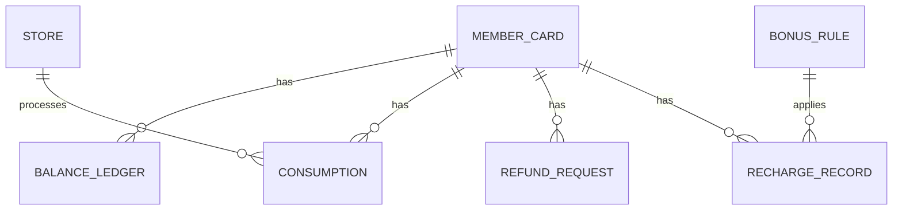

## 1. 架构设计



## 2. 技术描述

- **前端**：React@18 + TypeScript + TailwindCSS@3 + Vite
- **后端**：Express@4 + TypeScript
- **数据库**：SQLite（本地文件，无需额外服务）
- **图表**：Recharts
- **状态管理**：React Context + useReducer
- **路由**：React Router v6

## 3. 路由定义

| 路由 | 页面 | 功能 |
|------|------|------|
| / | 仪表盘 | 概览、图表、异常预警 |
| /cards | 会员卡列表 | 会员卡管理、搜索筛选 |
| /cards/:id | 会员卡详情 | 余额账本、操作记录 |
| /recharge | 充值流水 | 充值记录、赠送金计算 |
| /consume | 消费记账 | 消费录入、撤单处理 |
| /refund | 退卡管理 | 退卡申请、审核 |
| /rules | 规则配置 | 赠送金规则、版本管理 |
| /audit | 审计中心 | 操作日志、导出报表 |

## 4. API 定义

```typescript
// 会员卡
interface MemberCard {
  id: string;
  cardNo: string;
  userName: string;
  phone: string;
  principalBalance: number;
  bonusBalance: number;
  status: 'active' | 'frozen' | 'refunded';
  createdAt: string;
  updatedAt: string;
}

// 余额账本
interface BalanceLedger {
  id: string;
  cardId: string;
  type: 'recharge' | 'consume' | 'refund' | 'bonus' | 'adjust';
  amount: number;
  principalAmount: number;
  bonusAmount: number;
  balanceAfter: number;
  principalAfter: number;
  bonusAfter: number;
  source: string;
  sourceId: string;
  operator: string;
  remark: string;
  isException: boolean;
  exceptionType?: string;
  createdAt: string;
}

// 赠送金规则
interface BonusRule {
  id: string;
  version: number;
  name: string;
  tiers: { minAmount: number; bonusRate: number; maxBonus?: number }[];
  priority: 'bonus_first' | 'principal_first';
  effectiveFrom: string;
  effectiveTo?: string;
  isActive: boolean;
  createdBy: string;
  createdAt: string;
}

// 消费记录
interface Consumption {
  id: string;
  cardId: string;
  storeId: string;
  storeName: string;
  amount: number;
  principalUsed: number;
  bonusUsed: number;
  isCrossStore: boolean;
  isReversed: boolean;
  reversedAt?: string;
  reverseReason?: string;
  operator: string;
  createdAt: string;
}

// 退卡申请
interface RefundRequest {
  id: string;
  cardId: string;
  principalBalance: number;
  bonusBalance: number;
  refundAmount: number;
  status: 'pending' | 'approved' | 'rejected';
  applicant: string;
  approver?: string;
  approvedAt?: string;
  rejectReason?: string;
  createdAt: string;
}

// 操作日志
interface AuditLog {
  id: string;
  action: string;
  module: string;
  operator: string;
  ip?: string;
  details: Record<string, any>;
  createdAt: string;
}
```

## 5. 服务端架构



## 6. 数据模型

### 6.1 ER 图



### 6.2 DDL 语句

```sql
-- 门店表
CREATE TABLE stores (
  id TEXT PRIMARY KEY,
  name TEXT NOT NULL,
  code TEXT UNIQUE NOT NULL,
  address TEXT,
  is_active INTEGER DEFAULT 1,
  created_at TEXT DEFAULT CURRENT_TIMESTAMP
);

-- 会员卡表
CREATE TABLE member_cards (
  id TEXT PRIMARY KEY,
  card_no TEXT UNIQUE NOT NULL,
  user_name TEXT NOT NULL,
  phone TEXT,
  principal_balance REAL DEFAULT 0,
  bonus_balance REAL DEFAULT 0,
  status TEXT DEFAULT 'active',
  created_at TEXT DEFAULT CURRENT_TIMESTAMP,
  updated_at TEXT DEFAULT CURRENT_TIMESTAMP
);

-- 赠送金规则表
CREATE TABLE bonus_rules (
  id TEXT PRIMARY KEY,
  version INTEGER NOT NULL,
  name TEXT NOT NULL,
  tiers TEXT NOT NULL,
  priority TEXT DEFAULT 'bonus_first',
  effective_from TEXT NOT NULL,
  effective_to TEXT,
  is_active INTEGER DEFAULT 1,
  created_by TEXT NOT NULL,
  created_at TEXT DEFAULT CURRENT_TIMESTAMP
);

-- 充值记录表
CREATE TABLE recharge_records (
  id TEXT PRIMARY KEY,
  card_id TEXT NOT NULL,
  rule_id TEXT,
  principal_amount REAL NOT NULL,
  bonus_amount REAL DEFAULT 0,
  total_amount REAL NOT NULL,
  operator TEXT NOT NULL,
  source TEXT,
  remark TEXT,
  created_at TEXT DEFAULT CURRENT_TIMESTAMP,
  FOREIGN KEY (card_id) REFERENCES member_cards(id),
  FOREIGN KEY (rule_id) REFERENCES bonus_rules(id)
);

-- 余额账本表
CREATE TABLE balance_ledger (
  id TEXT PRIMARY KEY,
  card_id TEXT NOT NULL,
  type TEXT NOT NULL,
  amount REAL NOT NULL,
  principal_amount REAL DEFAULT 0,
  bonus_amount REAL DEFAULT 0,
  balance_after REAL NOT NULL,
  principal_after REAL NOT NULL,
  bonus_after REAL NOT NULL,
  source TEXT NOT NULL,
  source_id TEXT NOT NULL,
  operator TEXT NOT NULL,
  remark TEXT,
  is_exception INTEGER DEFAULT 0,
  exception_type TEXT,
  created_at TEXT DEFAULT CURRENT_TIMESTAMP,
  FOREIGN KEY (card_id) REFERENCES member_cards(id)
);

-- 消费记录表
CREATE TABLE consumptions (
  id TEXT PRIMARY KEY,
  card_id TEXT NOT NULL,
  store_id TEXT NOT NULL,
  store_name TEXT NOT NULL,
  amount REAL NOT NULL,
  principal_used REAL NOT NULL,
  bonus_used REAL NOT NULL,
  is_cross_store INTEGER DEFAULT 0,
  is_reversed INTEGER DEFAULT 0,
  reversed_at TEXT,
  reverse_reason TEXT,
  operator TEXT NOT NULL,
  created_at TEXT DEFAULT CURRENT_TIMESTAMP,
  FOREIGN KEY (card_id) REFERENCES member_cards(id),
  FOREIGN KEY (store_id) REFERENCES stores(id)
);

-- 退卡申请表
CREATE TABLE refund_requests (
  id TEXT PRIMARY KEY,
  card_id TEXT NOT NULL,
  principal_balance REAL NOT NULL,
  bonus_balance REAL NOT NULL,
  refund_amount REAL NOT NULL,
  status TEXT DEFAULT 'pending',
  applicant TEXT NOT NULL,
  approver TEXT,
  approved_at TEXT,
  reject_reason TEXT,
  created_at TEXT DEFAULT CURRENT_TIMESTAMP,
  FOREIGN KEY (card_id) REFERENCES member_cards(id)
);

-- 操作日志表
CREATE TABLE audit_logs (
  id TEXT PRIMARY KEY,
  action TEXT NOT NULL,
  module TEXT NOT NULL,
  operator TEXT NOT NULL,
  details TEXT,
  created_at TEXT DEFAULT CURRENT_TIMESTAMP
);

-- 余额快照表
CREATE TABLE balance_snapshots (
  id TEXT PRIMARY KEY,
  snapshot_date TEXT NOT NULL,
  card_id TEXT NOT NULL,
  principal_balance REAL NOT NULL,
  bonus_balance REAL NOT NULL,
  total_balance REAL NOT NULL,
  created_at TEXT DEFAULT CURRENT_TIMESTAMP,
  UNIQUE(snapshot_date, card_id)
);

-- 索引
CREATE INDEX idx_ledger_card_id ON balance_ledger(card_id);
CREATE INDEX idx_ledger_created_at ON balance_ledger(created_at);
CREATE INDEX idx_consumption_card_id ON consumptions(card_id);
CREATE INDEX idx_audit_created_at ON audit_logs(created_at);
```
