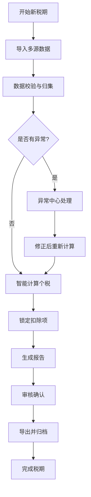

## 1. 产品概述

工资个税专项扣除管理系统，解决人事月底工资核算时多表数据分散、扣除错位、补发跨期等痛点，实现一站式数据归集、智能计算、异常预警和报告导出。

- 目标用户：企业薪酬专员、财务人员
- 核心价值：减少人工核对错误，提高个税核算效率，确保合规性
- 解决问题：扣除月份错位、补发跨税期、离职后仍计社保等异常情况自动识别

## 2. 核心功能

### 2.1 用户角色

| 角色 | 注册方式 | 核心权限 |
|------|----------|----------|
| 薪酬专员 | 企业账号登录 | 数据导入、计算、异常处理、报告导出 |
| 财务审核 | 企业账号登录 | 查看报告、审核确认、导出存档 |

### 2.2 功能模块

1. **数据导入中心**：支持多源数据导入（员工档案、工资项、专项扣除、补发记录、离职日期、个税试算）
2. **税期归集工作台**：按税期统一管理所有工资数据，支持扣除月份锁定
3. **智能计算引擎**：自动计算个税、专项扣除、补发重算、社保调整
4. **异常检测中心**：实时检测扣除错位、跨期补发、离职后社保等异常并高亮提示
5. **报告导出模块**：生成可下载的Excel/PDF报告，包含明细和异常说明
6. **操作审计追踪**：记录每次数据修正的来源、时间、操作人，保留完整痕迹

### 2.3 页面详情

| 页面名称 | 模块名称 | 功能描述 |
|---------|----------|----------|
| 首页概览 | 数据看板 | 显示当前税期进度、异常数量、待处理事项 |
| 首页概览 | 快捷入口 | 快速跳转至导入、计算、报告等核心功能 |
| 数据导入 | 多源导入 | 支持Excel样例导入，拖拽上传，数据预览 |
| 数据导入 | 数据校验 | 导入时自动校验格式和数据完整性 |
| 税期管理 | 税期列表 | 按月/季展示税期状态（未开始/进行中/已锁定/已完成） |
| 税期管理 | 扣除锁定 | 支持锁定已确认的扣除项，防止误修改 |
| 工资计算 | 计算工作台 | 展示员工工资明细，支持单条/批量重算 |
| 工资计算 | 补发处理 | 跨税期补发自动识别和税额调整 |
| 异常中心 | 异常列表 | 按类型分类展示所有异常，支持筛选和搜索 |
| 异常中心 | 异常详情 | 展示异常来源、影响范围、处理建议 |
| 报告中心 | 报告生成 | 一键生成工资明细报告、异常报告、个税汇总报告 |
| 报告中心 | 历史报告 | 查看和下载历史税期报告 |
| 操作日志 | 审计追踪 | 查看所有数据修改记录，支持溯源 |

## 3. 核心流程

## 4. 用户界面设计

### 4.1 设计风格

- **主色调**：深蓝色 #1E40AF（专业、可信赖），辅助色：橙色 #F97316（异常提醒）、绿色 #10B981（正常状态）
- **按钮风格**：圆角4px，扁平化设计，主按钮深蓝色填充，次要按钮边框样式
- **字体**：中文使用 PingFang SC，数字使用等宽字体，清晰易读
- **布局风格**：顶部导航 + 左侧菜单 + 内容区域的三段式布局，卡片式展示数据
- **图标风格**：线性图标，简洁现代，异常状态使用醒目图标

### 4.2 页面设计概览

| 页面名称 | 模块名称 | UI元素 |
|---------|----------|--------|
| 首页概览 | 数据看板 | 统计卡片、进度条、异常徽章、趋势图表 |
| 数据导入 | 多源导入 | 拖拽上传区、文件列表、预览表格、校验状态标签 |
| 税期管理 | 税期列表 | 时间线视图、状态标签、锁定开关、操作按钮 |
| 工资计算 | 计算工作台 | 数据表格（支持固定列、筛选、排序）、批量操作栏、计算进度条 |
| 异常中心 | 异常列表 | 分类标签页、异常卡片（带来源标识）、处理状态流转 |
| 报告中心 | 报告生成 | 报告类型选择器、预览区域、下载按钮、导出进度 |

### 4.3 响应式

- 桌面端优先设计（1920×1080）
- 平板端适配：侧边栏可收起，表格支持横向滚动
- 移动端：核心功能可访问，优化表格展示，支持左右滑动查看

### 4.4 数据可视化

- 使用柱状图展示各税期工资/个税趋势
- 饼图展示异常类型分布
- 进度条展示税期处理进度
- 热力图展示各部门工资分布
