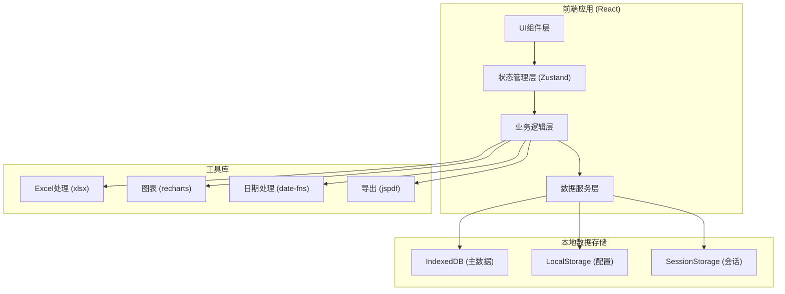
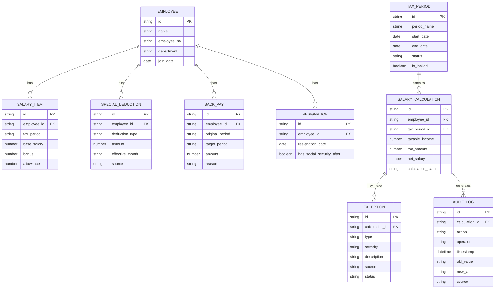

## 1. 架构设计



## 2. 技术描述

- **前端框架**：React@18 + TypeScript
- **构建工具**：Vite@5
- **样式方案**：TailwindCSS@3
- **状态管理**：Zustand（轻量级，适合中后台系统）
- **路由管理**：React Router@6
- **UI组件库**：Ant Design@5（企业级中后台组件）
- **图表库**：Recharts@2
- **Excel处理**：xlsx@0.18
- **PDF导出**：jspdf@2
- **日期处理**：date-fns@2
- **本地存储**：IndexedDB（存储大量工资数据）+ LocalStorage

## 3. 路由定义

| 路由 | 页面 | 说明 |
|------|------|------|
| / | 首页概览 | 数据看板、快捷入口 |
| /import | 数据导入 | 多源数据导入、预览、校验 |
| /tax-periods | 税期管理 | 税期列表、状态管理、扣除锁定 |
| /calculation | 工资计算 | 计算工作台、补发处理、批量操作 |
| /exceptions | 异常中心 | 异常列表、详情、处理 |
| /reports | 报告中心 | 报告生成、预览、下载 |
| /audit-logs | 操作日志 | 审计追踪、操作历史 |

## 4. 数据模型

### 4.1 数据模型定义



### 4.2 核心数据结构

#### 员工档案 (Employee)
```typescript
interface Employee {
  id: string;
  name: string;
  employeeNo: string;
  department: string;
  position: string;
  joinDate: string;
  idCard: string;
  socialSecurityBase: number;
  housingFundBase: number;
}
```

#### 工资项 (SalaryItem)
```typescript
interface SalaryItem {
  id: string;
  employeeId: string;
  taxPeriod: string;
  baseSalary: number;
  performanceBonus: number;
  overtimePay: number;
  allowance: number;
  otherIncome: number;
  socialSecurityPersonal: number;
  housingFundPersonal: number;
}
```

#### 专项扣除 (SpecialDeduction)
```typescript
interface SpecialDeduction {
  id: string;
  employeeId: string;
  deductionType: 'children_education' | 'continuing_education' | 'housing_loan' | 'housing_rent' | 'elderly_care' | 'infant_care';
  amount: number;
  effectiveMonth: string;
  expiryMonth?: string;
  source: 'employee_declaration' | 'system_import' | 'manual_adjustment';
  isLocked: boolean;
}
```

#### 补发记录 (BackPay)
```typescript
interface BackPay {
  id: string;
  employeeId: string;
  originalPeriod: string;
  targetPeriod: string;
  amount: number;
  reason: string;
  taxAdjustment: number;
  isCrossPeriod: boolean;
}
```

#### 离职记录 (Resignation)
```typescript
interface Resignation {
  id: string;
  employeeId: string;
  resignationDate: string;
  lastWorkingDay: string;
  socialSecurityEndMonth: string;
  housingFundEndMonth: string;
  hasSeverancePay: boolean;
  severancePayAmount: number;
}
```

#### 异常记录 (Exception)
```typescript
interface Exception {
  id: string;
  type: 'deduction_mismatch' | 'backpay_cross_period' | 'social_security_after_resign' | 'data_inconsistency' | 'calculation_error';
  severity: 'error' | 'warning' | 'info';
  employeeId: string;
  taxPeriod: string;
  description: string;
  source: string;
  affectedFields: string[];
  suggestion: string;
  status: 'pending' | 'resolved' | 'ignored';
  createdAt: string;
  resolvedAt?: string;
  resolvedBy?: string;
}
```

#### 操作日志 (AuditLog)
```typescript
interface AuditLog {
  id: string;
  entityType: 'employee' | 'salary' | 'deduction' | 'backpay' | 'calculation';
  entityId: string;
  action: 'create' | 'update' | 'delete' | 'import' | 'calculate' | 'lock' | 'unlock';
  operator: string;
  timestamp: string;
  oldValue?: string;
  newValue?: string;
  source: string;
  remark?: string;
}
```

## 5. 核心算法

### 5.1 个税计算公式
```
应纳税所得额 = 税前工资 - 五险一金个人部分 - 起征点(5000) - 专项扣除合计
应纳税额 = 应纳税所得额 × 适用税率 - 速算扣除数
实发工资 = 税前工资 - 五险一金个人部分 - 应纳税额 - 其他扣款
```

### 5.2 异常检测规则
1. **扣除月份错位**：检查专项扣除的生效月份是否与当前税期匹配
2. **补发跨税期**：检测补发记录的原期间与目标期间是否跨税期
3. **离职后社保**：检查离职日期后是否仍在缴纳社保/公积金
4. **数据不一致**：比对不同来源的同一数据项是否存在差异
5. **计算异常**：校验计算结果是否在合理范围内

### 5.3 跨期补发重算
```
1. 将补发金额分配至原所属月份
2. 重新计算原月份应纳税额
3. 计算税额差异
4. 在当前税期进行调整
```
