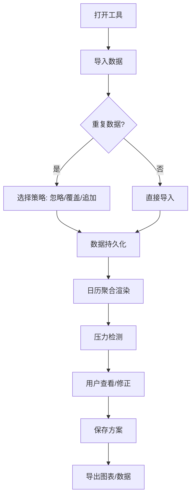

## 1. 产品概述

面向创业公司决策者的"现金流压力日历"Web工具，将工资、房租、贷款、大客户回款等关键现金流事件聚合到日历视图，提前预警压力日，支持多方案对比与图表导出。

- **核心痛点**：老板靠表格和截图拼凑现金流视图，无法实时看到多笔支付/回款撞日、回款延迟、余额穿透等高风险场景
- **目标用户**：创业公司老板、财务负责人
- **产品价值**：一页日历即看全局，压力日醒目提示，修正留痕不混算，方案可保存对比，数据可重复导入

## 2. 核心功能

### 2.1 用户角色
| 角色 | 注册方式 | 核心权限 |
|------|----------|----------|
| 财务用户 | 无需注册（本地工具） | 导入数据、查看日历、修正数据、保存方案、导出图表 |

### 2.2 功能模块
1. **日历主视图**：月历网格 + 日现金流聚合 + 压力日标识
2. **数据导入面板**：付款计划、回款预测、账户余额批量导入，支持忽略/覆盖/追加策略
3. **数据修正面板**：逐条修改，保留来源和修正痕迹
4. **余额预测面板**：逐日余额曲线，标注穿透点
5. **方案管理面板**：方案保存、切换、对比
6. **导出面板**：图表/数据导出

### 2.3 页面详情
| 页面名称 | 模块名称 | 功能描述 |
|----------|----------|----------|
| 日历主页 | 月历网格 | 每日显示：流入/流出净额、事件计数、压力等级颜色标识 |
| 日历主页 | 日详情抽屉 | 点击日期展开：当日所有现金流条目列表，含来源/类型/金额/优先级/备注 |
| 日历主页 | 顶部筛选栏 | 按类型（工资/房租/贷款/回款）、优先级、是否延期筛选 |
| 日历主页 | 余额预测区 | 未来30/90天余额趋势图，穿透日红色警示 |
| 数据管理页 | 导入面板 | CSV/JSON批量导入，选择忽略/覆盖/追加策略，显示导入预览与冲突提示 |
| 数据管理页 | 数据列表 | 所有现金流条目，支持编辑/删除/标记延期，显示修正历史 |
| 数据管理页 | 账户设置 | 初始余额、安全线设置 |
| 方案管理页 | 方案列表 | 保存的方案卡片，支持切换/重命名/删除/对比 |
| 方案管理页 | 导出面板 | 图表PNG导出、数据CSV导出、方案JSON导出 |

## 3. 核心流程

用户打开工具 → 导入付款计划/回款预测/账户余额（选择忽略/覆盖/追加策略）→ 日历自动聚合显示 → 查看压力日详情 → 修正数据（标记延期、调整金额）→ 保存为方案 → 切换方案对比 → 导出图表/数据

## 4. 用户界面设计

### 4.1 设计风格
- **主色调**：深蓝色 (#1a365d) 背景，琥珀色 (#d69e2e) 警告，红色 (#e53e3e) 危险，绿色 (#38a169) 安全
- **按钮风格**：圆角 (8px)，悬停微阴影
- **字体**：数字用 JetBrains Mono，正文用系统无衬线字体
- **布局风格**：左侧日历主区 + 右侧可折叠详情面板
- **图标**：Lucide 图标库，线性风格

### 4.2 页面设计概览
| 页面名称 | 模块名称 | UI元素 |
|----------|----------|----------|
| 日历主页 | 月历网格 | 6x7网格，每日卡片含净额数字、事件徽章、压力颜色边框 |
| 日历主页 | 日详情抽屉 | 右侧滑出，列表式条目，含来源标签、金额、优先级徽章 |
| 日历主页 | 顶部筛选栏 | 芯片式筛选按钮（工资/房租/贷款/回款），优先级下拉 |
| 日历主页 | 余额预测区 | 紧凑折线图，X轴日期，Y轴余额，安全线虚线 |
| 数据管理页 | 导入面板 | 拖放区 + 策略选择器（忽略/覆盖/追加）+ 预览表格 |
| 数据管理页 | 数据列表 | 表格，行可展开查看修正历史，操作按钮内嵌 |
| 方案管理页 | 方案列表 | 卡片网格，当前方案高亮，对比模式复选框 |

### 4.3 响应式设计
- 桌面优先（≥1280px），日历主区最小宽度 800px
- 平板（768-1279px）：右侧抽屉改为底部弹出
- 移动端（<768px）：日历改为周视图，详情全屏展开

## 5. 压力检测规则

| 压力类型 | 检测条件 | 提示级别 |
|----------|----------|----------|
| 回款延迟 | 回款条目标记为延期 | ⚠️ 黄色警告 |
| 同日多笔大额 | 当日流出净额 > 月均日流出 2倍 | 🔴 红色危险 |
| 余额穿透 | 预测余额 < 安全线 | 🔴 红色危险 + 弹窗提醒 |
| 延期后穿透 | 延期后重新计算导致余额穿透 | 🔴 红色危险 + 标注"延期导致" |
| 高优先级撞日 | 同日≥2笔高优先级流出 | ⚠️ 黄色警告 |