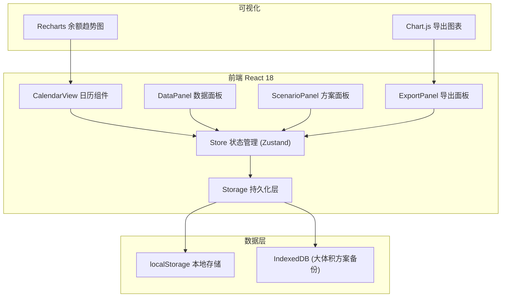
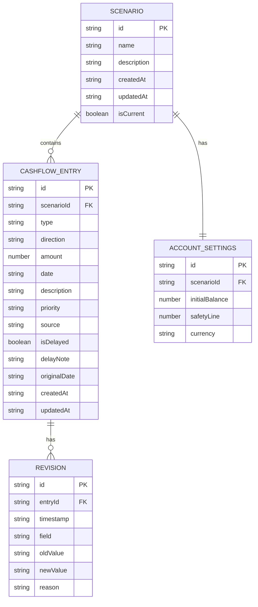

## 1. 架构设计



## 2. 技术选型说明

| 层级 | 技术 | 版本 | 说明 |
|------|------|------|------|
| 前端框架 | React | 18.x | 组件化开发，Hooks 状态管理 |
| 构建工具 | Vite | 5.x | 快速开发体验，热更新 |
| 样式 | TailwindCSS | 3.x | 原子化CSS，自定义主题色 |
| 状态管理 | Zustand | 4.x | 轻量级状态管理，支持持久化中间件 |
| 图表 | Recharts | 2.x | React原生图表库，余额趋势图 |
| 图标 | Lucide React | 0.x | 线性图标库 |
| 日期处理 | date-fns | 3.x | 轻量级日期工具库 |
| CSV解析 | Papaparse | 5.x | CSV导入导出 |
| 导出 | html2canvas | 1.x | 图表截图导出PNG |

## 3. 路由定义

| 路由 | 用途 |
|------|------|
| `/` | 日历主页：月历视图 + 日详情 + 余额预测图 |
| `/data` | 数据管理：导入面板 + 数据列表 + 账户设置 |
| `/scenarios` | 方案管理：方案列表 + 对比视图 + 导出面板 |

## 4. API 定义（纯前端，无后端）

### 4.1 数据模型类型定义

```typescript
// 现金流条目类型
type CashflowType = 'salary' | 'rent' | 'loan' | 'receivable' | 'tax' | 'other';
type Priority = 'high' | 'medium' | 'low';
type FlowDirection = 'in' | 'out';

interface CashflowEntry {
  id: string;
  type: CashflowType;
  direction: FlowDirection;
  amount: number;
  date: string; // YYYY-MM-DD
  description: string;
  priority: Priority;
  source: string; // 数据来源标识
  isDelayed: boolean; // 是否延期
  delayNote?: string; // 延期备注
  originalDate?: string; // 原定日期（延期后）
  createdAt: string;
  updatedAt: string;
  revisionHistory: Revision[];
}

interface Revision {
  timestamp: string;
  field: string;
  oldValue: any;
  newValue: any;
  reason?: string;
}

interface AccountSettings {
  initialBalance: number;
  safetyLine: number; // 余额安全线
  currency: string;
}

interface Scenario {
  id: string;
  name: string;
  description?: string;
  entries: CashflowEntry[];
  settings: AccountSettings;
  createdAt: string;
  updatedAt: string;
  isCurrent: boolean;
}

interface DailySummary {
  date: string;
  inflow: number;
  outflow: number;
  netAmount: number;
  balance: number;
  entries: CashflowEntry[];
  stressLevel: 'none' | 'warning' | 'danger';
  stressReasons: string[];
}
```

### 4.2 Store Actions

```typescript
interface CashflowStore {
  // 数据
  scenarios: Scenario[];
  currentScenarioId: string | null;
  filters: {
    types: CashflowType[];
    priorities: Priority[];
    showDelayedOnly: boolean;
  };
  
  // Actions
  importEntries(entries: Omit<CashflowEntry, 'id'|'createdAt'|'updatedAt'|'revisionHistory'>[], strategy: 'ignore'|'overwrite'|'append'): ImportResult;
  updateEntry(id: string, changes: Partial<CashflowEntry>, reason?: string): void;
  deleteEntry(id: string): void;
  markAsDelayed(id: string, delayNote?: string, newDate?: string): void;
  
  // 方案
  saveScenario(name: string, description?: string): string;
  loadScenario(id: string): void;
  deleteScenario(id: string): void;
  compareScenarios(ids: string[]): Scenario[];
  
  // 查询
  getDailySummary(date: string): DailySummary;
  getDateRangeSummary(startDate: string, endDate: string): DailySummary[];
  getBalanceForecast(days: number): { date: string; balance: number }[];
  
  // 持久化
  persist(): void;
  restore(): void;
  
  // 导出
  exportCSV(): string;
  exportScenarioJSON(): string;
}
```

## 5. 数据模型ER图



## 6. 压力检测算法

```typescript
function detectStress(day: DailySummary, allDays: DailySummary[], settings: AccountSettings): { level: 'none'|'warning'|'danger'; reasons: string[] } {
  const reasons: string[] = [];
  
  // 1. 回款延迟检测
  const delayedReceivables = day.entries.filter(e => e.type === 'receivable' && e.isDelayed);
  if (delayedReceivables.length > 0) {
    reasons.push(`${delayedReceivables.length}笔回款延期`);
  }
  
  // 2. 同日多笔大额流出检测
  const avgDailyOutflow = allDays.reduce((sum, d) => sum + d.outflow, 0) / allDays.length;
  if (day.outflow > avgDailyOutflow * 2 && day.outflow > 0) {
    reasons.push(`大额流出(${formatMoney(day.outflow)})超日均2倍`);
  }
  
  // 3. 余额穿透检测
  if (day.balance < settings.safetyLine) {
    reasons.push(`余额(${formatMoney(day.balance)})低于安全线(${formatMoney(settings.safetyLine)})`);
  }
  
  // 4. 高优先级撞日检测
  const highPriorityEntries = day.entries.filter(e => e.priority === 'high' && e.direction === 'out');
  if (highPriorityEntries.length >= 2) {
    reasons.push(`${highPriorityEntries.length}笔高优先级支出撞日`);
  }
  
  // 5. 延期导致穿透
  if (day.balance < settings.safetyLine) {
    const delayedEntries = day.entries.filter(e => e.isDelayed);
    if (delayedEntries.length > 0) {
      reasons.push('延期导致余额穿透');
    }
  }
  
  // 判断级别
  const level = reasons.some(r => r.includes('穿透') || r.includes('大额')) 
    ? 'danger' 
    : reasons.length > 0 
      ? 'warning' 
      : 'none';
  
  return { level, reasons };
}
```

## 7. 项目结构

```
src/
├── components/
│   ├── calendar/
│   │   ├── CalendarGrid.tsx      # 月历网格
│   │   ├── DayCell.tsx           # 日历单元格
│   │   └── DayDetailDrawer.tsx   # 日详情抽屉
│   ├── data/
│   │   ├── ImportPanel.tsx       # 数据导入面板
│   │   ├── DataTable.tsx         # 数据列表
│   │   └── AccountSettings.tsx   # 账户设置
│   ├── scenarios/
│   │   ├── ScenarioList.tsx      # 方案列表
│   │   ├── ScenarioCompare.tsx   # 方案对比
│   │   └── ExportPanel.tsx       # 导出面板
│   ├── forecast/
│   │   └── BalanceChart.tsx      # 余额预测图
│   └── common/
│       ├── FilterBar.tsx         # 筛选栏
│       ├── StressBadge.tsx       # 压力标识
│       └── Layout.tsx            # 布局组件
├── store/
│   └── useCashflowStore.ts       # Zustand store
├── utils/
│   ├── stressDetector.ts         # 压力检测
│   ├── balanceCalculator.ts      # 余额计算
│   ├── csvParser.ts              # CSV解析
│   └── exporter.ts               # 导出工具
├── types/
│   └── index.ts                  # 类型定义
├── pages/
│   ├── CalendarPage.tsx          # 日历主页
│   ├── DataPage.tsx              # 数据管理页
│   └── ScenariosPage.tsx         # 方案管理页
├── App.tsx
└── main.tsx
```

## 8. 持久化策略

- **主存储**：localStorage，key = `cashflow-calendar-v1`
- **容量**：localStorage ~5MB，适合中小规模数据
- **备份**：IndexedDB 用于大体积方案备份
- **序列化**：Zustand persist 中间件自动处理
- **版本管理**：存储结构含 `version` 字段，便于后续迁移

## 9. 主题配置

```typescript
// tailwind.config.js
module.exports = {
  theme: {
    extend: {
      colors: {
        brand: {
          primary: '#1a365d',
          secondary: '#2d3748',
        },
        stress: {
          safe: '#38a169',
          warning: '#d69e2e',
          danger: '#e53e3e',
        },
        type: {
          salary: '#805ad5',
          rent: '#dd6b20',
          loan: '#3182ce',
          receivable: '#38a169',
          tax: '#d53f8c',
          other: '#718096',
        }
      },
      fontFamily: {
        mono: ['JetBrains Mono', 'monospace'],
        sans: ['-apple-system', 'BlinkMacSystemFont', 'sans-serif'],
      }
    }
  }
}
```