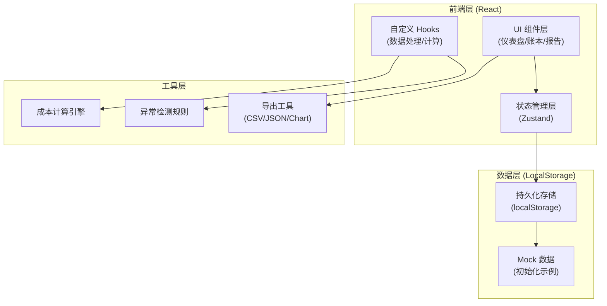
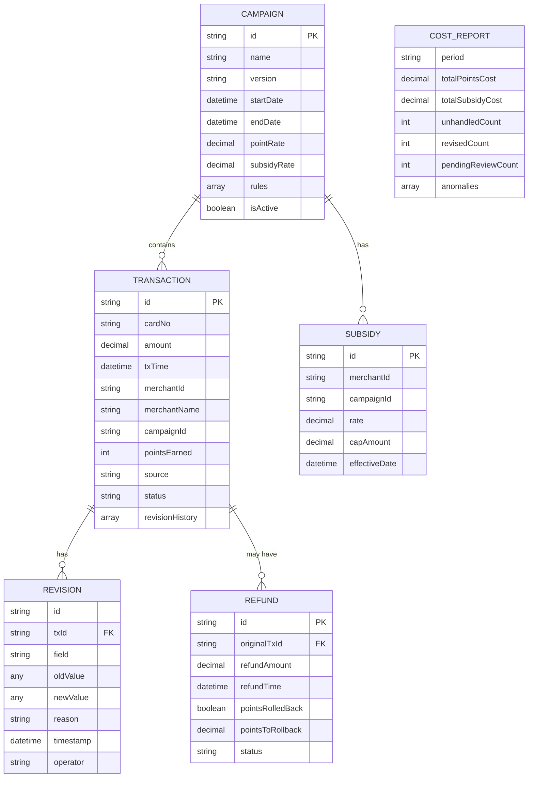

## 1. 架构设计



## 2. 技术选型

- **前端框架**: React@18 + TypeScript
- **构建工具**: Vite@5
- **样式方案**: TailwindCSS@3 + 自定义 CSS 变量
- **状态管理**: Zustand (轻量级，支持持久化)
- **图表库**: Recharts (React 原生图表组件)
- **图标库**: Lucide React (轻量线性图标)
- **数据存储**: localStorage (客户端持久化)
- **日期处理**: date-fns

## 3. 路由定义

| 路由 | 页面名称 | 功能 |
|------|----------|------|
| / | 仪表盘 | 成本概览、异常预警、关键指标 |
| /ledger | 积分账本 | 交易明细、筛选、修正操作 |
| /campaigns | 活动版本 | 活动配置、规则管理、版本历史 |
| /refunds | 退款补偿 | 退款记录、回滚检查、补偿计算 |
| /allocation | 成本分摊 | 成本分配、明细查看 |
| /reports | 报告导出 | 图表展示、分类报告导出 |

## 4. 数据模型

### 4.1 核心数据结构



### 4.2 状态定义

```typescript
// 交易状态
type TxStatus = 'normal' | 'anomaly' | 'revised' | 'pending_review';

// 异常类型
type AnomalyType = 
  | 'refund_not_rolledback'    // 退款未回滚
  | 'subsidy_cross_campaign'   // 补贴跨活动
  | 'points_rate_overlap'      // 积分倍率叠加
  | 'manual_review_needed';    // 需要人工确认

// 积分账本状态
interface LedgerState {
  transactions: Transaction[];
  campaigns: Campaign[];
  refunds: Refund[];
  subsidies: Subsidy[];
  revisions: Revision[];
  filters: FilterOptions;
  selectedTx: Transaction | null;
  stats: CostStats;
}
```

## 5. 核心计算规则

### 5.1 积分成本计算
```
积分成本 = 交易积分 × 积分单位成本
积分单位成本 = 历史兑换总成本 / 历史兑换总积分
```

### 5.2 商户补贴计算
```
单笔补贴 = min(交易金额 × 补贴费率, 单笔补贴上限)
```

### 5.3 退款回滚检查
```
对于已退款交易:
  应回滚积分 = 原交易获得积分 × 退款比例
  实际已回滚积分 = 查询积分变动记录
  异常 = 应回滚积分 > 实际已回滚积分
```

### 5.4 异常检测规则
1. **退款未回滚**: 退款记录存在，但积分账户无对应扣减
2. **补贴跨活动**: 同一商户同期参与多个活动，补贴重复计算
3. **积分倍率叠加**: 交易同时命中多个积分规则，倍率异常
4. **数据不一致**: 多来源数据对同一交易描述不一致

## 6. 持久化策略

- 使用 `localStorage` 存储所有业务数据
- 数据按模块分 key 存储: `ccost_transactions`, `ccost_campaigns`, 等
- 每次修改自动触发持久化保存
- 支持数据导出为 JSON 文件备份
- 首次访问自动加载 Mock 示例数据
