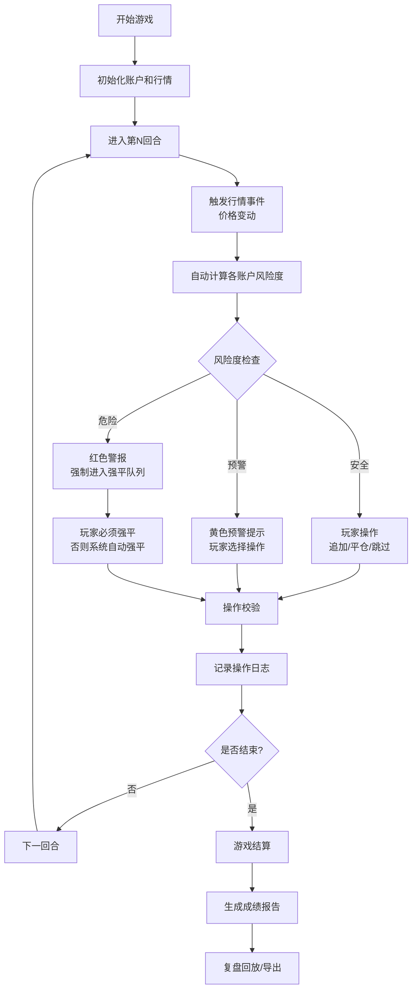

## 1. 产品概述

期货交易风控桌游是一款面向金融培训课堂的浏览器端网页游戏，让学员在模拟行情跳水场景中练习追加保证金处理和强平决策。通过回合制游戏机制，自然体现风控流程、风险阈值管理和强平队列逻辑，帮助学员直观理解期货交易风控原理。

- 目标用户：金融培训讲师及学员
- 核心价值：将抽象的期货风控规则转化为可交互的游戏体验，降低学习门槛
- 教学目标：掌握保证金计算、风险预警、强平顺序、复盘分析等核心技能

## 2. 核心功能

### 2.1 用户角色
| 角色 | 注册方式 | 核心权限 |
|------|----------|----------|
| 学员/玩家 | 无需注册，直接进入 | 进行游戏操作、查看成绩、导出结果 |
| 讲师 | 无需注册 | 配置游戏参数、查看全班成绩、调整难度 |

### 2.2 功能模块
1. **游戏主界面**：交易卡展示区、行情事件区、客户账户区、保证金条、操作按钮区
2. **游戏控制系统**：开始、暂停、重开、结算四大核心操作
3. **风控决策系统**：追加保证金提示、强平队列、风险阈值预警
4. **复盘回放系统**：历史操作记录、失败原因追溯、得分详情
5. **成绩导出系统**：单局成绩导出、课堂成绩汇总

### 2.3 页面详情
| 页面名称 | 模块名称 | 功能描述 |
|----------|----------|----------|
| 游戏主页面 | 顶部控制栏 | 开始/暂停/重开/结算按钮、当前回合数、剩余时间 |
| 游戏主页面 | 客户账户区 | 展示多个客户账户：账户名、持仓合约、持仓量、保证金余额、风险度 |
| 游戏主页面 | 行情事件区 | 显示当前回合行情事件、合约价格变动、历史行情记录 |
| 游戏主页面 | 交易卡区 | 可拖拽/点击的操作卡：追加保证金、部分平仓、全部平仓 |
| 游戏主页面 | 保证金条 | 可视化展示每个账户的保证金充足率，颜色随风险度变化 |
| 游戏主页面 | 强平队列 | 当触发强平时，按风险度排序显示待强平账户 |
| 游戏主页面 | 爆仓记录 | 记录所有爆仓事件：时间、账户、原因、亏损金额 |
| 结算弹窗 | 成绩面板 | 最终得分、操作正确率、强平次数、爆仓次数、失败原因分析 |
| 结算弹窗 | 复盘面板 | 按时间线展示所有操作和行情事件，支持回放 |
| 结算弹窗 | 导出功能 | 导出成绩为JSON/CSV格式 |

## 3. 核心流程

**游戏流程说明：**
1. 游戏开始时生成3-5个客户账户，每个账户持有不同的期货合约持仓
2. 每回合触发随机行情事件，合约价格上涨或下跌
3. 系统自动计算每个账户的保证金余额和风险度
4. 风险度 < 100%：安全，玩家可自由操作
5. 100% ≤ 风险度 < 120%：预警，提示追加保证金
6. 风险度 ≥ 120%：危险，必须强平，否则系统自动执行
7. 玩家可选择：给某个账户追加保证金、部分平仓、全部平仓
8. 每回合有时间限制，超时系统自动处理
9. 固定回合数后或全部账户爆仓后游戏结束，进入结算

## 4. 用户界面设计

### 4.1 设计风格
- **主色调**：深蓝色（#1a365d）代表金融专业感，搭配红色（#e53e3e）预警、绿色（#38a169）安全、黄色（#d69e2e）警示
- **按钮风格**：圆角矩形，带有轻微阴影，点击有缩放反馈
- **字体**：使用"JetBrains Mono"等宽字体展示数字数据，"Noto Sans SC"展示中文
- **布局风格**：卡片式布局，分区明确，信息密度适中
- **视觉元素**：使用K线图小图标、趋势箭头、保证金进度条等金融元素

### 4.2 页面设计概述
| 页面名称 | 模块名称 | UI元素 |
|----------|----------|--------|
| 游戏主页面 | 顶部控制栏 | 深色背景，白色文字，按钮采用胶囊形状 |
| 游戏主页面 | 客户账户卡片 | 每个账户一张卡片，顶部显示账户名和风险度，中间是保证金进度条，底部是操作按钮 |
| 游戏主页面 | 行情事件区 | 时间线布局，最新事件在顶部，带有价格变动箭头 |
| 游戏主页面 | 交易卡区 | 可点击的操作按钮，带有图标和文字说明 |
| 游戏主页面 | 强平队列 | 红色边框的警示区域，按风险度从高到低排序 |
| 结算弹窗 | 成绩面板 | 大号数字展示得分，分项指标用进度条展示 |
| 结算弹窗 | 复盘时间线 | 垂直时间线，可点击展开查看详情 |

### 4.3 响应式设计
- 桌面端优先设计，支持1280px及以上分辨率
- 平板端：卡片布局自动调整为2列
- 移动端：单列布局，操作按钮固定在底部
- 触控优化：按钮最小尺寸44x44px，支持滑动操作

## 5. 异常场景处理

### 5.1 行情连跳
- 连续两回合及以上价格同向大幅变动（≥5%）时，触发"极端行情"提示
- 界面显示红色闪烁效果，行情事件区标注"极端行情"标签
- 保证金计算自动加速，风险度更新频率提高

### 5.2 客户资金不足
- 当玩家选择追加保证金但账户总资金不足时，弹出明确提示
- 显示"资金不足，剩余可用资金：XXX"，并高亮显示
- 不允许提交操作，必须修改选择或改为平仓

### 5.3 强平顺序争议
- 强平队列严格按照风险度从高到低排序
- 提供"强平规则说明"按钮，点击展示详细规则
- 强平操作时显示"按风险度排序，当前强平优先级：第X位"
- 所有强平操作记录在爆仓日志中，可事后追溯

### 5.4 操作超时
- 每回合倒计时结束后，系统自动执行最优操作
- 显示"操作超时，系统已自动处理"提示
- 自动处理策略：优先强平风险度最高的账户
- 超时操作标记为"系统处理"，在复盘中明确标注
