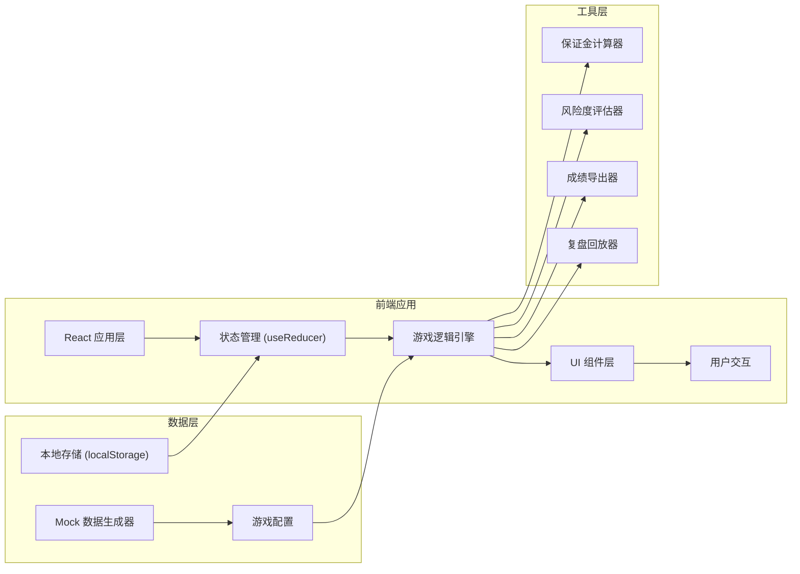
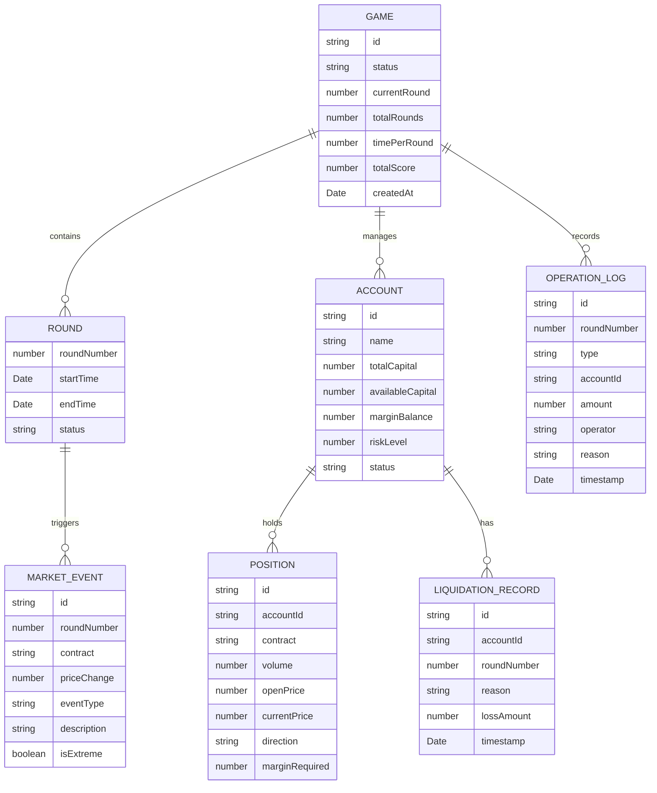

## 1. 架构设计



## 2. 技术选型

- **前端框架**: React@18 + TypeScript
- **构建工具**: Vite
- **样式方案**: TailwindCSS@3
- **状态管理**: React useReducer + Context
- **图表库**: Recharts (用于K线图和保证金趋势图)
- **图标**: Lucide React
- **数据持久化**: localStorage
- **动画**: Framer Motion

## 3. 目录结构

```
src/
├── components/          # UI组件
│   ├── GameHeader/     # 顶部控制栏
│   ├── AccountCard/    # 客户账户卡片
│   ├── MarketEvent/    # 行情事件区
│   ├── TradingCards/   # 交易卡操作区
│   ├── MarginBar/      # 保证金条
│   ├── ForceCloseQueue/ # 强平队列
│   ├── LiquidationLog/ # 爆仓记录
│   ├── SettlementModal/ # 结算弹窗
│   └── ReplayPanel/    # 复盘面板
├── hooks/              # 自定义Hooks
│   ├── useGameEngine.ts # 游戏引擎Hook
│   ├── useTimer.ts     # 计时器Hook
│   └── useLocalStorage.ts # 本地存储Hook
├── store/              # 状态管理
│   ├── gameReducer.ts  # 游戏状态Reducer
│   ├── gameContext.tsx # 游戏Context
│   └── initialState.ts # 初始状态
├── types/              # TypeScript类型定义
│   └── index.ts
├── utils/              # 工具函数
│   ├── marginCalculator.ts # 保证金计算
│   ├── riskAssessor.ts # 风险度评估
│   ├── dataGenerator.ts # 模拟数据生成
│   ├── exporter.ts     # 成绩导出
│   └── replay.ts       # 复盘逻辑
├── constants/          # 常量配置
│   ├── gameConfig.ts   # 游戏配置参数
│   └── marketData.ts   # 行情数据模板
├── App.tsx
├── main.tsx
└── index.css
```

## 4. 核心数据模型

### 4.1 数据模型定义



### 4.2 核心类型定义

```typescript
// 游戏状态
type GameStatus = 'idle' | 'playing' | 'paused' | 'settled';

// 账户状态
type AccountStatus = 'normal' | 'warning' | 'danger' | 'liquidated';

// 操作类型
type OperationType = 'add_margin' | 'partial_close' | 'full_close' | 'skip' | 'auto_liquidate';

// 行情事件类型
type EventType = 'price_rise' | 'price_fall' | 'extreme_rise' | 'extreme_fall' | 'news';

// 合约定义
interface Contract {
  code: string;
  name: string;
  multiplier: number; // 合约乘数
  marginRate: number; // 保证金比例
  initialPrice: number;
}

// 持仓
interface Position {
  id: string;
  accountId: string;
  contractCode: string;
  volume: number;
  openPrice: number;
  currentPrice: number;
  direction: 'long' | 'short';
  marginRequired: number;
}

// 账户
interface Account {
  id: string;
  name: string;
  totalCapital: number;
  availableCapital: number;
  marginBalance: number;
  unrealizedPnL: number;
  riskLevel: number; // 风险度 = 占用保证金 / 权益 * 100%
  status: AccountStatus;
  positions: Position[];
}

// 行情事件
interface MarketEvent {
  id: string;
  roundNumber: number;
  contractCode: string;
  priceChangePercent: number;
  eventType: EventType;
  description: string;
  isExtreme: boolean;
  timestamp: number;
}

// 操作日志
interface OperationLog {
  id: string;
  roundNumber: number;
  type: OperationType;
  accountId: string;
  amount?: number;
  operator: 'player' | 'system';
  reason: string;
  timestamp: number;
}

// 爆仓记录
interface LiquidationRecord {
  id: string;
  accountId: string;
  roundNumber: number;
  reason: string;
  lossAmount: number;
  timestamp: number;
}

// 游戏状态
interface GameState {
  status: GameStatus;
  currentRound: number;
  totalRounds: number;
  timePerRound: number;
  timeRemaining: number;
  accounts: Account[];
  marketEvents: MarketEvent[];
  operationLogs: OperationLog[];
  liquidationRecords: LiquidationRecord[];
  forceCloseQueue: Account[];
  totalScore: number;
  extremeConsecutiveCount: number;
}
```

## 5. 游戏规则配置

```typescript
// 游戏配置常量
const GAME_CONFIG = {
  TOTAL_ROUNDS: 10,           // 总回合数
  TIME_PER_ROUND: 30,         // 每回合时间（秒）
  INITIAL_ACCOUNTS: 4,        // 初始账户数量
  WARNING_THRESHOLD: 100,     // 预警阈值（%）
  DANGER_THRESHOLD: 120,      // 危险阈值（%）
  EXTREME_PRICE_CHANGE: 5,    // 极端行情涨跌幅（%）
  SCORE_CORRECT_OPERATION: 100, // 正确操作得分
  SCORE_WRONG_OPERATION: -50,   // 错误操作扣分
  SCORE_TIMEOUT: -30,           // 超时扣分
  SCORE_PER_ROUND_SURVIVE: 50,  // 每回合存活奖励
};
```

## 6. 核心算法

### 6.1 保证金计算公式
```
持仓保证金 = 持仓量 × 当前价格 × 合约乘数 × 保证金比例
账户权益 = 总资金 + 浮动盈亏
风险度 = 持仓保证金 / 账户权益 × 100%
```

### 6.2 强平优先级排序
1. 首先按风险度从高到低排序
2. 风险度相同时，按浮动亏损从大到小排序
3. 再次按账户资金从小到大排序

### 6.3 成绩计算
```
总分 = 正确操作加分 + 存活奖励 + 错误操作扣分 + 超时扣分
操作正确率 = 正确操作次数 / 总操作次数 × 100%
评级：S(≥900), A(≥800), B(≥700), C(≥600), D(<600)
```
