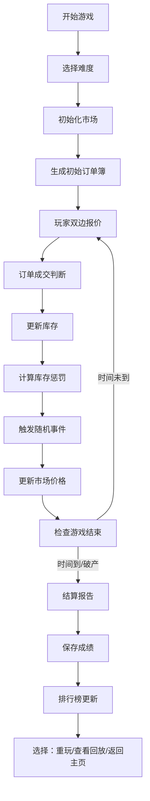

## 1. 产品概述

做市商价差挑战是一款面向金融爱好者和量化社团的浏览器端做市模拟游戏。玩家扮演做市商，在动态变化的订单流中通过双边报价赚取价差，同时管理库存风险应对市场波动。游戏旨在让玩家体验真实做市商的决策压力，理解流动性提供的核心机制。

- 目标用户：量化社团成员、金融学生、交易爱好者
- 核心价值：游戏化学习做市策略，体验库存风险管理
- 单局时长：3-5分钟

## 2. 核心功能

### 2.1 用户角色
| 角色 | 注册方式 | 核心权限 |
|------|----------|----------|
| 玩家 | 无需注册，本地存储 | 游戏游玩、成绩保存、回放查看 |

### 2.2 功能模块
1. **游戏主界面**：实时订单簿、报价面板、库存仪表盘、事件通知
2. **游戏控制**：开始、暂停、重开、提前结算
3. **风险管理**：库存偏斜警告、价格跳空警报、手续费提示
4. **结算系统**：详细盈亏分解、失败原因分析、得分评级
5. **排行榜**：本地历史成绩排名、最高分记录
6. **回放系统**：对局回放、关键节点标记、导出功能

### 2.3 页面详情
| 页面名称 | 模块名称 | 功能描述 |
|---------|----------|----------|
| 游戏主页 | 开始面板 | 难度选择、规则说明、历史记录入口 |
| 游戏主界面 | 订单簿区域 | 实时显示买卖盘深度、最新成交价、价格走势 |
| 游戏主界面 | 报价面板 | 限价买卖报价输入、一键撤单、报价历史 |
| 游戏主界面 | 库存仪表盘 | 当前持仓、库存价值、风险指标、库存惩罚系数 |
| 游戏主界面 | 事件日志 | 随机事件播报、系统通知、风险预警 |
| 结算页面 | 结算报告 | 总盈亏分解、交易明细、风险事件回顾、得分评级 |
| 排行榜页面 | 历史记录 | 历史对局列表、最高分排行、回放入口 |
| 回放页面 | 回放控制 | 时间轴拖拽、倍速播放、关键事件标记 |

## 3. 核心流程



**关键节点说明：**
- 玩家每轮提交买单和卖单报价，价差越大成交概率越低但利润越高
- 成交后库存增加，库存超过阈值会触发惩罚系数
- 随机事件包括：价格跳空、流动性枯竭、手续费调整、波动率突变
- 游戏结束条件：倒计时结束、强制平仓、主动结算

## 4. 用户界面设计

### 4.1 设计风格
- **主色调**：深绿(#0F172A)背景配翠绿(#10B981)上涨、玫红(#EF4444)下跌
- **辅助色**：琥珀(#F59E0B)警告、天蓝(#3B82F6)信息、紫罗兰(#8B5CF6)事件
- **字体**：JetBrains Mono(等宽数字) + Inter(界面文字)
- **视觉风格**：专业交易终端风格，暗黑主题，数据密集但层次清晰
- **动效**：价格闪烁、成交高亮、风险预警脉冲动画

### 4.2 页面布局
| 页面名称 | 布局结构 | 关键交互 |
|---------|----------|----------|
| 游戏主页 | 居中卡片式布局，左右分栏 | 难度选择悬停放大效果 |
| 游戏主界面 | 三栏布局：左(订单簿+走势)、中(报价面板)、右(库存+日志) | 点击盘口快速填充报价 |
| 结算页面 | 上下结构：顶部总结、中部明细、底部操作 | 盈亏条目展开/折叠 |
| 排行榜页面 | 表格列表，每行可展开详情 | 点击行查看对应回放 |
| 回放页面 | 镜像游戏界面+底部时间轴 | 拖拽时间轴跳转、倍速切换 |

### 4.3 风险提示设计
- **库存偏斜**：持仓条变红，边框脉冲动画，显示"库存风险过高"
- **价格跳空**：全屏红色闪烁边框，弹出事件卡片，标记跳空幅度
- **手续费吞噬**：手续费占利润比例>50%时，结算页高亮标红并标注

### 4.4 响应式
- 桌面端优先，保证1280px以上完美展示
- 平板端折叠右侧面板为可展开抽屉
- 移动端简化为单栏滚动布局，核心数据优先展示

## 5. 游戏数值设计

### 5.1 难度参数
| 难度 | 基础波动率 | 事件频率 | 手续费率 | 库存惩罚系数 | 目标得分 |
|------|-----------|----------|----------|-------------|----------|
| 新手 | 0.5% | 低 | 0.05% | 0.1x | 1000 |
| 进阶 | 1.0% | 中 | 0.10% | 0.3x | 3000 |
| 专家 | 2.0% | 高 | 0.15% | 0.5x | 8000 |
| 地狱 | 3.5% | 极高 | 0.20% | 1.0x | 20000 |

### 5.2 事件类型
| 事件 | 影响 | 持续时间 | 提示等级 |
|------|------|----------|----------|
| 重大利好 | 价格跳涨3-5% | 即时 | 紧急 |
| 重大利空 | 价格跳跌3-5% | 即时 | 紧急 |
| 流动性枯竭 | 买卖盘深度减半 | 10秒 | 警告 |
| 手续费调整 | 手续费临时翻倍 | 15秒 | 信息 |
| 波动率上升 | 价格波动翻倍 | 20秒 | 警告 |

### 5.3 得分计算
```
总得分 = 实现盈亏 - 库存惩罚 - 手续费 + 事件奖励
库存惩罚 = abs(持仓量) * 惩罚系数 * 当前价格
事件奖励 = 成功应对风险事件的额外加分
```
