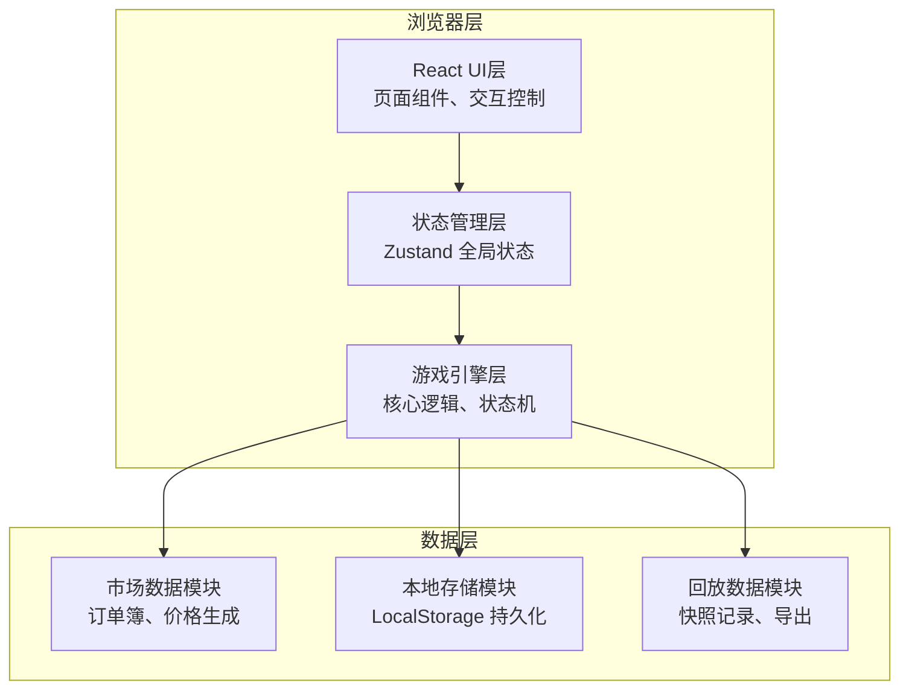
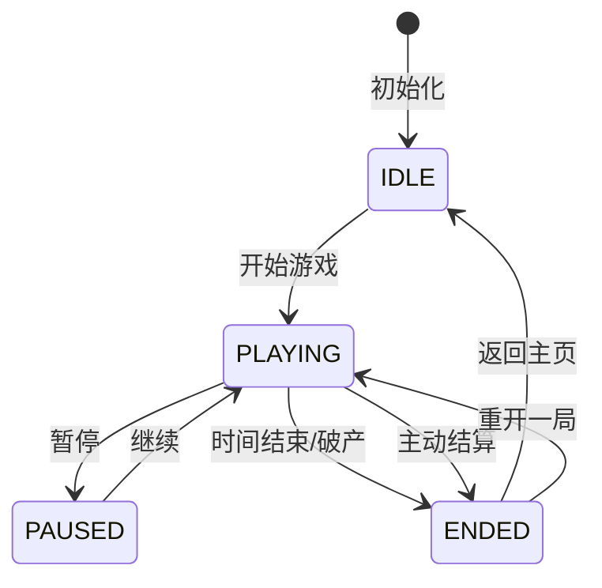

## 1. 架构设计



## 2. 技术选型

- **前端框架**：React@18 + TypeScript
- **构建工具**：Vite@5
- **样式方案**：TailwindCSS@3
- **状态管理**：Zustand@4（轻量级，适合游戏状态）
- **图表库**：lightweight-charts@4（专业金融K线图）
- **图标**：Lucide React
- **数据持久化**：LocalStorage（无需后端）

## 3. 目录结构

```
src/
├── components/          # UI组件
│   ├── game/           # 游戏相关组件
│   │   ├── OrderBook.tsx      # 订单簿
│   │   ├── QuotePanel.tsx     # 报价面板
│   │   ├── InventoryGauge.tsx # 库存仪表盘
│   │   ├── EventLog.tsx       # 事件日志
│   │   └── PriceChart.tsx     # 价格走势图
│   ├── layout/         # 布局组件
│   ├── settlement/     # 结算页面组件
│   ├── leaderboard/    # 排行榜组件
│   └── replay/         # 回放组件
├── store/              # 状态管理
│   └── useGameStore.ts # 游戏全局状态
├── engine/             # 游戏引擎
│   ├── types.ts        # 类型定义
│   ├── config.ts       # 游戏配置、难度参数
│   ├── market.ts       # 市场生成逻辑
│   ├── events.ts       # 随机事件系统
│   └── replay.ts       # 回放系统
├── hooks/              # 自定义Hooks
│   ├── useGameLoop.ts  # 游戏主循环
│   └── useMarketData.ts # 市场数据Hook
├── utils/              # 工具函数
│   ├── format.ts       # 格式化函数
│   └── storage.ts      # 本地存储
├── App.tsx
├── main.tsx
└── index.css
```

## 4. 核心数据模型

### 4.1 游戏状态
```typescript
interface GameState {
  status: 'idle' | 'playing' | 'paused' | 'ended';
  difficulty: Difficulty;
  timeRemaining: number;
  totalTime: number;
  currentPrice: number;
  inventory: number;
  avgCost: number;
  cash: number;
  realizedPnL: number;
  unrealizedPnL: number;
  totalFees: number;
  inventoryPenalty: number;
  activeOrders: Order[];
  tradeHistory: Trade[];
  events: GameEvent[];
  orderBook: OrderBook;
}
```

### 4.2 订单与交易
```typescript
interface Order {
  id: string;
  side: 'buy' | 'sell';
  price: number;
  quantity: number;
  timestamp: number;
  status: 'active' | 'filled' | 'cancelled';
}

interface Trade {
  id: string;
  side: 'buy' | 'sell';
  price: number;
  quantity: number;
  fee: number;
  timestamp: number;
  pnlContribution: number;
}

interface OrderBook {
  bids: Array<{ price: number; quantity: number }>;
  asks: Array<{ price: number; quantity: number }>;
  lastPrice: number;
}
```

### 4.3 事件系统
```typescript
interface GameEvent {
  id: string;
  type: 'price_jump' | 'liquidity_crisis' | 'fee_change' | 'volatility_spike';
  severity: 'info' | 'warning' | 'critical';
  message: string;
  effect: Record<string, any>;
  timestamp: number;
  duration: number;
}
```

### 4.4 回放数据
```typescript
interface ReplaySnapshot {
  timestamp: number;
  gameState: GameState;
  playerAction?: PlayerAction;
}

interface PlayerAction {
  type: 'place_order' | 'cancel_order' | 'settle';
  payload: any;
  timestamp: number;
}

interface ReplayData {
  id: string;
  startTime: number;
  endTime: number;
  difficulty: Difficulty;
  finalScore: number;
  snapshots: ReplaySnapshot[];
  events: GameEvent[];
}
```

## 5. 核心算法

### 5.1 做市成交逻辑
```typescript
function checkOrderExecution(order: Order, orderBook: OrderBook, currentPrice: number): boolean {
  // 买单：报价 >= 卖一价 时成交
  if (order.side === 'buy' && order.price >= orderBook.asks[0]?.price) {
    return true;
  }
  // 卖单：报价 <= 买一价 时成交
  if (order.side === 'sell' && order.price <= orderBook.bids[0]?.price) {
    return true;
  }
  // 根据价差计算概率成交（模拟真实市场流动性）
  const spread = order.side === 'buy' 
    ? orderBook.asks[0]?.price - order.price 
    : order.price - orderBook.bids[0]?.price;
  const probability = Math.max(0, 1 - spread / (currentPrice * 0.01));
  return Math.random() < probability * 0.3;
}
```

### 5.2 库存惩罚计算
```typescript
function calculateInventoryPenalty(inventory: number, currentPrice: number, penaltyCoeff: number): number {
  const threshold = 10; // 基础库存阈值
  const excess = Math.max(0, Math.abs(inventory) - threshold);
  return excess * penaltyCoeff * currentPrice * 0.01;
}
```

### 5.3 价格生成算法
```typescript
function generateNextPrice(
  currentPrice: number, 
  volatility: number, 
  trend: number,
  activeEvents: GameEvent[]
): number {
  let effectiveVolatility = volatility;
  let priceJump = 0;
  
  // 应用事件影响
  for (const event of activeEvents) {
    if (event.type === 'volatility_spike') {
      effectiveVolatility *= 2;
    }
    if (event.type === 'price_jump') {
      priceJump = event.effect.priceChange;
    }
  }
  
  // 几何布朗运动 + 趋势
  const drift = trend * currentPrice * 0.0001;
  const shock = (Math.random() - 0.5) * 2 * effectiveVolatility * currentPrice;
  
  return currentPrice + drift + shock + priceJump;
}
```

## 6. 游戏状态机



## 7. 性能优化点

1. **游戏循环**：使用 requestAnimationFrame，逻辑更新与渲染分离
2. **状态更新**：Zustand 选择性订阅，避免不必要重渲染
3. **图表渲染**：lightweight-charts 原生Canvas，增量更新
4. **回放系统**：快照间隔优化（100ms/帧），压缩存储
5. **列表虚拟**：交易历史、排行榜使用虚拟滚动
