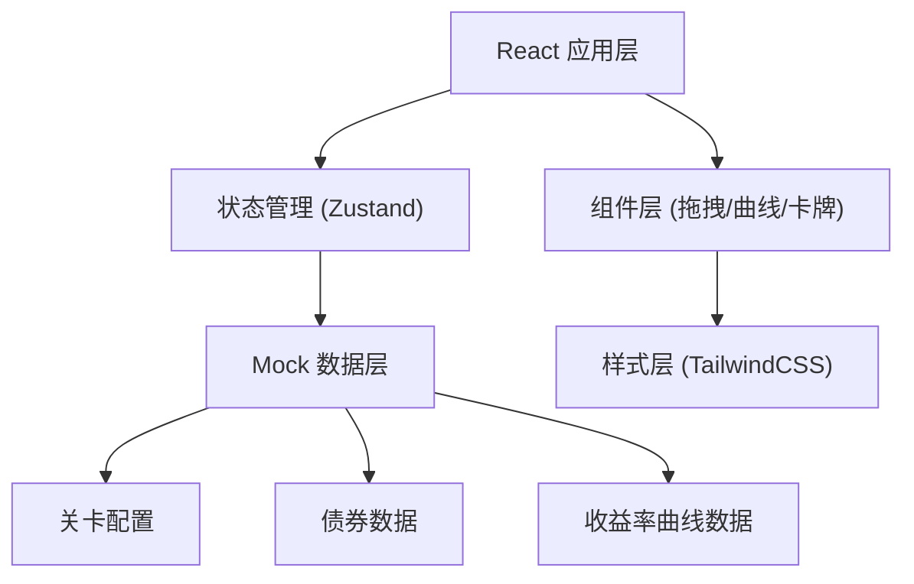
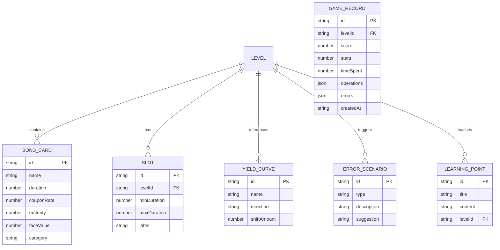

## 1. 架构设计

纯前端应用，使用 React 构建，数据通过 mock 数据提供，无需后端服务。



## 2. 技术说明

- 前端框架：React 18 + TypeScript
- 构建工具：Vite
- 样式方案：TailwindCSS 3
- 状态管理：Zustand（轻量状态库）
- 拖拽库：@dnd-kit/core（无障碍拖拽）
- 图表绘制：SVG + 自定义曲线组件
- 路由：React Router v6
- 动画：Framer Motion
- 图标：Lucide React
- 后端：无，所有数据使用 mock 数据
- 数据库：无，使用 localStorage 保存进度和回放记录

## 3. 路由定义

| 路由 | 用途 |
|------|------|
| / | 启动页，展示游戏标题和开始按钮 |
| /levels | 关卡选择页，展示所有关卡列表 |
| /play/:levelId | 游戏主页，实际游戏操作界面 |
| /result/:levelId | 关卡结果页，展示评分、错因、学习报告和回放 |

## 4. 数据模型

### 4.1 数据模型定义



### 4.2 TypeScript 类型定义

```typescript
interface BondCard {
  id: string;
  name: string;
  duration: number;
  couponRate: number;
  maturity: number;
  faceValue: number;
  category: 'short' | 'medium' | 'long';
  cashFlows: CashFlow[];
}

interface CashFlow {
  period: number;
  amount: number;
  weight: number;
}

interface Slot {
  id: string;
  levelId: string;
  minDuration: number;
  maxDuration: number;
  label: string;
}

interface YieldCurve {
  id: string;
  name: string;
  direction: 'up' | 'down' | 'flat';
  shiftAmount: number;
  points: { term: number; yield: number }[];
}

interface ErrorScenario {
  id: string;
  type: 'duration_mismatch' | 'curve_direction' | 'cashflow_weight';
  description: string;
  suggestion: string;
}

interface LearningPoint {
  id: string;
  title: string;
  content: string;
  levelId: string;
}

interface GameRecord {
  id: string;
  levelId: string;
  score: number;
  stars: number;
  timeSpent: number;
  operations: Operation[];
  errors: ErrorRecord[];
  createdAt: string;
}

interface Operation {
  timestamp: number;
  type: 'drag' | 'curve_adjust' | 'cashflow_estimate';
  detail: Record<string, unknown>;
  beforeState: Record<string, unknown>;
  afterState: Record<string, unknown>;
}

interface ErrorRecord {
  operationIndex: number;
  type: string;
  description: string;
  suggestion: string;
}

interface Level {
  id: string;
  name: string;
  description: string;
  bonds: BondCard[];
  slots: Slot[];
  yieldCurve: YieldCurve;
  targetScore: number;
  timeLimit: number;
  learningPoints: LearningPoint[];
}
```

## 5. 项目目录结构

```
src/
├── components/
│   ├── layout/
│   │   ├── Header.tsx
│   │   └── FeedbackToast.tsx
│   ├── game/
│   │   ├── BondCard.tsx
│   │   ├── DurationSlot.tsx
│   │   ├── YieldCurveChart.tsx
│   │   ├── CashFlowTimeline.tsx
│   │   └── DragArea.tsx
│   ├── level/
│   │   ├── LevelCard.tsx
│   │   └── LevelProgress.tsx
│   └── result/
│       ├── ScorePanel.tsx
│       ├── ErrorList.tsx
│       ├── LearningReport.tsx
│       └── ReplayTimeline.tsx
├── pages/
│   ├── StartPage.tsx
│   ├── LevelSelectPage.tsx
│   ├── GamePage.tsx
│   └── ResultPage.tsx
├── store/
│   └── gameStore.ts
├── data/
│   ├── levels.ts
│   └── bonds.ts
├── types/
│   └── index.ts
├── utils/
│   ├── durationCalc.ts
│   ├── scoreCalc.ts
│   └── errorDetection.ts
├── hooks/
│   └── useGameTimer.ts
├── App.tsx
└── main.tsx
```
