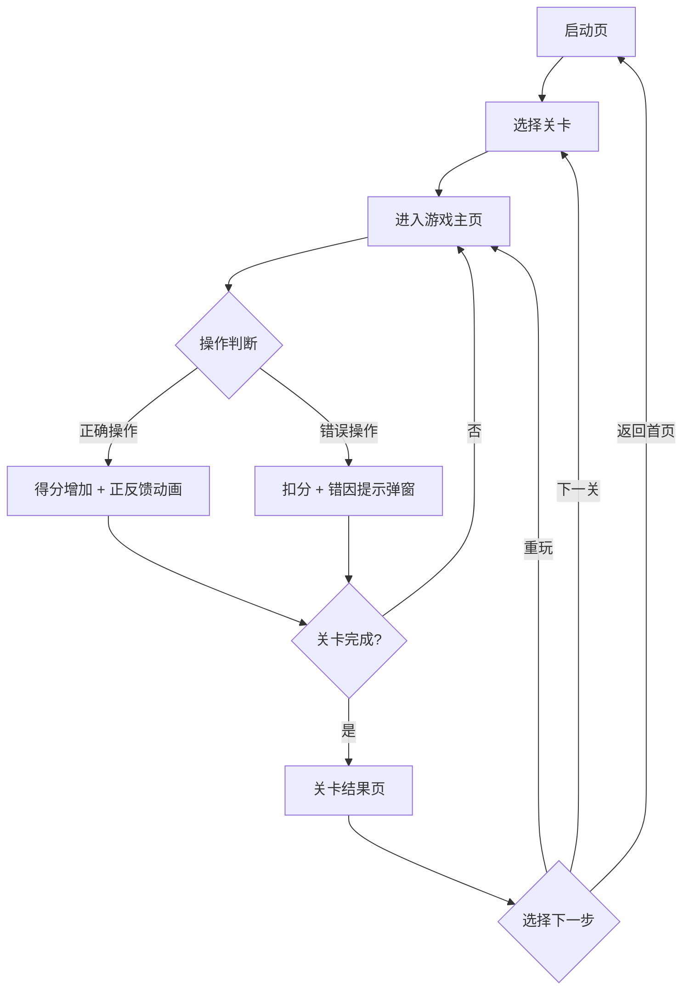

## 1. 产品概述

"债券久期拼图"是一款面向金融投教的互动网页游戏，将债券久期与利率变化的抽象概念转化为可视化、可拖拽的拼图玩法。玩家通过债券卡牌拖拽、收益率曲线调整、久期槽位匹配和现金流权重判断，在操作中理解久期对利率风险的影响，而非死记硬背公式。

- 目标用户：投教活动参与者、理财入门学习者、需要普及久期概念的从业人员
- 核心价值：把反复出错的久期判断流程收住，通过游戏化交互让长短久期区分、曲线平移方向、现金流权重计算变得直观可感知

## 2. 核心功能

### 2.1 功能模块

1. **启动页**：游戏标题、开始按钮、玩法说明入口
2. **游戏主页**：债券卡牌区、收益率曲线区、久期槽位区、操作反馈区
3. **关卡页**：关卡信息、当前进度、得分、剩余时间
4. **结果页**：关卡评分、错因说明、学习报告、回放记录

### 2.2 页面详情

| 页面名称 | 模块名称 | 功能描述 |
|----------|----------|----------|
| 启动页 | 标题区 | 游戏名称动画展示、副标题说明 |
| 启动页 | 操作区 | "开始游戏"主按钮、"玩法说明"次按钮 |
| 启动页 | 玩法说明面板 | 弹层展示操作方法、游戏目标、评分规则 |
| 游戏主页 | 债券卡牌区 | 展示可拖拽的债券卡牌，每张卡牌包含久期、票面利率、到期时间等信息 |
| 游戏主页 | 收益率曲线区 | 可交互的收益率曲线图，支持平移、旋转操作 |
| 游戏主页 | 久期槽位区 | 按久期长短排列的槽位，玩家将债券拖入对应槽位 |
| 游戏主页 | 现金流提示区 | 展示当前债券的现金流分布、权重提示 |
| 游戏主页 | 操作反馈区 | 实时显示得分变化、正确/错误提示动画 |
| 关卡页 | 进度区 | 关卡编号、关卡名称、当前得分、总得分 |
| 关卡页 | 目标区 | 本关目标描述、完成条件 |
| 关卡页 | 操作区 | 暂停按钮、放弃按钮 |
| 结果页 | 评分区 | 本关星级评分、得分明细、用时统计 |
| 结果页 | 错因区 | 逐条列出错误操作及原因说明，高亮标记长短久期混放、曲线方向错误、现金流权重误判 |
| 结果页 | 学习报告区 | 针对本关知识点的总结报告、知识点关联链接 |
| 结果页 | 回放区 | 可回放本关所有操作的时间线，查看每次操作的前后状态 |
| 结果页 | 操作区 | "下一关"按钮、"重玩本关"按钮、"返回首页"按钮 |

## 3. 核心流程

玩家从启动页进入游戏，选择关卡后拖拽债券卡牌到久期槽位，调整收益率曲线方向，系统实时计算得分并给出反馈。关卡结束后展示评分、错因和学习报告，可回放操作记录，然后进入下一关或返回首页。

## 4. 用户界面设计

### 4.1 设计风格

- 主色调：深蓝 #0A1628（金融专业感）、琥珀金 #D4A843（重点强调）
- 辅助色：翠绿 #2ECC71（正确）、珊瑚红 #FF6B6B（错误）、浅蓝 #4ECDC4（操作区）
- 按钮风格：圆角 8px，卡片有细边框和微阴影，拖拽态有发光效果
- 字体：标题用 Playfair Display（金融典雅感），正文用 Noto Sans SC（中文可读性）
- 布局风格：卡片式布局，顶部信息栏，主操作区居中
- 图标风格：线性图标为主，关键状态用填充图标

### 4.2 页面设计概览

| 页面名称 | 模块名称 | UI 元素 |
|----------|----------|----------|
| 启动页 | 标题区 | 深蓝渐变背景、金色标题文字、淡入动画 |
| 启动页 | 操作区 | 大号金色"开始游戏"按钮、次级"玩法说明"文字链接 |
| 游戏主页 | 债券卡牌区 | 可拖拽卡片，显示久期数值、票面利率、到期时间，悬停高亮 |
| 游戏主页 | 收益率曲线区 | SVG 绘制的曲线图，可拖动平移，曲线颜色随方向变化 |
| 游戏主页 | 久期槽位区 | 纵向排列的槽位容器，短久期在上、长久期在下，放入时显示匹配度 |
| 游戏主页 | 现金流提示区 | 横向时间线柱状图，展示每期现金流大小和权重占比 |
| 游戏主页 | 操作反馈区 | 顶部浮动提示条，正确时绿色滑入、错误时红色抖动 |
| 结果页 | 评分区 | 星级动画、得分数字放大展示、用时统计 |
| 结果页 | 错因区 | 列表式展示，每条错误标红并附修正说明，可展开查看详情 |
| 结果页 | 学习报告区 | 卡片式展示知识点，可点击展开详细解释 |
| 结果页 | 回放区 | 时间轴滑块，可拖动查看每一步操作的前后对比 |

### 4.3 响应式设计

- 桌面端优先设计，最低适配 1024px 宽度
- 平板端（768px-1023px）：债券卡牌改为两列布局，久期槽位压缩高度
- 移动端（<768px）：操作区改为纵向堆叠，拖拽改为点击选择+确认模式，收益率曲线简化为方向选择按钮
- 所有触摸操作需增加 44px 最小触控区域

### 4.4 异常路径设计

| 异常场景 | 处理方式 |
|----------|----------|
| 长短久期卡牌混放在同一槽位 | 红色边框高亮槽位，弹出"久期不匹配"提示，说明该卡牌应放入的正确槽位 |
| 收益率曲线方向与久期预期相反 | 曲线抖动变灰，提示"曲线方向错误：利率上升时长久期债券价格跌幅更大" |
| 现金流权重判断偏差过大 | 柱状图上错误部分标红，提示"第X期现金流权重占比应为Y%，当前判断偏差Z%" |
| 拖拽到非法区域 | 卡牌弹回原位，提示"请将债券拖入对应的久期槽位" |
| 关卡超时 | 自动结束，展示已完成得分和未完成部分，给出"时间管理"建议 |
| 网络异常/页面刷新 | 使用 localStorage 保存当前关卡进度，重新打开时提示"检测到未完成的关卡，是否继续?" |
