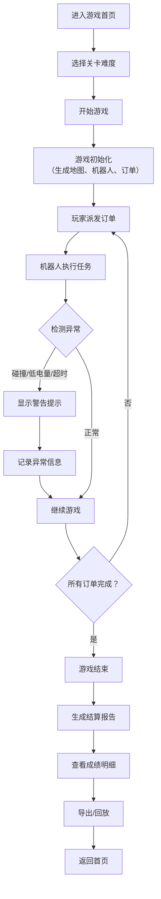

## 1. 产品概述

仓库机器人拣货赛是一款面向仓储新人的培训浏览器小游戏，通过模拟真实仓库环境，让新人练习机器人派单、充电调度和障碍物规避技能。游戏注重操作反馈、关卡结果和回放记录，帮助新人快速掌握仓储机器人调度的核心逻辑。

## 2. 核心功能

### 2.1 用户角色
| 角色 | 注册方式 | 核心权限 |
|------|----------|----------|
| 仓储新人 | 直接进入 | 游戏练习、成绩查看、历史回放 |
| 仓储经理 | 直接进入 | 查看学员成绩、导出数据 |

### 2.2 功能模块
1. **游戏首页**：游戏介绍、关卡选择、开始游戏
2. **游戏主界面**：网格地图、机器人操作面板、订单列表、状态监控
3. **结算页面**：成绩展示、得分明细、失败原因分析
4. **历史记录**：游戏回放、成绩导出、图表统计

### 2.3 页面详情
| 页面名称 | 模块名称 | 功能描述 |
|----------|----------|----------|
| 游戏首页 | 关卡选择 | 难度选择（初级/中级/高级）、游戏说明 |
| 游戏首页 | 历史记录入口 | 查看过往游戏成绩和回放 |
| 游戏主界面 | 网格地图 | 12x12网格，显示机器人、货架、充电桩、障碍物位置 |
| 游戏主界面 | 机器人控制 | 选择机器人、派发订单、手动充电指令 |
| 游戏主界面 | 订单面板 | 显示待处理订单、优先级、剩余时间 |
| 游戏主界面 | 状态监控 | 电量显示、碰撞预警、超时警告 |
| 游戏主界面 | 游戏控制 | 暂停/继续、重新开始、速度调节 |
| 结算页面 | 成绩展示 | 总得分、完成订单数、用时统计 |
| 结算页面 | 得分明细 | 每项得分/扣分的详细来源 |
| 结算页面 | 异常记录 | 碰撞、低电量接单、超时的具体记录 |
| 历史记录 | 回放功能 | 逐帧回放游戏过程 |
| 历史记录 | 数据导出 | 导出CSV格式成绩报告 |
| 历史记录 | 图表统计 | 完成趋势、得分分布图表 |

## 3. 核心流程

## 4. 用户界面设计

### 4.1 设计风格
- **主色调**：工业蓝 (#1E3A8A) 搭配 警示橙 (#F97316)
- **辅助色**：成功绿 (#10B981)、警告红 (#EF4444)、中性灰 (#6B7280)
- **按钮风格**：圆角矩形，带悬停动效，危险操作使用红色警示
- **字体**：标题使用 Orbitron（科技感字体），正文使用 JetBrains Mono（等宽字体，便于数据显示）
- **布局风格**：卡片式布局，左侧地图、右侧控制面板，顶部状态栏
- **图标风格**：线条简洁的 SVG 图标，机器人使用 🤖 emoji，订单使用 📦

### 4.2 页面设计概览
| 页面名称 | 模块名称 | UI 元素 |
|----------|----------|---------|
| 游戏首页 | 关卡选择 | 渐变背景卡片，悬浮放大效果，难度标签 |
| 游戏主界面 | 网格地图 | 深色背景网格，色块区分不同元素，机器人带动画 |
| 游戏主界面 | 控制面板 | 玻璃拟态卡片，清晰的操作按钮分组 |
| 结算页面 | 成绩展示 | 大号数字展示，环形进度图展示完成率 |
| 结算页面 | 异常记录 | 时间线样式展示，颜色区分异常类型 |
| 历史记录 | 图表统计 | 响应式柱状图/折线图，支持数据点交互 |

### 4.3 响应式
- 桌面端优先设计（1280px+）
- 平板端（768px-1279px）：调整面板布局，缩小地图尺寸
- 移动端（<768px）：垂直堆叠布局，简化操作

### 4.4 动画与交互
- 机器人移动：平滑过渡动画，显示移动路径
- 订单派发：波纹扩散效果
- 异常警告：闪烁边框 + 声音提示
- 页面切换：淡入淡出过渡
