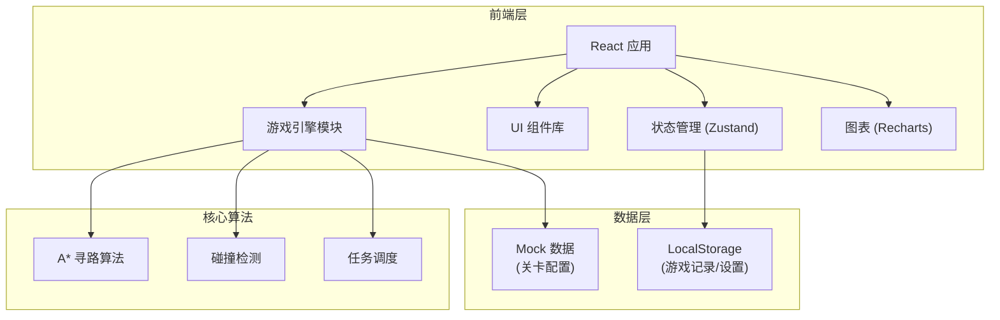
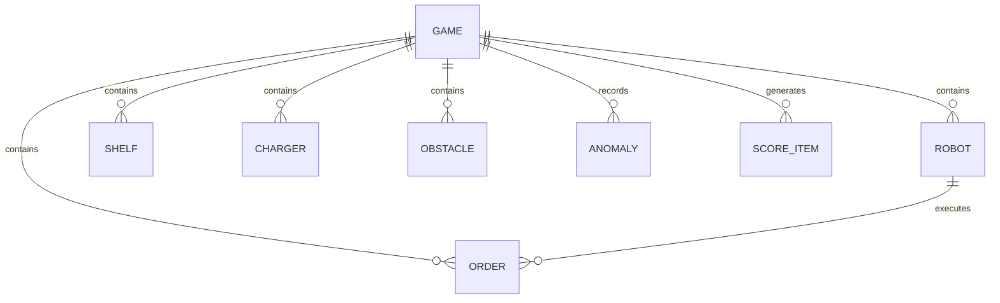

## 1. 架构设计



## 2. 技术描述

- **前端框架**: React@18 + TypeScript
- **构建工具**: Vite@5
- **样式方案**: TailwindCSS@3
- **状态管理**: Zustand@4
- **图表库**: Recharts@2
- **图标**: Lucide React
- **数据持久化**: LocalStorage
- **路由**: React Router DOM@6

## 3. 路由定义

| 路由 | 页面 | 用途 |
|------|------|------|
| / | 游戏首页 | 关卡选择、游戏说明、历史记录入口 |
| /game | 游戏主界面 | 核心游戏玩法 |
| /result/:gameId | 结算页面 | 展示游戏成绩和明细 |
| /history | 历史记录 | 回放和数据导出 |

## 4. 数据模型

### 4.1 实体关系图



### 4.2 TypeScript 类型定义

```typescript
// 位置坐标
interface Position {
  x: number;
  y: number;
}

// 机器人
interface Robot {
  id: string;
  name: string;
  position: Position;
  battery: number; // 0-100
  status: 'idle' | 'moving' | 'charging' | 'picking' | 'blocked';
  currentOrderId: string | null;
  path: Position[];
}

// 订单
interface Order {
  id: string;
  shelfId: string;
  priority: 'high' | 'medium' | 'low';
  status: 'pending' | 'assigned' | 'completed' | 'timeout';
  timeLimit: number; // 秒
  remainingTime: number;
  createdAt: number;
  reward: number;
}

// 货架
interface Shelf {
  id: string;
  position: Position;
  items: string[];
}

// 充电桩
interface Charger {
  id: string;
  position: Position;
  chargeRate: number; // 每秒充电量
}

// 障碍物
interface Obstacle {
  id: string;
  position: Position;
  type: 'wall' | 'equipment' | 'danger';
}

// 异常记录
interface Anomaly {
  id: string;
  type: 'collision' | 'low_battery' | 'timeout';
  timestamp: number;
  robotId?: string;
  orderId?: string;
  message: string;
  penalty: number;
}

// 得分明细
interface ScoreItem {
  id: string;
  timestamp: number;
  type: 'order_complete' | 'efficiency' | 'penalty' | 'bonus';
  description: string;
  value: number;
  source: string;
}

// 游戏状态
interface GameState {
  id: string;
  level: 'easy' | 'medium' | 'hard';
  status: 'ready' | 'playing' | 'paused' | 'finished';
  startTime: number;
  endTime: number;
  totalScore: number;
  robots: Robot[];
  orders: Order[];
  shelves: Shelf[];
  chargers: Charger[];
  obstacles: Obstacle[];
  anomalies: Anomaly[];
  scoreHistory: ScoreItem[];
  replayData: ReplayFrame[];
}

// 回放帧
interface ReplayFrame {
  timestamp: number;
  robots: Robot[];
  orders: Order[];
}
```

## 5. 核心模块设计

### 5.1 游戏引擎模块
- **地图系统**: 12x12 网格管理，元素定位
- **寻路系统**: A* 算法实现，障碍物规避
- **移动系统**: 机器人移动动画，路径执行
- **碰撞检测**: 机器人间碰撞预警和处理
- **电量系统**: 电量消耗计算，充电逻辑

### 5.2 任务调度模块
- **订单分配**: 优先级排序，机器人匹配
- **超时检测**: 订单倒计时，超时处理
- **状态流转**: 订单和机器人状态管理

### 5.3 评分系统
- **基础得分**: 订单完成奖励
- **效率加分**: 提前完成奖励
- **异常扣分**: 碰撞、低电量、超时扣分
- **明细记录**: 每项分数来源追溯

### 5.4 回放系统
- **帧录制**: 游戏状态快照记录
- **帧回放**: 逐帧渲染，速度控制
- **进度条**: 时间轴导航

## 6. 目录结构

```
src/
├── components/          # UI 组件
│   ├── game/           # 游戏相关组件
│   │   ├── GameMap.tsx
│   │   ├── RobotPanel.tsx
│   │   ├── OrderPanel.tsx
│   │   └── StatusBar.tsx
│   ├── common/         # 通用组件
│   │   ├── Button.tsx
│   │   ├── Card.tsx
│   │   └── Modal.tsx
│   └── layout/         # 布局组件
├── hooks/              # 自定义 Hooks
│   ├── useGameEngine.ts
│   ├── usePathfinding.ts
│   └── useReplay.ts
├── store/              # 状态管理
│   └── gameStore.ts
├── utils/              # 工具函数
│   ├── pathfinding.ts  # A* 算法
│   ├── collision.ts    # 碰撞检测
│   └── scoring.ts      # 评分计算
├── types/              # 类型定义
│   └── index.ts
├── data/               # Mock 数据
│   └── levels.ts       # 关卡配置
├── pages/              # 页面组件
│   ├── Home.tsx
│   ├── Game.tsx
│   ├── Result.tsx
│   └── History.tsx
└── App.tsx
```
