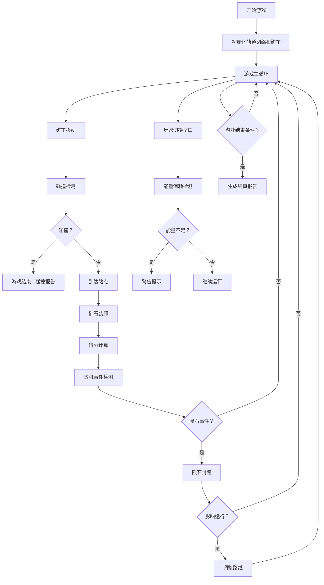

## 1. 产品概述

"太空矿车轨道调度"是一款科幻题材的策略调度游戏，玩家在小行星基地中扮演矿车调度员，通过切换轨道岔口来指挥矿车运输矿石，同时避免碰撞、管理能量、应对陨石事件。游戏核心在于实时决策与资源优化，每一步操作都会影响最终得分和结算报告。

## 2. 核心特性

### 2.1 用户角色

| 角色 | 注册方式 | 核心权限 |
|------|-----------|----------|
| 调度员 | 无需注册 | 游戏内调度矿车、查看报告、重放游戏 |

### 2.2 功能模块

1. **游戏主界面**：轨道网络可视化、矿车实时运行、岔口切换操作面板
2. **资源状态面板**：矿石仓储量、能量站状态、当前得分
3. **事件系统**：陨石预警、能量不足、碰撞警报
4. **结算报告页**：得分明细、失败原因分析、操作历史回放
5. **图表分析**：运输效率图表、资源变化曲线、操作时序图

### 2.3 页面详情

| 页面名称 | 模块名称 | 功能描述 |
|---------|---------|----------|
| 游戏主界面 | 轨道网络可视化 | 展示小行星基地的完整轨道网络，包括直轨、弯轨、岔口、矿石仓、能量站的位置和状态 |
| 游戏主界面 | 矿车实时运行 | 矿车在轨道上的实时位置和方向显示，支持多矿车同时运行 |
| 游戏主界面 | 岔口切换操作 | 点击岔口切换轨道方向，有明确的视觉反馈 |
| 游戏主界面 | 资源状态面板 | 实时显示矿石总量、能量剩余、当前得分、游戏时间 |
| 游戏主界面 | 事件提示系统 | 陨石事件警告、能量不足警告、碰撞警告的弹窗提示 |
| 结算报告页 | 得分明细 | 展示每个得分/扣分的详细来源和时间线 |
| 结算报告页 | 失败原因分析 | 游戏结束原因的详细分析，包括碰撞、能量耗尽、陨石封路等 |
| 结算报告页 | 操作历史回放 | 可逐步回放游戏过程中的关键操作节点 |
| 结算报告页 | 统计图表 | 运输效率柱状图、资源变化曲线图 |

## 3. 核心流程

## 4. 用户界面设计

### 4.1 设计风格

- **主色调**：深空蓝 (#0a1628) 作为背景，配合科技感的青色 (#00d4ff) 作为主强调色
- **辅助色**：警告红 (#ff4757)、成功绿 (#2ed573)、能量橙 (#ffa502)
- **按钮风格**：圆角矩形，带发光效果，悬停时有脉冲动画
- **字体**：使用等宽字体 (JetBrains Mono) 配合科技感无衬线字体
- **布局风格**：深色科技风，网格背景，半透明面板，霓虹发光边框
- **图标风格**：线性图标，带发光效果，科幻 HUD 风格

### 4.2 页面设计概述

| 页面名称 | 模块名称 | UI 元素 |
|---------|---------|----------|
| 游戏主界面 | 轨道网络 | 发光轨道线，动态矿车精灵，可点击岔口节点 |
| 游戏主界面 | 状态面板 | 半透明玻璃态面板，实时数据更新 |
| 游戏主界面 | 事件警告 | 全屏红色闪烁警告，音效提示 |
| 结算报告页 | 数据面板 | 卡片式布局，数据可视化图表 |
| 结算报告页 | 时间线 | 垂直时间线，可交互节点 |

### 4.3 响应式

桌面优先设计，支持平板自适应，触控设备优化触摸操作区域。

### 4.4 游戏场景设计

- **环境**：深空背景，带星点粒子效果
- **光照**：霓虹发光效果，轨道发光，矿车灯光轨迹
- **相机**：固定俯视视角，可缩放平移查看整个轨道网络
- **动画**：矿车移动动画、岔口切换动画、碰撞爆炸效果
- **后期处理**：辉光效果，扫描线效果，CRT 显示器风格
