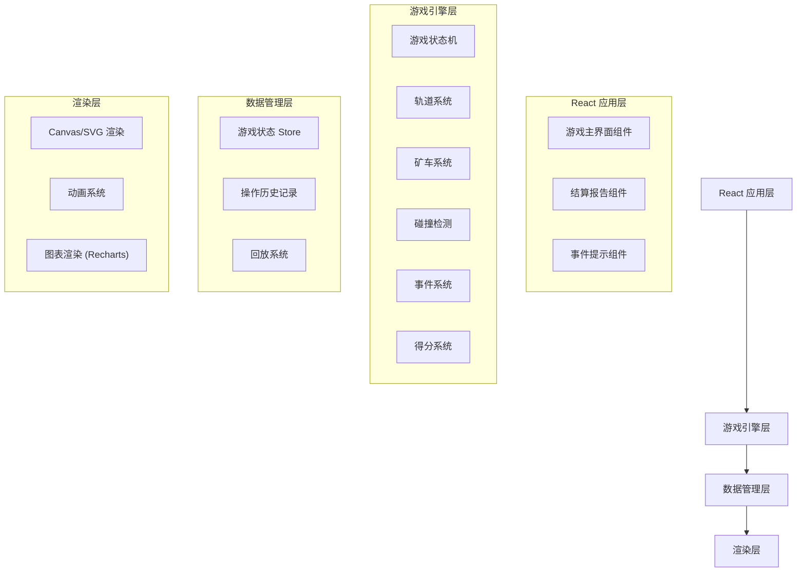

## 1. 架构设计



## 2. 技术描述

- **前端框架**: React@18 + TypeScript + Vite
- **样式方案**: TailwindCSS@3
- **游戏渲染**: Canvas 2D / SVG
- **图表库**: Recharts
- **状态管理**: Zustand
- **动画**: Framer Motion
- **图标**: Lucide React

## 3. 路由定义

| 路由 | 用途 |
|------|------|
| / | 游戏主界面 |
| /report | 结算报告页 |

## 4. 数据模型

### 4.1 游戏状态

```typescript
interface GameState {
  status: 'idle' | 'playing' | 'paused' | 'ended'
  time: number
  score: number
  energy: number
  ore: number
  level: number
  carts: Cart[]
  tracks: Track[]
  junctions: Junction[]
  stations: Station[]
  events: GameEvent[]
  operationHistory: OperationRecord[]
  endReason?: string
}
```

### 4.2 矿车

```typescript
interface Cart {
  id: string
  position: { x: number; y: number }
  trackId: string
  direction: 'forward' | 'backward'
  speed: number
  cargo: number
  maxCargo: number
  status: 'moving' | 'loading' | 'unloading' | 'broken'
}
```

### 4.3 轨道

```typescript
interface Track {
  id: string
  type: 'straight' | 'curve' | 'junction'
  from: { x: number; y: number }
  to: { x: number; y: number }
  blocked: boolean
  blockedReason?: string
}
```

### 4.4 岔口

```typescript
interface Junction {
  id: string
  position: { x: number; y: number }
  activeTrack: string
  availableTracks: string[]
}
```

### 4.5 站点

```typescript
interface Station {
  id: string
  type: 'ore' | 'energy' | 'warehouse'
  position: { x: number; y: number }
  capacity: number
  current: number
}
```

### 4.6 事件

```typescript
interface GameEvent {
  id: string
  type: 'meteor' | 'energy_low' | 'collision' | 'delivery'
  time: number
  data: Record<string, any>
  message: string
}
```

### 4.7 操作记录

```typescript
interface OperationRecord {
  id: string
  time: number
  type: 'junction_switch' | 'cart_command'
  data: Record<string, any>
  result: 'success' | 'failed'
  scoreChange: number
}
```

## 5. 核心模块划分

```
src/
├── components/
│   ├── game/
│   │   ├── GameCanvas.tsx      # 游戏画布组件
│   │   ├── TrackRenderer.tsx  # 轨道渲染
│   │   ├── CartRenderer.tsx   # 矿车渲染
│   │   └── JunctionControl.tsx    # 岔口控制
│   ├── ui/
│   │   ├── StatusPanel.tsx    # 状态面板
│   │   ├── EventToast.tsx     # 事件提示
│   │   └── ScoreBoard.tsx      # 得分面板
│   │   └── ControlPanel.tsx   # 控制面板
│   └── report/
│       ├── ReportPage.tsx        # 报告页面
│       ├── ScoreBreakdown.tsx   # 得分明细
│       ├── Timeline.tsx        # 时间线
│       └── Charts.tsx         # 图表
│       └── ReplayPlayer.tsx   # 回放播放器
├── store/
│   └── useGameStore.ts         # 游戏状态管理
├── engine/
│   ├── GameEngine.ts           # 游戏引擎
│   ├── TrackSystem.ts          # 轨道系统
│   ├── CartSystem.ts           # 矿车系统
│   ├── CollisionSystem.ts      # 碰撞检测
│   ├── EventSystem.ts          # 事件系统
│   └── ScoreSystem.ts          # 得分系统
├── types/
│   └── game.ts                 # 类型定义
└── utils/
    └── constants.ts            # 常量定义
```
