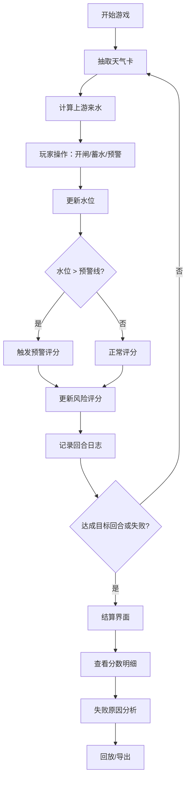

## 1. 产品概述

水库闸门防洪棋是一款面向水利科普馆的一屏交互式教学游戏原型。学生通过操控水库闸门、蓄水调度和预警发布，理解防洪决策中的取舍与权衡。

- 核心目标：让学生通过回合模拟，直观体验"开闸过猛/蓄水不足/预警太晚"三类典型失误的后果
- 目标用户：中小学生及水利科普馆参观者
- 产品价值：将抽象的水文调度转化为可操作、可回看、可解释的互动体验

## 2. 核心功能

### 2.1 功能模块

1. **游戏主界面**：水库可视化场景、水位曲线、回合控制、闸门操作面板
2. **回合模拟系统**：每回合天气卡抽取、上游来水计算、玩家决策（开闸/蓄水/预警）
3. **水位曲线图**：实时绘制水库水位、预警线、溢洪线的变化曲线
4. **风险评分系统**：实时计算并展示当前水位风险、下游安全风险、预警及时性评分
5. **结算与回放**：游戏结束后的分数明细、失败原因分析、回合级回放
6. **图表导出**：水位曲线、评分明细可导出为图片

### 2.2 页面详情

| 页面名称 | 模块名称 | 功能描述 |
|----------|----------|----------|
| 游戏主界面 | 水库场景 | 上中下游可视化，显示水库、闸门、村镇位置 |
| 游戏主界面 | 操作面板 | 闸门开度滑块、蓄水量调整、预警按钮 |
| 游戏主界面 | 水位曲线 | 实时折线图，含预警线、溢洪线标注 |
| 游戏主界面 | 状态面板 | 当前回合、天气、上游来水、风险评分 |
| 游戏主界面 | 回合日志 | 每回合操作记录及评分变化 |
| 结算界面 | 分数明细 | 各项得分/扣分明细及来源说明 |
| 结算界面 | 失败分析 | 若失败，高亮关键失误回合及原因 |
| 结算界面 | 回放控制 | 逐回合回放操作序列 |
| 结算界面 | 导出按钮 | 导出水位曲线和结算报告为图片 |

## 3. 核心流程

玩家从首页进入游戏，每回合依次经历：天气卡抽取 → 上游来水注入 → 玩家操作（开闸/蓄水/预警） → 水位计算 → 风险评分 → 回合日志记录。游戏在达成目标回合或触发失败条件（溃坝/洪水淹没）后结束，进入结算界面查看分数明细、失败原因，可回放或导出图表。

## 4. 用户界面设计

### 4.1 设计风格

- 主色调：深海蓝 `#1a365d` + 警戒橙 `#ed8936` + 安全绿 `#48bb78`
- 辅助色：水位蓝 `#4299e1`、蓄水中蓝 `#63b3ed`、警报红 `#f56565`
- 按钮风格：工业风方形按钮，带状态指示灯效果
- 字体：等宽字体展示数值数据，无衬线字体展示说明文字
- 布局：顶部分段式布局，左侧水库场景，右侧数据面板
- 图标：使用 lucide-react 图标库，搭配水坝、波浪、警报、图表等图标

### 4.2 页面设计概览

| 页面名称 | 模块名称 | UI 元素 |
|----------|----------|---------|
| 游戏主界面 | 水库场景 | SVG 水库剖面图，渐变色水位填充，动画水流效果 |
| 游戏主界面 | 操作面板 | 闸门开度滑块（0-100%），蓄水按钮组，预警开关 |
| 游戏主界面 | 水位曲线 | 折线图，预警线/溢洪线虚线标注，悬停显示数值 |
| 游戏主界面 | 状态面板 | 卡片式布局，数值大号等宽字体，颜色标识风险等级 |
| 结算界面 | 分数明细 | 表格布局，每行列出来源、操作、得分、说明 |
| 结算界面 | 回放控制 | 时间轴滑块，逐帧播放按钮 |

### 4.3 响应式设计

- 桌面优先设计，最小支持 1280px 宽度
- 操作面板与数据面板采用左右双栏布局
- 在小屏幕下自动切换为上下堆叠布局
- 水位曲线图表自适应容器宽度

## 5. 游戏规则明细

### 5.1 核心参数

| 参数 | 说明 | 取值范围 |
|------|------|----------|
| 水库容量 | 最大蓄水量 | 100 单位 |
| 安全水位 | 正常运行上限 | 70 单位 |
| 预警线 | 需发布预警的水位 | 80 单位 |
| 溢洪线 | 超过则溢洪 | 90 单位 |
| 溃坝水位 | 超过则游戏失败 | 100 单位 |

### 5.2 天气卡

| 天气类型 | 上游来水（每回合） | 概率 |
|----------|-------------------|------|
| 晴天 | 2-5 | 30% |
| 小雨 | 5-10 | 25% |
| 中雨 | 10-18 | 20% |
| 大雨 | 18-30 | 15% |
| 暴雨 | 30-45 | 10% |

### 5.3 评分规则

| 评分项 | 得分条件 | 分值 |
|--------|----------|------|
| 安全运行 | 水位在安全线以下 | +10/回合 |
| 预警及时 | 水位超预警线时已发布预警 | +15 |
| 预警滞后 | 水位超预警线未发布预警 | -20 |
| 开闸过猛 | 单回合开闸 > 50% 且下回合水位 < 安全线 | -10 |
| 蓄水不足 | 水位 < 30 且后续无大雨 | -5 |
| 溢洪损失 | 水位超溢洪线 | -30/回合 |
| 溃坝 | 水位超 100 | 游戏失败 |

### 5.4 失败条件

1. 水位超过 100（溃坝）
2. 连续 3 回合水位超过溢洪线（下游淹没）
3. 预警滞后导致风险评分低于 -50