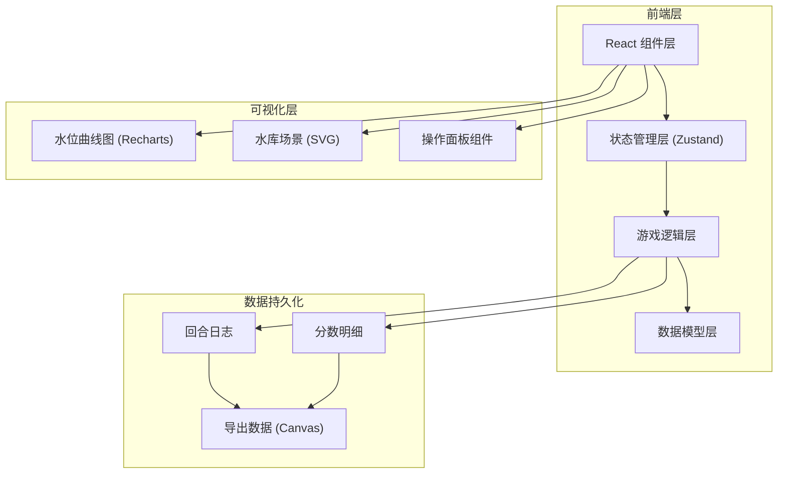

## 1. 架构设计



## 2. 技术说明

- 前端：React@18 + TypeScript + Vite
- 状态管理：Zustand
- 图表库：Recharts（水位曲线）
- 样式：TailwindCSS 3
- 图标：Lucide React
- 后端：无（纯前端单页应用）
- 数据持久化：LocalStorage（保存游戏记录）

## 3. 路由定义

| 路由 | 用途 |
|------|------|
| `/` | 游戏主界面（包含水库场景、操作面板、水位曲线、状态面板、回合日志） |
| `/result` | 结算界面（分数明细、失败分析、回放控制、导出按钮） |

## 4. 数据模型

### 4.1 游戏状态

```typescript
interface GameState {
  round: number;
  maxRounds: number;
  weather: WeatherCard;
  upstreamInflow: number;
  reservoirLevel: number;
  gateOpening: number;
  storage: number;
  warningIssued: boolean;
  riskScore: number;
  totalScore: number;
  status: 'playing' | 'success' | 'failed';
  failureReason: string | null;
  logs: RoundLog[];
  scoreDetails: ScoreDetail[];
}
```

### 4.2 天气卡

```typescript
interface WeatherCard {
  type: 'sunny' | 'lightRain' | 'moderateRain' | 'heavyRain' | 'storm';
  name: string;
  inflowMin: number;
  inflowMax: number;
  color: string;
  icon: string;
}
```

### 4.3 回合日志

```typescript
interface RoundLog {
  round: number;
  weather: WeatherCard;
  upstreamInflow: number;
  gateOpening: number;
  storageChange: number;
  reservoirLevel: number;
  warningIssued: boolean;
  scoreChange: number;
  events: string[];
}
```

### 4.4 分数明细

```typescript
interface ScoreDetail {
  round: number;
  category: string;
  score: number;
  reason: string;
  icon: string;
}
```

## 5. 项目结构

```
src/
├── components/
│   ├── ReservoirScene.tsx      # 水库可视化场景
│   ├── ControlPanel.tsx        # 闸门操作面板
│   ├── WaterLevelChart.tsx     # 水位曲线图
│   ├── StatusPanel.tsx         # 状态数据面板
│   ├── RoundLog.tsx            # 回合日志组件
│   ├── WeatherCard.tsx         # 天气卡展示
│   ├── ScoreDetail.tsx         # 分数明细表格
│   ├── FailureAnalysis.tsx     # 失败原因分析
│   ├── PlaybackControl.tsx     # 回放控制器
│   └── ExportButton.tsx        # 导出按钮
├── hooks/
│   ├── useGameState.ts         # 游戏状态管理
│   ├── useGameLogic.ts         # 游戏逻辑计算
│   └── useExport.ts            # 导出功能
├── pages/
│   ├── Game.tsx                # 游戏主界面
│   └── Result.tsx              # 结算界面
├── utils/
│   ├── weather.ts              # 天气卡生成
│   ├── scoring.ts              # 评分规则
│   └── export.ts               # 导出工具
├── types/
│   └── game.ts                 # 类型定义
├── data/
│   └── constants.ts            # 常量配置
├── App.tsx
└── main.tsx
```