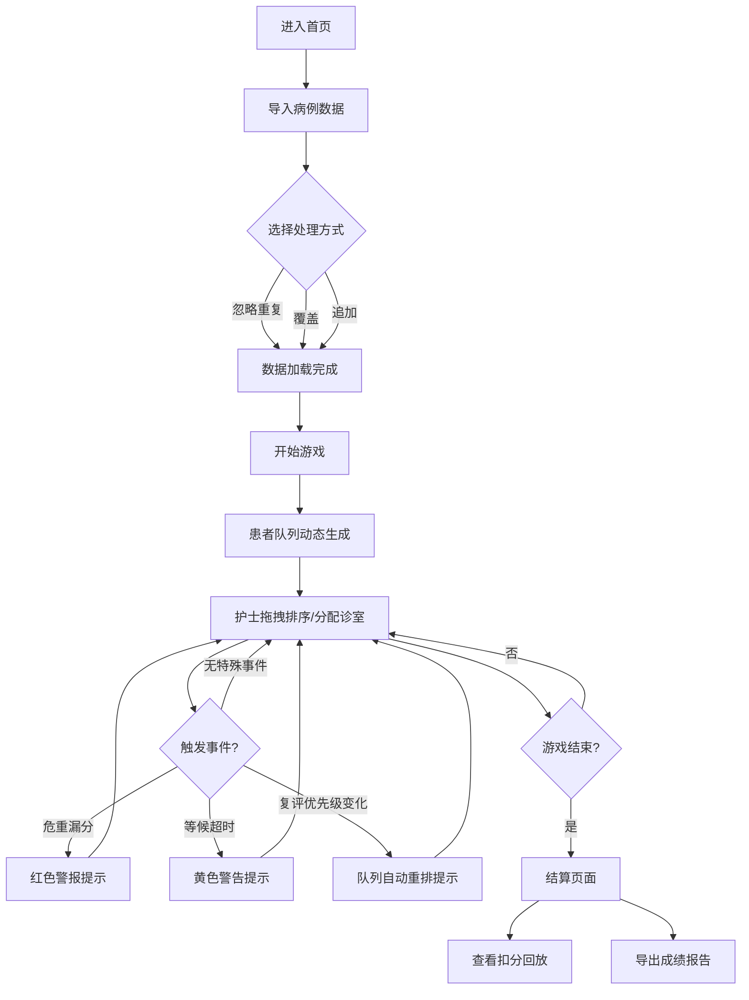

## 1. 产品概述

急诊分诊队列赛是一款面向医院新护士培训的浏览器端模拟游戏，通过模拟真实急诊场景，训练护士根据患者症状、候诊时长和诊室资源进行队列重排的决策能力。

- 解决问题：传统培训方式枯燥、漏分危重患者、超时等待等关键错误难以追溯
- 目标用户：急诊科新护士、护理培训师
- 核心价值：通过游戏化方式提升分诊准确率，降低临床风险

## 2. 核心功能

### 2.1 用户角色

| 角色 | 注册方式 | 核心权限 |
|------|----------|----------|
| 学员 | 直接使用 | 进行游戏、查看成绩、导出报告 |
| 培训师 | 直接使用 | 导入病例数据、管理题库、查看学员成绩 |

### 2.2 功能模块

1. **游戏主界面**：患者队列展示、诊室资源面板、操作控制区
2. **病例管理**：患者数据导入（忽略/覆盖/追加）、材料来源追踪
3. **游戏流程**：开始、暂停、重开、结算完整流程
4. **特殊事件处理**：危重漏分警报、等候超时提示、复评优先级变化
5. **成绩系统**：实时计分、扣分回放、历史回看、成绩导出

### 2.3 页面详情

| 页面名称 | 模块名称 | 功能描述 |
|---------|----------|----------|
| 首页 | 游戏入口 | 开始游戏、导入数据、查看历史记录 |
| 游戏界面 | 队列管理 | 拖拽排序患者、查看患者详情、分配诊室 |
| 游戏界面 | 事件面板 | 显示复评事件、超时警告、危重漏分提示 |
| 游戏界面 | 操作控制 | 开始/暂停/重开/结束游戏 |
| 结算页面 | 成绩展示 | 总分、扣分明细、错误回放、失败原因分析 |
| 数据管理 | 导入导出 | 病例导入（选择忽略/覆盖/追加）、成绩导出 |

## 3. 核心流程

用户进入首页 → 导入病例数据（选择处理方式） → 开始游戏 → 患者队列动态更新 → 护士拖拽排序/分配诊室 → 触发特殊事件（超时/复评/危重） → 游戏结束 → 查看成绩和扣分回放 → 导出成绩报告

## 4. 用户界面设计

### 4.1 设计风格

- 主色调：医疗蓝（#165DFF）作为主色，警示红（#F53F3F）用于危重警报，提醒黄（#FFAA00）用于超时提示
- 按钮风格：圆角8px，悬停微放大效果，危重按钮带脉冲动画
- 字体：标题使用"Noto Sans SC"粗体，正文使用"Noto Sans SC"常规
- 布局风格：卡片式布局，队列区域采用竖向列表，诊室区域采用横向排列
- 图标风格：使用医疗相关图标，患者卡片带头像和症状标签

### 4.2 页面设计概述

| 页面名称 | 模块名称 | UI元素 |
|---------|----------|--------|
| 首页 | 入口区域 | 大标题、开始按钮、导入按钮、历史记录列表 |
| 游戏界面 | 顶部状态栏 | 剩余时间、当前得分、已处理患者数 |
| 游戏界面 | 患者队列区 | 可拖拽卡片，显示：姓名、症状标签、候诊时长、优先级 |
| 游戏界面 | 诊室资源区 | 4个诊室卡片，显示：状态、当前患者、剩余时间 |
| 游戏界面 | 事件提示区 | 右侧悬浮面板，按时间顺序显示特殊事件 |
| 游戏界面 | 操作控制区 | 开始/暂停/重开/结束按钮 |
| 结算页面 | 成绩概览 | 大分数展示、等级评定、完成时间 |
| 结算页面 | 扣分明细 | 时间线形式展示每次扣分及原因 |
| 结算页面 | 回放控制 | 进度条、播放/暂停、跳转特定时刻 |

### 4.3 响应性

- Desktop-first设计，主操作区最小宽度1200px
- 平板设备适配：队列区和诊区可垂直堆叠
- 关键操作按钮保持足够触控区域（最小44px）

### 4.4 交互特效

- 患者卡片拖拽时半透明，释放时弹性动画
- 危重警报：红色边框脉冲动画 + 轻微震动
- 超时警告：黄色闪烁背景
- 队列重排：平滑过渡动画（0.3s ease）
- 得分变化：数字滚动动画
- 事件提示：从右侧滑入，悬停时暂停自动消失
