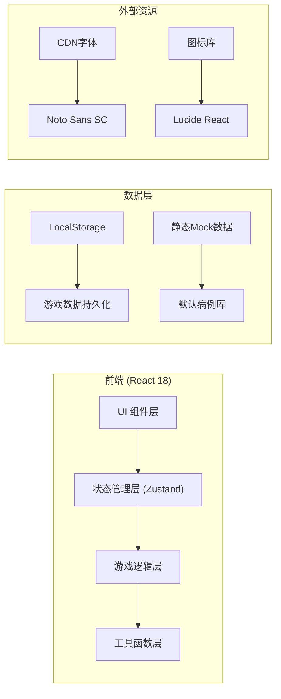

## 1. 架构设计



## 2. 技术描述

- **前端框架**: React@18 + TypeScript
- **构建工具**: Vite@5
- **状态管理**: Zustand（轻量级，适合游戏状态）
- **样式方案**: TailwindCSS@3 + CSS动画
- **拖拽库**: @dnd-kit/core + @dnd-kit/sortable（拖拽排序）
- **图标**: lucide-react
- **数据持久化**: LocalStorage API
- **导出功能**: 原生 Blob + FileSaver（CSV/JSON格式）

## 3. 路由定义

| 路由 | 页面组件 | 功能 |
|------|----------|------|
| `/` | HomePage | 首页：开始游戏、导入数据、历史记录 |
| `/game` | GamePage | 游戏主界面：队列管理、诊室分配、事件提示 |
| `/result` | ResultPage | 结算页面：成绩展示、扣分回放、导出 |

## 4. 数据模型

### 4.1 核心数据类型定义

```typescript
// 患者优先级
type Priority = 'critical' | 'urgent' | 'normal' | 'low';

// 患者状态
type PatientStatus = 'waiting' | 'in_room' | 'completed' | 'discharged';

// 事件类型
type EventType = 'timeout' | 're_evaluate' | 'critical_miss' | 'priority_change' | 'room_assign';

// 诊室状态
type RoomStatus = 'idle' | 'occupied' | 'cleaning';

// 患者信息
interface Patient {
  id: string;
  name: string;
  age: number;
  gender: 'male' | 'female';
  symptoms: string[];
  initialPriority: Priority;
  currentPriority: Priority;
  waitTime: number; // 已等待时长（秒）
  maxWaitTime: number; // 最大允许等待时长
  arrivalTime: number; // 到达时间戳
  status: PatientStatus;
  roomId?: string;
  source: string; // 材料来源
  reEvaluateCount: number; // 复评次数
  history: PriorityChange[]; // 优先级变化历史
}

// 优先级变化记录
interface PriorityChange {
  timestamp: number;
  oldPriority: Priority;
  newPriority: Priority;
  reason: string;
}

// 诊室信息
interface Room {
  id: string;
  name: string;
  status: RoomStatus;
  currentPatientId?: string;
  remainingTime: number; // 剩余处理时间
  totalTime: number; // 总处理时间
}

// 游戏事件
interface GameEvent {
  id: string;
  type: EventType;
  timestamp: number;
  message: string;
  patientId?: string;
  roomId?: string;
  pointsChange: number; // 分数变化
  details?: Record<string, any>;
}

// 游戏状态
interface GameState {
  status: 'idle' | 'playing' | 'paused' | 'ended';
  startTime: number;
  elapsedTime: number;
  totalTime: number; // 游戏总时长
  score: number;
  maxScore: number;
  patients: Patient[];
  rooms: Room[];
  events: GameEvent[];
  currentPatientIndex: number;
}

// 导入配置
interface ImportConfig {
  mode: 'ignore' | 'overwrite' | 'append';
}

// 成绩记录
interface GameRecord {
  id: string;
  startTime: number;
  endTime: number;
  totalScore: number;
  maxScore: number;
  accuracy: number;
  criticalMissCount: number;
  timeoutCount: number;
  reEvaluateCount: number;
  events: GameEvent[];
  patientSnapshots: Patient[];
}
```

### 4.2 数据持久化

- **存储键**: `triage_game_records`, `triage_patients_data`
- **格式**: JSON
- **内容**: 历史游戏记录、自定义病例数据

## 5. 核心模块设计

### 5.1 游戏引擎 (gameEngine.ts)

```typescript
// 核心方法
- startGame(): void
- pauseGame(): void
- resumeGame(): void
- restartGame(): void
- endGame(): GameRecord
- update(deltaTime: number): void // 每帧更新
- assignPatientToRoom(patientId: string, roomId: string): boolean
- reorderPatients(fromIndex: number, toIndex: number): void
- triggerReEvaluate(patientId: string, newPriority: Priority): void
```

### 5.2 计分系统 (scoring.ts)

```typescript
// 计分规则
- 正确分诊危重患者: +100分
- 正确分诊急症患者: +50分
- 正确分诊普通患者: +20分
- 危重漏分: -200分 (红色警报)
- 等候超时: -50分/30秒 (黄色警告)
- 复评后优先级调整正确: +30分
- 复评后优先级调整错误: -80分
- 诊室空闲超过30秒: -20分
```

### 5.3 数据导入导出 (dataManager.ts)

```typescript
// 方法
- importPatients(data: Patient[], mode: 'ignore' | 'overwrite' | 'append'): ImportResult
- exportPatients(): Patient[]
- exportGameRecord(record: GameRecord, format: 'json' | 'csv'): Blob
- validatePatientData(data: any): ValidationResult
```

## 6. 组件结构

```
src/
├── components/
│   ├── game/
│   │   ├── PatientCard.tsx      # 患者卡片
│   │   ├── PatientQueue.tsx     # 患者队列
│   │   ├── RoomCard.tsx         # 诊室卡片
│   │   ├── RoomPanel.tsx        # 诊室面板
│   │   ├── EventPanel.tsx       # 事件面板
│   │   ├── GameControls.tsx     # 游戏控制按钮
│   │   └── GameHeader.tsx       # 顶部状态栏
│   ├── result/
│   │   ├── ScoreOverview.tsx    # 成绩概览
│   │   ├── DeductionTimeline.tsx # 扣分明细时间线
│   │   └── ReplayControls.tsx   # 回放控制
│   ├── home/
│   │   ├── ImportModal.tsx      # 导入弹窗
│   │   └── HistoryList.tsx      # 历史记录
│   └── common/
│       ├── AlertModal.tsx       # 警报弹窗
│       └── Button.tsx           # 通用按钮
├── stores/
│   └── useGameStore.ts          # 游戏状态管理
├── types/
│   └── index.ts                 # 类型定义
├── utils/
│   ├── gameEngine.ts            # 游戏引擎
│   ├── scoring.ts               # 计分系统
│   ├── dataManager.ts           # 数据导入导出
│   └── mockData.ts              # Mock数据
├── pages/
│   ├── HomePage.tsx
│   ├── GamePage.tsx
│   └── ResultPage.tsx
└── App.tsx
```

## 7. 游戏循环设计

```
requestAnimationFrame
    ↓
update(deltaTime)
    ├─ 更新患者等待时间
    ├─ 检查超时（触发timeout事件）
    ├─ 更新诊室剩余时间
    ├─ 检查诊室完成（释放患者）
    ├─ 随机触发复评事件
    ├─ 检查危重漏分
    └─ 生成新患者（按时间间隔）
    ↓
render()
```

## 8. 性能优化

- 使用React.memo优化患者卡片和诊室卡片渲染
- 游戏状态使用Zustand选择器避免不必要重渲染
- 拖拽操作使用@dnd-kit的优化策略
- 事件列表采用虚拟滚动（当事件超过50条时）
- LocalStorage操作采用防抖批量写入
