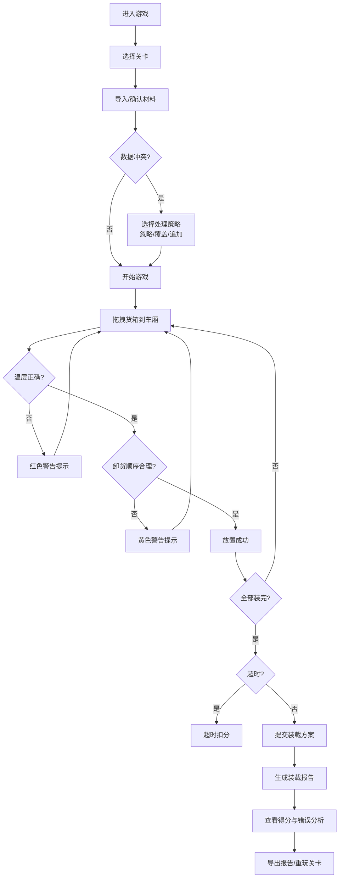

## 1. 产品概述

冷链车装载闯关游戏是一款面向物流司机的培训工具，通过交互式游戏化方式帮助司机理解冷链运输的温度控制原则。游戏模拟真实的冷链车装载场景，训练司机正确区分冷冻、冷藏、常温货物的温层摆放规则，掌握合理的卸货顺序，避免因操作不当导致的温度失控和货物损坏。

## 2. 核心功能

### 2.1 用户角色

| 角色 | 注册方式 | 核心权限 |
|------|----------|----------|
| 培训主管 | 无需注册 | 导入材料、配置关卡、查看培训报告 |
| 司机学员 | 无需注册 | 进行游戏、查看得分、回看失败原因 |

### 2.2 功能模块

1. **关卡选择页**：关卡列表、难度选择、成绩记录
2. **游戏主界面**：货箱待装区、车厢格位区、计时器、操作控制栏
3. **装载报告页**：得分详情、错误分析、温层合规性检查、卸货顺序验证
4. **材料管理**：货箱数据导入、温层配置、站点设置、数据版本追踪

### 2.3 页面详情

| 页面名称 | 模块名称 | 功能描述 |
|----------|----------|----------|
| 关卡选择页 | 关卡卡片 | 显示关卡名称、难度、最佳成绩、完成状态 |
| 关卡选择页 | 材料导入 | 支持JSON格式导入货箱、温层、站点数据，处理冲突策略选择 |
| 游戏主界面 | 货箱待装区 | 展示待装货箱，支持拖拽操作，显示温层标签 |
| 游戏主界面 | 车厢格位区 | 三维车厢视图，分温层显示格位，支持拖放放置 |
| 游戏主界面 | 操作控制栏 | 开始、暂停、继续、重开、撤销、提交按钮 |
| 游戏主界面 | 实时提示区 | 温层混放警告、卸货顺序冲突提示、超时预警 |
| 装载报告页 | 得分面板 | 总分、分项得分、扣分明细 |
| 装载报告页 | 错误回溯 | 每个错误的时间点、位置、原因说明 |
| 装载报告页 | 报告导出 | 支持PDF/JSON格式导出装载报告 |

## 3. 核心流程

## 4. 用户界面设计

### 4.1 设计风格

- **主色调**：冷链蓝 (#165DFF) 作为主色，代表专业和低温
- **温层标识色**：冷冻-深蓝紫 (#6B3FA0)、冷藏-青蓝 (#2EC4B6)、常温-暖橙 (#FF9F1C)
- **警示色**：错误-红 (#E71D36)、警告-黄 (#FFBF00)、成功-绿 (#2ECC71)
- **按钮风格**：圆角卡片式按钮，带有微妙阴影和悬浮动效
- **字体**：使用现代无衬线字体，数字等宽显示确保计时器清晰可读
- **布局风格**：分区明确的卡片式布局，车厢区域采用透视网格增强空间感
- **图标风格**：线性图标配合填充色，货箱使用立体图标增强辨识度

### 4.2 页面设计概述

| 页面名称 | 模块名称 | UI元素 |
|----------|----------|--------|
| 关卡选择页 | 关卡卡片 | 渐变背景卡片、悬浮放大效果、进度条显示完成度 |
| 游戏主界面 | 货箱待装区 | 横向滚动卡片，温层色标签，拖拽时光标变化 |
| 游戏主界面 | 车厢格位区 | 三维透视车厢，分层背景，放置时高亮提示 |
| 游戏主界面 | 操作控制栏 | 固定底部，半透明背景，图标+文字按钮 |
| 游戏主界面 | 实时提示区 | 右上角Toast通知，错误时震动动画 |
| 装载报告页 | 得分圆环 | 环形进度条动画，分数渐入效果 |
| 装载报告页 | 时间线 | 错误事件按时间轴排列，可点击查看详情 |

### 4.3 响应式

- 桌面端优先设计，适配1280px及以上宽度
- 平板端自适应布局，车厢区域保持最小比例
- 移动端简化操作，货箱采用点击选择+点击放置模式替代拖拽

### 4.4 交互细节

- 拖拽货箱时显示半透明预览，跟随鼠标移动
- 放置到错误温层时格位边框变红并轻微抖动
- 撤销操作时货箱平滑飞回待装区
- 计时器最后10秒数字变红并闪烁
- 报告页面元素依次入场，形成流畅的加载动画
