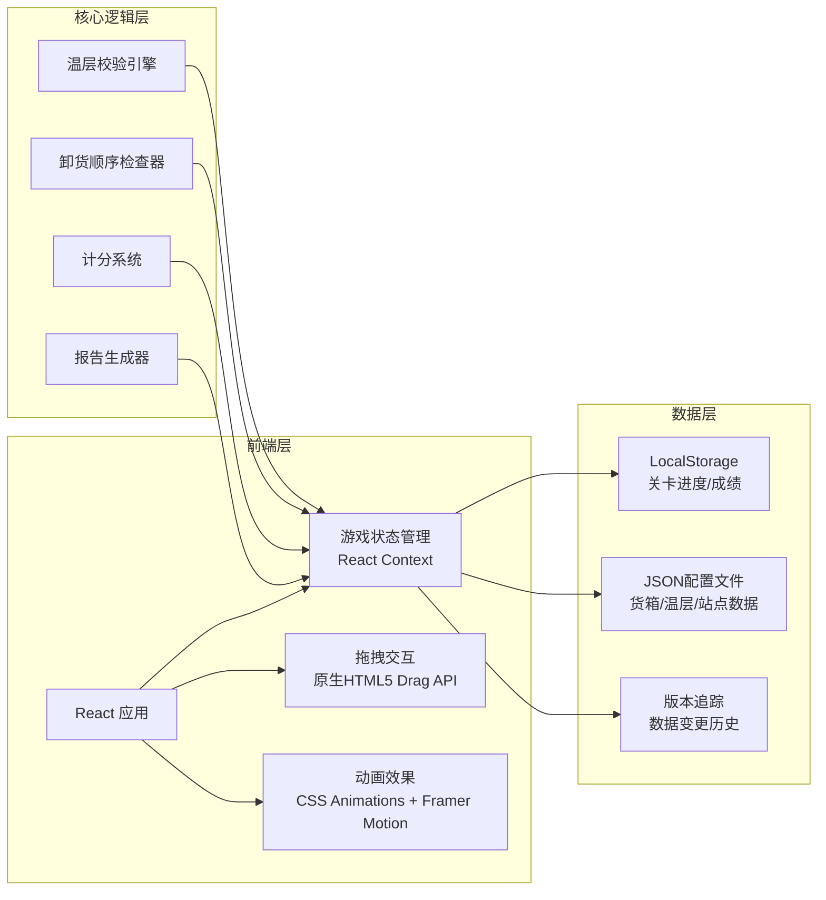

## 1. 架构设计



## 2. 技术描述

- **前端框架**：React@18 + TypeScript
- **构建工具**：Vite@5
- **样式方案**：TailwindCSS@3
- **动画库**：Framer Motion
- **图标库**：Lucide React
- **数据存储**：LocalStorage（本地持久化）
- **状态管理**：React Context + useReducer
- **拖拽实现**：原生HTML5 Drag and Drop API

## 3. 页面路由

| 路由 | 页面组件 | 功能 |
|------|----------|------|
| / | LevelSelect | 关卡选择与材料导入 |
| /game/:levelId | GameBoard | 游戏主界面 |
| /report/:sessionId | LoadReport | 装载报告页 |

## 4. 数据模型

### 4.1 核心数据结构

```typescript
// 温层类型
type TemperatureZone = 'frozen' | 'chilled' | 'ambient';

// 货箱
interface CargoBox {
  id: string;
  name: string;
  zone: TemperatureZone;
  weight: number;
  destination: string; // 卸货站点ID
  priority: number; // 卸货优先级，数字越小越早卸
}

// 车厢格位
interface Compartment {
  id: string;
  zone: TemperatureZone;
  row: number;
  col: number;
  occupiedBy: string | null; // CargoBox ID
}

// 卸货站点
interface Station {
  id: string;
  name: string;
  order: number; // 站点顺序
}

// 关卡配置
interface Level {
  id: string;
  name: string;
  difficulty: 'easy' | 'medium' | 'hard';
  timeLimit: number; // 秒
  cargoBoxes: CargoBox[];
  compartments: Compartment[];
  stations: Station[];
  source: string; // 数据来源
  version: number;
  lastModified: number;
}

// 游戏记录
interface GameSession {
  id: string;
  levelId: string;
  startTime: number;
  endTime: number | null;
  pauseDuration: number;
  actions: GameAction[];
  score: ScoreDetail | null;
  errors: GameError[];
}

// 游戏动作
interface GameAction {
  type: 'place' | 'remove' | 'undo' | 'pause' | 'resume';
  timestamp: number;
  cargoId?: string;
  compartmentId?: string;
  fromZone?: TemperatureZone;
  toZone?: TemperatureZone;
}

// 游戏错误
interface GameError {
  type: 'zone_mismatch' | 'unload_order' | 'timeout';
  timestamp: number;
  cargoId: string;
  compartmentId?: string;
  message: string;
}

// 得分详情
interface ScoreDetail {
  total: number;
  zoneCorrectness: number;
  unloadOrder: number;
  timeBonus: number;
  deductions: Deduction[];
}

interface Deduction {
  type: string;
  amount: number;
  reason: string;
}
```

### 4.2 数据导入与冲突处理

```typescript
// 导入策略
type ImportStrategy = 'skip' | 'overwrite' | 'append';

interface ImportResult {
  added: number;
  updated: number;
  skipped: number;
  conflicts: ConflictInfo[];
}

interface ConflictInfo {
  existingId: string;
  incomingId: string;
  field: string;
  existingValue: any;
  incomingValue: any;
}
```

## 5. 核心算法

### 5.1 温层校验算法

- 输入：货箱温层、目标格位温层
- 输出：是否允许放置、错误信息
- 规则：冷冻→冷冻、冷藏→冷藏、常温→常温，跨温层放置直接判定错误

### 5.2 卸货顺序检查

- 输入：当前装载状态、卸货站点顺序
- 逻辑：检查是否存在高优先级货箱被低优先级货箱阻挡的情况
- 输出：阻挡警告、涉及货箱信息

### 5.3 计分规则

- 基础分：100分
- 温层正确：每个货箱+5分
- 卸货顺序最优：每个正确位置+3分
- 时间奖励：剩余时间每秒+0.5分
- 扣分：温层错误-10分/次，顺序警告-5分/次，超时-1分/秒

## 6. 性能与存储

- 游戏状态实时保存到LocalStorage，支持刷新恢复
- 报告数据使用Blob生成，支持JSON导出
- 历史记录最多保留50条，超出自动清理最早记录
