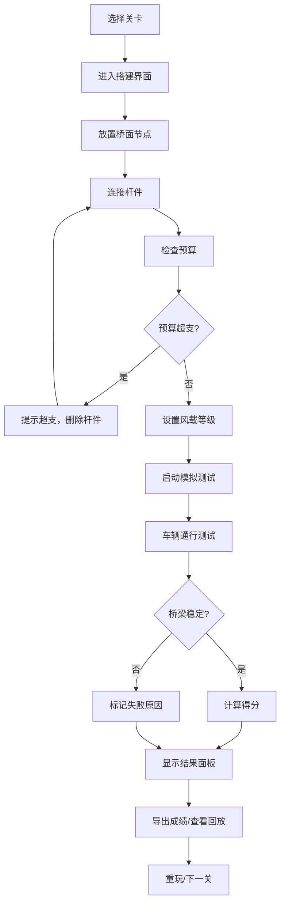

## 1. 产品概述
桥梁受力搭建赛是一款面向物理社团的2D物理模拟游戏，玩家在预算约束下使用杆件搭建桥梁，承受车辆通行和风载挑战。
- 核心目的：提供直观的物理教学工具，让玩家理解结构力学、材料成本与工程权衡
- 目标用户：物理社团成员、学生、物理爱好者

## 2. 核心功能

### 2.1 用户角色
| 角色 | 注册方式 | 核心权限 |
|------|----------|----------|
| 玩家 | 本地使用 | 游戏游玩、关卡挑战、成绩导出、回放查看 |

### 2.2 功能模块
1. **主菜单页面**：开始游戏、关卡选择、成绩回放、游戏说明
2. **搭建界面**：桥梁编辑、材料面板、预算监控、风载设置
3. **模拟测试**：车辆通行、物理模拟、失败检测、实时受力显示
4. **结果界面**：成绩统计、失败原因分析、受力报告、导出功能
5. **回放系统**：游戏过程回放、失败瞬间定格、关键数据回顾
6. **材料导入**：批量导入材料配置、冲突处理策略（忽略/覆盖/追加）

### 2.3 页面详情
| 页面名称 | 模块名称 | 功能描述 |
|----------|----------|----------|
| 主菜单 | 导航区 | 关卡选择、继续游戏、成绩回放、游戏设置 |
| 搭建界面 | 编辑画布 | 点击放置节点、拖拽连接杆件、删除操作 |
| 搭建界面 | 材料面板 | 杆件类型选择、材料属性显示、成本预览 |
| 搭建界面 | 状态面板 | 预算显示、已用材料、支点数量、风载设置 |
| 模拟测试 | 动画区 | 车辆行驶动画、桥梁变形、杆件应力颜色反馈 |
| 模拟测试 | 实时数据 | 应力峰值、预算使用、当前载荷 |
| 结果界面 | 成绩面板 | 得分计算、星级评价、时间统计 |
| 结果界面 | 失败分析 | 杆件过载位置、预算超支详情、支点稳定性报告 |
| 结果界面 | 受力报告 | 各杆件受力图表、最大应力点标注 |
| 回放界面 | 控制区 | 播放/暂停、进度拖拽、倍速调节 |
| 回放界面 | 数据同步 | 时间轴同步显示受力数据和预算变化 |
| 材料导入 | 导入面板 | 文件选择、预览数据、冲突策略选择 |

## 3. 核心流程

玩家选择关卡 → 进入搭建界面 → 规划桥梁结构 → 放置节点连接杆件 → 监控预算 → 设置风载 → 启动测试 → 观察车辆通行 → 检测失败条件 → 显示结果与分析 → 导出成绩或重玩

## 4. 用户界面设计

### 4.1 设计风格
- 主色调：深蓝色(#1e3a5f)代表工程与可靠，辅助色橙色(#f97316)用于强调交互
- 按钮风格：圆角矩形，带有微妙阴影和悬停动画
- 字体：标题使用Orbitron增强科技感，正文使用Roboto Mono提升数据可读性
- 布局：左侧工具面板 + 中央画布 + 右侧状态面板的三栏布局
- 图标风格：线性简约图标，配合颜色编码区分功能

### 4.2 页面设计概览
| 页面名称 | 模块名称 | UI元素 |
|----------|----------|--------|
| 主菜单 | 背景 | 动态桥梁结构线条动画 |
| 搭建界面 | 画布 | 网格背景、可拖拽节点、彩色杆件(按应力) |
| 搭建界面 | 材料面板 | 卡片式材料选择，显示成本和强度参数 |
| 结果界面 | 成绩区 | 大号数字动画、星级点亮效果 |
| 结果界面 | 受力报告 | 渐变色应力图表、可交互数据点 |
| 回放界面 | 时间轴 | 刻度标尺、关键事件标记点 |

### 4.3 响应式
- 桌面端优先，支持1280px以上分辨率
- 平板适配：工具面板可折叠，画布自适应缩放
- 触屏优化：节点点击区域扩大，支持双指缩放

### 4.4 动画与反馈
- 失败动画：断裂处粒子爆炸效果，杆件按应力颜色渐变变红
- 成功动画：桥梁轻微弹跳，星星依次点亮
- 受力反馈：杆件颜色从绿色→黄色→红色实时变化
- 悬停效果：节点放大、杆件高亮、信息提示浮现
