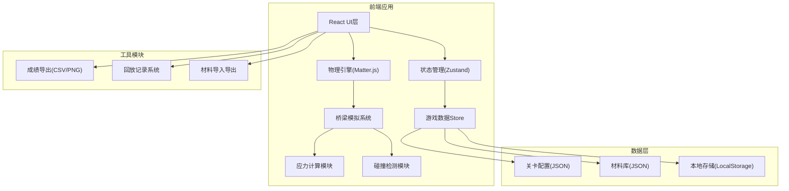

## 1. 架构设计



## 2. 技术描述
- 前端框架：React@18 + TypeScript
- 构建工具：Vite@5
- 样式方案：TailwindCSS@3
- 状态管理：Zustand
- 物理引擎：Matter.js (2D刚体物理模拟)
- 图表绘制：Canvas API + Recharts
- 数据存储：LocalStorage + JSON文件

## 3. 路由定义
| 路由 | 用途 |
|------|------|
| / | 主菜单页面 |
| /level/:id | 关卡选择页面 |
| /build/:levelId | 桥梁搭建界面 |
| /simulate/:levelId | 模拟测试页面 |
| /result/:sessionId | 结果与分析页面 |
| /replay/:sessionId | 回放查看页面 |

## 4. 数据模型

### 4.1 核心数据结构

```typescript
// 节点
interface Node {
  id: string;
  x: number;
  y: number;
  isAnchor: boolean;  // 是否为支点
  isDeck: boolean;    // 是否为桥面节点
}

// 杆件
interface Member {
  id: string;
  startNodeId: string;
  endNodeId: string;
  materialId: string;
  stress: number;     // 当前应力
  maxStress: number;  // 最大承受应力
  broken: boolean;
}

// 材料
interface Material {
  id: string;
  name: string;
  costPerMeter: number;
  maxCompression: number;  // 最大压力
  maxTension: number;      // 最大拉力
  density: number;
  color: string;
  source?: string;         // 材料来源记录
}

// 车辆
interface Vehicle {
  id: string;
  name: string;
  weight: number;
  speed: number;
  width: number;
  wheels: { x: number; radius: number }[];
}

// 关卡
interface Level {
  id: string;
  name: string;
  description: string;
  budget: number;
  span: number;           // 跨度
  height: number;         // 高度限制
  anchors: { x: number; y: number }[];  // 支点位置
  vehicles: string[];     // 需通过的车辆ID列表
  windLoad: number;       // 风载等级 0-3
  deckNodes: { x: number; y: number }[];  // 桥面节点
}

// 游戏会话
interface GameSession {
  id: string;
  levelId: string;
  nodes: Node[];
  members: Member[];
  totalCost: number;
  windSetting: number;
  startTime: number;
  endTime?: number;
  success: boolean;
  failureReason?: 'overload' | 'overbudget' | 'anchor_fail' | 'wind';
  failureMemberId?: string;
  score?: number;
  replayData: ReplayFrame[];
}

// 回放帧
interface ReplayFrame {
  timestamp: number;
  nodePositions: { [nodeId: string]: { x: number; y: number } };
  memberStresses: { [memberId: string]: number };
  vehiclePosition: number;
  budgetUsed: number;
}

// 材料导入策略
type ImportStrategy = 'ignore' | 'overwrite' | 'append';
```

### 4.2 状态管理设计

```typescript
// 游戏全局状态
interface GameState {
  // 关卡
  currentLevel: Level | null;
  levels: Level[];
  
  // 搭建
  nodes: Node[];
  members: Member[];
  selectedMaterial: string | null;
  selectedNode: string | null;
  totalCost: number;
  windSetting: number;
  
  // 模拟
  isSimulating: boolean;
  simulationTime: number;
  vehicleProgress: number;
  
  // 结果
  currentSession: GameSession | null;
  sessions: GameSession[];
  
  // 材料库
  materials: Material[];
  importStrategy: ImportStrategy;
  
  // Actions
  setCurrentLevel: (id: string) => void;
  addNode: (x: number, y: number, isDeck?: boolean) => void;
  connectNodes: (startId: string, endId: string) => void;
  deleteMember: (id: string) => void;
  setWindSetting: (level: number) => void;
  startSimulation: () => void;
  endSimulation: (success: boolean, reason?: string) => void;
  importMaterials: (data: Material[], strategy: ImportStrategy) => void;
  exportResults: (sessionId: string, format: 'csv' | 'png') => void;
  loadReplay: (sessionId: string) => void;
}
```

## 5. 核心算法模块

### 5.1 应力计算
```
杆件应力 = (轴向力) / (横截面积)
轴向力通过Matter.js约束反力计算
颜色映射: 应力/最大应力 → 绿黄红渐变
```

### 5.2 失败检测
1. **杆件过载**：|stress| > maxStress → 标记断裂
2. **预算超支**：totalCost > budget → 禁止继续添加
3. **支点不稳**：anchor节点位移超过阈值 → 支点失效
4. **风载影响**：横向风力 × 迎风面积 → 附加侧向力

### 5.3 得分计算
```
基础分 = 1000
预算节省奖励 = (预算 - 实际花费) / 预算 × 500
时间奖励 = (1 - 用时/标准时间) × 200
扣分 = 杆件过载次数 × 100 + 警告次数 × 20
最终得分 = 基础分 + 预算节省奖励 + 时间奖励 - 扣分
星级: ≥1500 ★★★, ≥1200 ★★, ≥900 ★
```

## 6. 文件结构

```
src/
├── components/
│   ├── BuildCanvas.tsx      # 搭建画布
│   ├── MaterialPanel.tsx    # 材料面板
│   ├── StatusBar.tsx        # 状态栏
│   ├── SimulationView.tsx   # 模拟视图
│   ├── ResultPanel.tsx      # 结果面板
│   ├── ReplayPlayer.tsx     # 回放播放器
│   └── ImportDialog.tsx     # 导入对话框
├── store/
│   └── useGameStore.ts      # 游戏状态
├── physics/
│   ├── BridgeSimulator.ts   # 桥梁模拟器
│   ├── StressCalculator.ts  # 应力计算
│   └── WindEffect.ts        # 风载效果
├── data/
│   ├── levels.json          # 关卡配置
│   └── materials.json       # 材料库
├── types/
│   └── index.ts             # 类型定义
└── utils/
    ├── export.ts            # 导出工具
    ├── replay.ts            # 回放工具
    └── import.ts            # 导入工具
```
