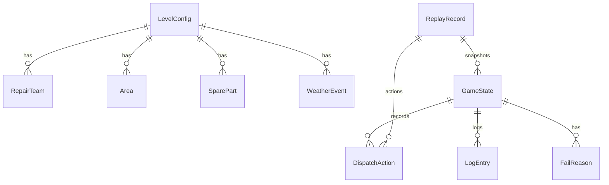

## 1. 架构设计

```mermaid
flowchart TD
    "UI层 (React组件)" --> "状态管理层 (Zustand)"
    "状态管理层 (Zustand)" --> "游戏引擎层 (纯函数)"
    "游戏引擎层 (纯函数)" --> "数据模型层 (TypeScript类型)"
    "数据模型层 (TypeScript类型)" --> "关卡配置数据 (JSON)"
    "UI层 (React组件)" --> "回放系统"
    "回放系统" --> "导出报告 (JSON下载)"
```

## 2. 技术说明
- 前端：React@18 + TypeScript + Vite
- 样式：TailwindCSS@3 + 自定义CSS变量
- 状态管理：Zustand（轻量级，适合游戏状态）
- 图表/动画：CSS动画 + requestAnimationFrame
- 构建工具：Vite
- 无后端，所有数据前端模拟
- 无数据库，使用 localStorage 保存本地进度和回放记录

## 3. 路由定义
| 路由 | 用途 |
|------|------|
| / | 主界面，关卡选择 |
| /game/:levelId | 游戏主界面，指定关卡 |
| /result/:levelId | 关卡结果页 |
| /replay/:replayId | 操作回放入口（从结果页跳转） |

## 4. API定义
无后端，所有操作为前端状态管理。以下为核心数据类型：

```typescript
// 抢修队
interface RepairTeam {
  id: string;
  name: string;
  skills: SkillType[];     // 技能类型
  status: TeamStatus;      // idle | executing | cooling
  cooldown: number;        // 剩余冷却回合数
  currentTarget: string | null; // 当前派遣目标
  executeRounds: number;   // 执行还需多少回合
}

// 用户区域
interface Area {
  id: string;
  name: string;
  type: AreaType;          // hospital | residential | commercial | industrial
  priority: number;        // 优先级 1-5，数字越小优先级越高
  powerStatus: PowerStatus; // normal | damaged | blackout
  timeoutRounds: number;   // 超时剩余回合数
  requiredSkill: SkillType; // 需要的技能
  userCount: number;       // 影响用户数
  reward: number;          // 修复得分
  penalty: number;         // 超时扣分
}

// 备件
interface SparePart {
  id: string;
  name: string;
  quantity: number;
}

// 天气事件
interface WeatherEvent {
  id: string;
  type: WeatherType;       // typhoon | rainstorm | lightning | normal
  description: string;
  effectOnRound: number;   // 影响的回合数
  cooldownModifier: number; // 冷却回合增减
}

// 派遣操作
interface DispatchAction {
  teamId: string;
  areaId: string;
  round: number;
  timestamp: number;
}

// 游戏状态
interface GameState {
  currentRound: number;
  maxRounds: number;
  teams: RepairTeam[];
  areas: Area[];
  spareParts: SparePart[];
  weather: WeatherEvent;
  logs: LogEntry[];
  score: number;
  gameOver: boolean;
  failReasons: FailReason[];
  dispatchHistory: DispatchAction[];
}

// 日志条目
interface LogEntry {
  round: number;
  timestamp: number;
  type: LogType;           // dispatch | recall | weather | error | system
  level: LogLevel;         // info | warning | error | success
  message: string;
  source: string;          // 来源标识，如 "teams[0].dispatch" 或 "areas[1].timeout"
  line?: number;           // 关联的行号（配置文件中的行号）
}

// 失败原因
interface FailReason {
  round: number;
  type: FailType;          // timeout | duplicate_dispatch | spare_parts_insufficient | other
  areaId?: string;
  teamId?: string;
  description: string;
  detail: string;
  source: string;
}

// 回放记录
interface ReplayRecord {
  id: string;
  levelId: string;
  startTime: number;
  endTime: number;
  finalScore: number;
  actions: DispatchAction[];
  stateSnapshots: GameState[]; // 每回合的状态快照
}

// 关卡配置
interface LevelConfig {
  id: string;
  name: string;
  description: string;
  difficulty: 'easy' | 'normal' | 'hard';
  maxRounds: number;
  initialTeams: Omit<RepairTeam, 'status' | 'cooldown' | 'currentTarget' | 'executeRounds'>[];
  initialAreas: Omit<Area, 'powerStatus' | 'timeoutRounds'>[];
  initialSpareParts: SparePart[];
  weatherSequence: WeatherEvent[]; // 每回合的天气事件
  timeoutThreshold: number;        // 区域超时回合数
}
```

## 5. 服务器架构图
无后端，纯前端应用。状态流转如下：

```mermaid
flowchart TD
    "用户操作" --> "Action Creator"
    "Action Creator" --> "校验引擎 (validation.ts)"
    "校验引擎 (validation.ts)" --> "校验通过？"
    "校验通过？" --> "是" --> "状态更新器 (reducer)"
    "校验通过？" --> "否" --> "生成错误日志"
    "生成错误日志" --> "UI反馈"
    "状态更新器 (reducer)" --> "Zustand Store"
    "Zustand Store" --> "React 组件渲染"
    "Zustand Store" --> "保存状态快照"
    "保存状态快照" --> "回放系统"
```

## 6. 数据模型

### 6.1 数据模型定义



### 6.2 数据定义语言
无数据库，使用 TypeScript 类型系统和 JSON 配置文件。

关卡配置示例（levels/basic.json）：
```json
{
  "id": "basic",
  "name": "基础训练关",
  "description": "风暴后基础抢修调度训练",
  "difficulty": "easy",
  "maxRounds": 10,
  "initialTeams": [
    {"id": "team-1", "name": "一班", "skills": ["line_repair"]},
    {"id": "team-2", "name": "二班", "skills": ["transformer"]}
  ],
  "initialAreas": [
    {"id": "area-1", "name": "中心医院", "type": "hospital", "priority": 1, "requiredSkill": "line_repair", "userCount": 500, "reward": 300, "penalty": 500},
    {"id": "area-2", "name": "阳光小区", "type": "residential", "priority": 3, "requiredSkill": "line_repair", "userCount": 2000, "reward": 200, "penalty": 200}
  ],
  "initialSpareParts": [
    {"id": "part-1", "name": "电缆", "quantity": 5},
    {"id": "part-2", "name": "变压器", "quantity": 2}
  ],
  "weatherSequence": [
    {"type": "typhoon", "description": "台风影响，抢修难度+1", "effectOnRound": 2, "cooldownModifier": 1},
    {"type": "normal", "description": "天气正常", "effectOnRound": 0, "cooldownModifier": 0}
  ],
  "timeoutThreshold": 3
}
```