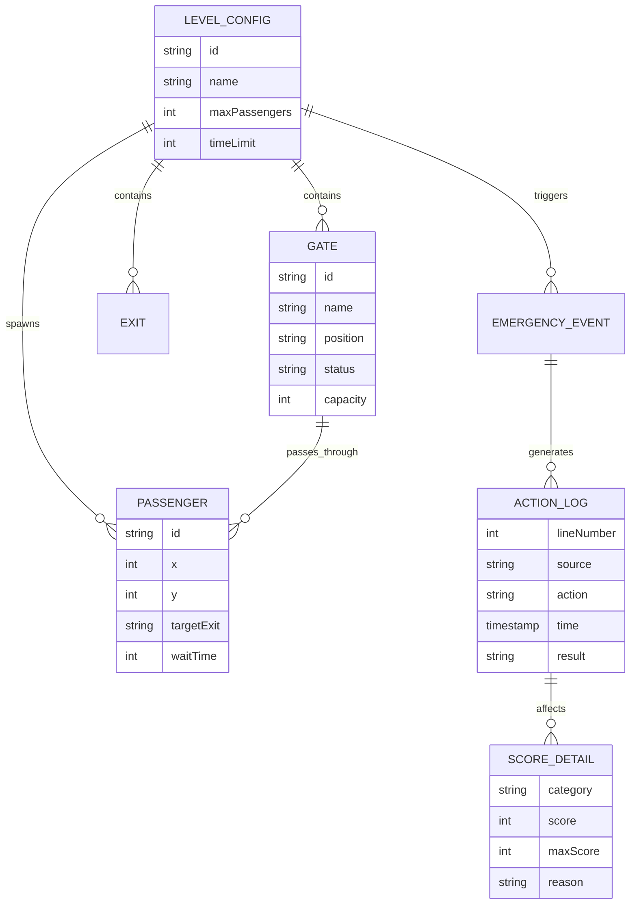

## 1. 架构设计

```mermaid
flowchart TD
    subgraph "前端 (React 18)"
        "UI组件层" --> "状态管理层 (Zustand)"
        "状态管理层" --> "游戏引擎层"
        "游戏引擎层" --> "渲染层 (Canvas/SVG)"
    end
    
    subgraph "数据层"
        "关卡配置数据"
        "操作记录存储"
        "评分计算引擎"
    end
    
    subgraph "输出层"
        "报告生成器"
        "JSON导出模块"
        "回放引擎"
    end
    
    "游戏引擎层" --> "数据层"
    "数据层" --> "输出层"
```

## 2. 技术说明

- **前端框架**: React 18 + TypeScript
- **构建工具**: Vite
- **状态管理**: Zustand (轻量级状态管理)
- **样式方案**: TailwindCSS 3
- **图标方案**: 自定义SVG组件
- **动画方案**: Canvas 2D API + CSS动画
- **数据存储**: LocalStorage (本地存储游戏进度)
- **后端**: 无后端，纯前端应用

## 3. 路由定义

| 路由 | 用途 |
|-----|------|
| / | 游戏主界面，包含站厅地图、操作面板、分数显示 |
| /report | 结束报告页面，包含处置报告、回放模式、导出功能 |

## 4. 数据模型

### 4.1 数据模型定义



### 4.2 数据结构定义

```typescript
// 关卡配置
interface LevelConfig {
  id: string;
  name: string;
  maxPassengers: number;
  timeLimit: number;
  gates: GateConfig[];
  exits: ExitConfig[];
  areas: AreaConfig[];
  emergencyEvents: EmergencyEvent[];
}

// 闸机配置
interface GateConfig {
  id: string;
  name: string;
  x: number;
  y: number;
  width: number;
  height: number;
  status: 'open' | 'closed' | 'fault';
  capacity: number;
}

// 出口配置
interface ExitConfig {
  id: string;
  name: string;
  x: number;
  y: number;
  direction: string;
}

// 区域配置
interface AreaConfig {
  id: string;
  name: string;
  x: number;
  y: number;
  width: number;
  height: number;
  blocked: boolean;
}

// 紧急事件
interface EmergencyEvent {
  id: string;
  type: 'gate_fault' | 'station_close' | 'crowd_surge';
  triggerTime: number;
  affectedGates: string[];
  affectedAreas: string[];
  description: string;
}

// 操作记录
interface ActionLog {
  lineNumber: number;
  source: string;
  action: string;
  time: number;
  result: 'success' | 'warning' | 'error';
  details?: string;
}

// 得分明细
interface ScoreDetail {
  category: string;
  score: number;
  maxScore: number;
  reason: string;
}

// 游戏状态
interface GameState {
  currentLevel: LevelConfig;
  passengers: Passenger[];
  gates: GateConfig[];
  areas: AreaConfig[];
  score: number;
  timeRemaining: number;
  actionLogs: ActionLog[];
  scoreDetails: ScoreDetail[];
  isPaused: boolean;
  isGameOver: boolean;
}
```

## 5. 核心模块设计

### 5.1 游戏引擎模块
- 乘客AI移动算法
- 拥堵检测逻辑
- 路径规划系统
- 事件触发器

### 5.2 渲染模块
- 站厅地图SVG渲染
- 乘客Canvas动画
- 状态可视化

### 5.3 评分引擎
- 实时分数计算
- 多维度评分
- 扣分原因追踪

### 5.4 报告生成模块
- 操作时间线生成
- 得分汇总分析
- 失败原因提取
- JSON格式化导出