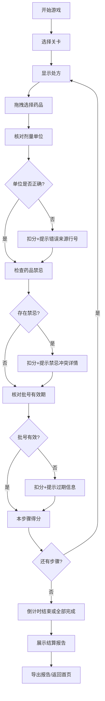

## 1. 产品概述
药房配药校验赛是一款药剂师培训互动游戏，用于训练学员在限时场景下正确核对处方剂量、药品禁忌和批号有效性。
- 目标用户：药学院学生、药剂师培训生
- 核心价值：通过游戏化方式强化配药核对技能，减少真实药房中的人为差错

## 2. 核心功能

### 2.1 功能模块
1. **首页**：游戏标题、关卡选择、游戏说明、历史记录入口
2. **游戏界面**：处方显示区、药品拖拽区、核对操作区、实时计分、倒计时
3. **结算报告**：得分详情、错误清单、原始材料回溯、修正痕迹
4. **历史记录**：过往对局查看、得分对比

### 2.2 页面详情
| 页面名称 | 模块名称 | 功能描述 |
|----------|----------|----------|
| 首页 | 关卡选择 | 展示3-5个难度递增的关卡，显示已解锁状态和最高分 |
| 首页 | 游戏说明 | 简要说明玩法、评分规则、常见错误类型 |
| 游戏界面 | 处方显示区 | 展示完整处方内容，包括药品名称、剂量、用法、患者信息 |
| 游戏界面 | 药品拖拽区 | 提供可选药品卡片，支持拖拽至核对区 |
| 游戏界面 | 核对操作区 | 剂量单位换算、禁忌确认、批号核对操作 |
| 游戏界面 | 实时计分 | 显示当前得分、已完成步骤、剩余时间 |
| 游戏界面 | 倒计时 | 限时倒计时，时间到自动结束 |
| 结算报告 | 得分详情 | 按步骤展示得分/扣分明细 |
| 结算报告 | 错误清单 | 列出所有错误及其原因，保留原始行号/来源位置 |
| 结算报告 | 原始材料回溯 | 可展开查看处方原始行、修正痕迹 |
| 结算报告 | 导出报告 | 支持导出PDF/文本格式的详细报告 |
| 历史记录 | 对局列表 | 展示历史对局时间、关卡、得分 |
| 历史记录 | 详情查看 | 可查看具体对局的完整结算报告 |

## 3. 核心流程
玩家选择关卡进入游戏，在限时内依次完成处方核对：阅读处方→拖拽选择药品→确认剂量单位（必要时换算）→检查药品禁忌→核对批号有效期→提交结果。每步操作实时计分，错误立即提示并保留来源。游戏结束后展示详细结算报告，支持回看错误原因和导出报告。

## 4. 用户界面设计

### 4.1 设计风格
- 主色调：医疗蓝(#1565C0) + 警示红(#E53935) + 成功绿(#43A047) + 琥珀橙(#FB8C00)
- 辅助色：深灰背景(#1A1A2E) + 卡片白(#FFFFFF)
- 按钮样式：圆角胶囊按钮，带微阴影和悬停动效
- 字体：标题使用思源黑体粗体，正文使用思源黑体常规
- 布局：左侧操作区 + 右侧信息栏的双栏布局
- 图标风格：线性图标 + 色块标签组合

### 4.2 页面设计概览
| 页面名称 | 模块名称 | UI元素 |
|----------|----------|--------|
| 首页 | 关卡选择 | 卡片网格布局，解锁态/锁定态样式区分，悬停动画 |
| 游戏界面 | 处方显示区 | 仿真实处方单样式，表格布局，关键信息高亮 |
| 游戏界面 | 药品拖拽区 | 可拖拽药品卡片，带药品图标、名称、规格 |
| 游戏界面 | 核对操作区 | 单位换算选择器、禁忌确认勾选框、批号输入/选择框 |
| 游戏界面 | 实时计分 | 进度条 + 数字双显示，颜色随得分变化 |
| 游戏界面 | 倒计时 | 大号数字显示，时间不足时红色闪烁 |
| 结算报告 | 错误清单 | 时间线布局，每条错误标注来源行号和错误类型 |
| 结算报告 | 原始材料回溯 | 可折叠的原始处方行，修正处用不同颜色标记 |

### 4.3 响应式
- 桌面优先设计，适配1280px及以上屏幕
- 平板端自动调整为上下布局
- 触控设备优化拖拽操作手感
