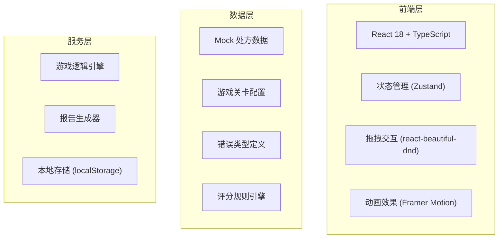

## 1. 架构设计


## 2. 技术说明
- 前端：React@18 + TypeScript + Vite
- 样式：Tailwind CSS 3
- 状态管理：Zustand
- 拖拽库：@hello-pangea/dnd (react-beautiful-dnd 社区维护分支)
- 动画：Framer Motion
- 图标：Lucide React
- 后端：无，纯前端实现
- 数据存储：localStorage 保存历史记录

## 3. 路由定义
| 路由 | 用途 |
|------|------|
| / | 首页 - 关卡选择和游戏说明 |
| /game/:levelId | 游戏界面 - 配药校验操作 |
| /report/:sessionId | 结算报告 - 得分和错误详情 |
| /history | 历史记录 - 过往对局列表 |

## 4. 数据模型

### 4.1 核心数据类型

```typescript
// 处方药品条目
interface PrescriptionItem {
  id: string;
  lineNumber: number;           // 原始行号
  drugName: string;              // 药品名称
  drugCode: string;              // 药品编码
  dosage: string;                // 原始剂量（如"0.25g"）
  dosageValue: number;           // 剂量数值
  dosageUnit: string;            // 剂量单位
  frequency: string;             // 用药频次
  route: string;                 // 给药途径
}

// 药品信息
interface DrugInfo {
  id: string;
  name: string;
  code: string;
  specifications: string;        // 规格（如"0.25g/片"）
  unit: string;                  // 基础单位
  batchNumbers: BatchNumber[];    // 可用批号
  contraindications: string[];   // 禁忌
  warnings: string[];            // 警告信息
}

// 批号信息
interface BatchNumber {
  id: string;
  number: string;                // 批号字符串
  productionDate: string;        // 生产日期
  expiryDate: string;            // 有效期
  isExpired: boolean;            // 是否过期
}

// 禁忌信息
interface Contraindication {
  id: string;
  drugCode: string;
  condition: string;             // 禁忌条件
  severity: 'high' | 'medium' | 'low';
  description: string;
}

// 游戏关卡配置
interface LevelConfig {
  id: string;
  name: string;
  difficulty: 1 | 2 | 3 | 4 | 5;
  timeLimit: number;             // 秒
  prescriptions: PrescriptionItem[];
  availableDrugs: DrugInfo[];
  trapDrugs: DrugInfo[];         // 干扰项（禁忌/过期药品）
  targetScore: number;
}

// 玩家操作记录
interface PlayerAction {
  step: number;
  timestamp: number;
  type: 'drug_select' | 'unit_confirm' | 'contra_check' | 'batch_confirm';
  selectedId: string;
  isCorrect: boolean;
  correctionMade: boolean;       // 是否有修正
  originalSelection?: string;    // 原始选择（如有修正）
  pointsDelta: number;
  errorType?: ErrorType;
  errorDetail?: string;
  sourceLine?: number;           // 来源行号
}

// 错误类型
type ErrorType = 
  | 'WRONG_DRUG'           // 药品选错
  | 'UNIT_MISMATCH'        // 剂量单位错误
  | 'CONTRAINDICATION'     // 禁忌未拦截
  | 'BATCH_EXPIRED'        // 批号过期
  | 'BATCH_WRONG'          // 批号选错
  | 'CALCULATION_ERROR';   // 计算错误

// 游戏会话
interface GameSession {
  id: string;
  levelId: string;
  startTime: number;
  endTime?: number;
  actions: PlayerAction[];
  totalScore: number;
  maxScore: number;
  errors: PlayerAction[];
  status: 'playing' | 'completed' | 'timeout';
}

// 结算报告
interface GameReport {
  session: GameSession;
  scoreBreakdown: ScoreItem[];
  errorSummary: ErrorSummaryItem[];
  correctionTrail: CorrectionTrail[];
}

// 得分项
interface ScoreItem {
  step: number;
  description: string;
  basePoints: number;
  deductions: number;
  netPoints: number;
  sourceLine?: number;
}

// 错误汇总项
interface ErrorSummaryItem {
  errorType: ErrorType;
  count: number;
  instances: Array<{
    step: number;
    sourceLine: number;
    detail: string;
    correction: string;
  }>;
}

// 修正痕迹
interface CorrectionTrail {
  step: number;
  sourceLine: number;
  originalValue: string;
  correctedValue: string;
  reason: string;
  timestamp: number;
}
```

## 5. 评分规则

### 5.1 基础得分
| 操作类型 | 基础得分 |
|----------|----------|
| 正确选择药品 | +10 |
| 正确确认剂量单位 | +5 |
| 正确执行单位换算 | +10 |
| 正确识别禁忌 | +15 |
| 正确核对批号 | +10 |

### 5.2 扣分规则
| 错误类型 | 扣分 | 说明 |
|----------|------|------|
| 药品选错 | -15 | 选择了错误药品 |
| 剂量单位错误 | -10 | 单位与处方不符 |
| 禁忌未拦截 | -20 | 未识别出禁忌药品 |
| 批号过期 | -15 | 选择了过期批号 |
| 批号错误 | -10 | 选择了错误批号 |
| 计算错误 | -10 | 剂量换算错误 |

### 5.3 修正奖励
- 首次选择错误后在限时内修正：扣一半分数
- 未修正直接提交：全额扣分
