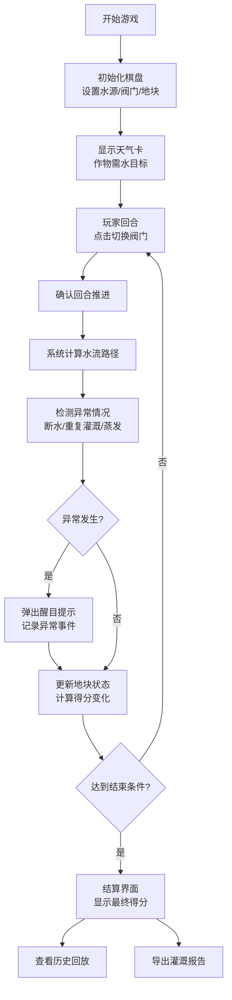

## 1. 产品概述

"农田灌溉阀门棋"是一款面向农业技术教学的互动式浏览器游戏，通过模拟水渠阀门操作，帮助学生理解农田灌溉系统的水力逻辑和水资源管理。游戏以回合制棋盘形式呈现，玩家通过开关阀门控制水流，需要避免下游断水、重复灌溉等问题，同时考虑天气影响和蒸发损失。

- **核心目标**：通过游戏化方式教授灌溉系统原理，培养正确的水资源调配思维
- **目标用户**：农业院校学生、农技站培训人员、农业科普爱好者
- **产品价值**：将抽象的灌溉原理具象化，通过试错式学习加深理解，提供可追溯的操作记录和详细报告

## 2. 核心功能

### 2.1 用户角色

| 角色 | 登录方式 | 核心权限 |
|------|----------|----------|
| 玩家 | 无需登录，直接访问 | 完整游戏体验、报告导出、历史记录查看 |

### 2.2 功能模块

1. **游戏主界面**：棋盘显示、水渠网络、阀门控制、地块状态
2. **游戏控制**：开始、暂停、重开、回合推进、结算
3. **信息面板**：天气卡、作物需水、实时数据、异常提示
4. **回放系统**：操作历史、失败原因回看、得分详情
5. **报告导出**：灌溉报告生成、PDF/文本导出、数据追溯

### 2.3 页面详情

| 页面名称 | 模块名称 | 功能描述 |
|----------|----------|----------|
| 游戏主界面 | 棋盘区域 | 6x6网格棋盘，展示水渠、阀门、地块、水源位置，支持阀门点击切换 |
| 游戏主界面 | 控制栏 | 开始/暂停/重开按钮，当前回合显示，得分实时更新 |
| 游戏主界面 | 信息侧边栏 | 天气卡展示、作物需水列表、异常警告区域、蒸发损失统计 |
| 结算弹窗 | 结果展示 | 最终得分、失败原因分析、各项指标评分、操作总览 |
| 历史记录 | 回放面板 | 逐步骤回放、每条操作详情、异常事件高亮标记 |
| 报告页面 | 灌溉报告 | 完整灌溉过程分析、数据来源标注、修正痕迹记录、导出功能 |

## 3. 核心流程

玩家进入游戏后，首先查看初始棋盘布局和天气卡。每个回合玩家可以切换多个阀门状态，然后推进回合。系统计算水流路径、耗水量、蒸发损失，并检测异常情况（下游断水、重复灌溉）。达到指定回合数或出现严重问题时游戏结束，显示结算报告并支持导出。

## 4. 界面设计

### 4.1 设计风格

- **主色调**：农业绿色系（#2D5A27 深绿为主色，#7CB342 草绿为辅助色），配合泥土棕（#8D6E63）和水蓝色（#4FC3F7）
- **按钮风格**：立体圆角按钮，阀门开关使用拟物化设计，带有明显的开/关状态对比
- **字体**：标题使用 Noto Serif SC（宋体风格，体现农业传统感），正文使用 Noto Sans SC（清晰易读）
- **布局风格**：左侧棋盘主区域 + 右侧信息面板的经典布局，卡片式信息模块，适当留白
- **图标风格**：使用 Emoji 结合 SVG 图标，水渠💧、阀门🔘、地块🌱、太阳☀️、雨滴💧等农业相关符号

### 4.2 页面设计概览

| 页面名称 | 模块名称 | UI元素 |
|----------|----------|--------|
| 游戏主界面 | 棋盘区域 | 网格背景、水渠连线动画、阀门开关交互、地块含水量进度条、异常红色闪烁 |
| 游戏主界面 | 控制栏 | 渐变按钮、回合计数器、得分数字动画、暂停遮罩效果 |
| 游戏主界面 | 信息侧边栏 | 天气卡翻转效果、作物列表展开、警告横幅、数据来源小字标注 |
| 结算弹窗 | 结果展示 | 得分环形图、失败原因时间线、数据表格、修正痕迹高亮 |
| 历史记录 | 回放面板 | 时间轴滑块、步骤卡片、异常事件标记、回放速度控制 |

### 4.3 响应式设计

- 桌面端优先（≥1200px）：完整双栏布局，棋盘尺寸充足
- 平板端（768px-1199px）：信息面板移至底部，棋盘自适应缩放
- 移动端（<768px）：单列布局，简化信息展示，保留核心操作

### 4.4 动画与交互

- **阀门切换**：点击时的缩放反馈 + 颜色过渡动画
- **水流效果**：水渠中的流动粒子动画，阀门开启后逐渐填充下游
- **异常提示**：红色边框闪烁 + 警告图标弹跳动画
- **回合推进**：地块状态渐变过渡，得分数字滚动效果
- **报告导出**：生成进度条 + 完成确认动效
