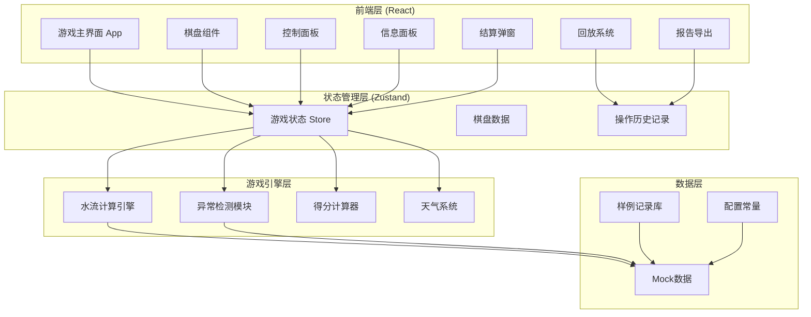

## 1. 架构设计



## 2. 技术选型说明

- **前端框架**：React@18 + TypeScript
- **构建工具**：Vite@5
- **样式方案**：TailwindCSS@3
- **状态管理**：Zustand（轻量级，适合游戏状态管理
- **图表可视化**：自定义 Canvas/SVG 实现棋盘和水流动画
- **报告导出**：jspdf（PDF导出）
- **纯前端实现**：无后端依赖，浏览器本地存储历史记录
- **图标**：Lucide React

## 3. 目录结构

```
src/
├── components/          # 组件目录
│   ├── GameBoard.tsx        # 棋盘主组件
│   ├── Valve.tsx              # 阀门组件
│   ├── Plot.tsx           # 地块组件
│   ├── ControlBar.tsx         # 控制面板
│   ├── InfoPanel.tsx      # 信息侧边栏
│   ├── WeatherCard.tsx   # 天气卡
│   ├── ResultModal.tsx   # 结算弹窗
│   ├── ReplayPanel.tsx   # 回放面板
│   └── ReportModal.tsx   # 报告导出
├── store/               # 状态管理
│   └── useGameStore.ts  # 游戏状态Store
├── engine/              # 游戏引擎
│   ├── waterFlow.ts     # 水流计算
│   ├── anomalyDetection.ts # 异常检测
│   └── scoring.ts       # 得分计算
├── data/                # 数据层
│   ├── mockData.ts      # Mock数据
│   ├── sampleRecords.ts # 样例记录
│   └── constants.ts     # 常量配置
├── types/               # 类型定义
│   └── index.ts         # TypeScript类型
├── utils/               # 工具函数
│   └── exportReport.ts  # 报告导出工具
├── App.tsx             # 主应用组件
├── main.tsx           # 入口文件
└── index.css          # 全局样式
```

## 4. 核心类型定义

```typescript
// 单元格类型
type CellType = 'source' | 'canal' | 'valve' | 'plot' | 'empty';

// 阀门状态
type ValveState = 'open' | 'closed';

// 地块状态
interface Plot {
  id: string;
  name: string;
  cropType: string;
  waterRequired: number;
  waterCurrent: number;
  isWatered: boolean;
  overwateredCount: number;
}

// 阀门
interface Valve {
  id: string;
  state: ValveState;
  position: { row: number; col: number };
}

// 天气类型
type WeatherType = 'sunny' | 'cloudy' | 'rainy' | 'windy';

interface Weather {
  type: WeatherType;
  evaporationRate: number;
  description: string;
}

// 异常类型
type AnomalyType = 'drought' | 'overwater' | 'evaporation';

interface Anomaly {
  type: AnomalyType;
  message: string;
  round: number;
  plotId?: string;
}

// 操作记录
interface ActionRecord {
  round: number;
  valveId: string;
  action: 'open' | 'close';
  timestamp: number;
}

// 游戏状态
interface GameState {
  phase: 'idle' | 'playing' | 'paused' | 'ended';
  currentRound: number;
  maxRounds: number;
  score: number;
  board: Cell[][];
  valves: Valve[];
  plots: Plot[];
  currentWeather: Weather;
  anomalies: Anomaly[];
  actionHistory: ActionRecord[];
  waterFlowState: WaterFlowState;
}

// 样例记录
interface SampleRecord {
  id: string;
  name: string;
  type: 'normal' | 'boundary' | 'bad';
  description: string;
  gameState: GameState;
  expectedOutcome: string;
}
```

## 5. 数据模型

### 5.1 样例数据定义

```typescript
// 正常记录 - 阀门操作合理，无异常
const normalRecord: SampleRecord = {
  id: 'normal-001',
  name: '正常灌溉流程',
  type: 'normal',
  description: '合理开关阀门，满足所有地块按需供水',
  gameState: {...},
  expectedOutcome: '所有作物正常生长，得分优秀'
};

// 边界记录 - 临界状态
const boundaryRecord: SampleRecord = {
  id: 'boundary-001',
  name: '临界供水记录',
  type: 'boundary',
  description: '蒸发量大，刚好满足最低需水',
  gameState: {...},
  expectedOutcome: '勉强达标，提示风险'
};

// 坏数据 - 错误操作
const badRecord: SampleRecord = {
  id: 'bad-001',
  name: '错误操作示例',
  type: 'bad',
  description: '上游阀门关闭导致下游断水，重复灌溉',
  gameState: {...},
  expectedOutcome: '作物干旱+过湿双重问题，低分'
};
```
