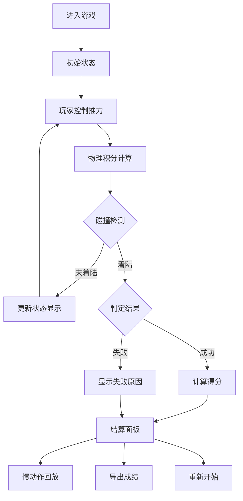

## 1. 产品概述

火箭着陆燃料赛是一款航天科普类浏览器物理小游戏，玩家通过控制火箭推力，在重力和风扰影响下将火箭安全降落在着陆平台上。以寓教于乐的方式展示航天物理原理，面向航天爱好者和科普教育场景。

## 2. 核心功能

### 2.1 用户角色
| 角色 | 注册方式 | 核心权限 |
|------|----------|----------|
| 玩家 | 无需注册 | 进行游戏、查看记录、导出成绩 |

### 2.2 功能模块
1. **游戏主界面**：游戏画布、控制面板、状态显示
2. **游戏流程控制**：开始、暂停、重开、结算
3. **物理引擎**：重力、推力、燃料消耗、风扰、碰撞检测
4. **飞行记录系统**：记录回放、失败原因分析、成绩导出
5. **慢动作回放**：可调整回放速度查看飞行细节

### 2.3 页面详情
| 页面名称 | 模块名称 | 功能描述 |
|---------|----------|----------|
| 游戏主页面 | 游戏画布 | Canvas渲染火箭、平台、背景星空动画 |
| 游戏主页面 | 控制面板 | 推力滑块、开始/暂停/重开按钮、慢动作控制 |
| 游戏主页面 | 状态面板 | 实时显示燃料、高度、速度、姿态角、风力 |
| 游戏主页面 | 结算面板 | 显示得分、失败原因、飞行数据统计 |
| 游戏主页面 | 记录面板 | 历史记录列表、回放控制、导出功能 |

## 3. 核心流程

玩家进入游戏 → 查看初始状态（火箭在高空，燃料满）→ 控制推力大小 → 火箭受重力、推力、风扰综合作用 → 实时监测飞行状态 → 触地判定（成功着陆/坠毁）→ 结算显示得分与失败原因 → 可查看慢动作回放 → 导出飞行记录或重新开始

## 4. 界面设计

### 4.1 设计风格
- **主色调**：深空蓝 (#0a1628) 为主背景，火焰橙 (#ff6b35) 为推力强调色，科技青 (#00d4ff) 为数据显示色
- **辅助色**：警告红 (#ff4757) 用于失败提示，成功绿 (#2ed573) 用于着陆成功
- **按钮风格**：圆角矩形，渐变边框，悬停发光效果
- **字体**：标题使用 Orbitron（科技感字体），数据使用 JetBrains Mono（等宽字体），正文使用 Inter
- **布局风格**：深色科技风，半透明玻璃拟态面板，霓虹发光边框
- **图标**：Emoji 搭配 SVG 线性图标，风格统一

### 4.2 页面设计概览
| 页面名称 | 模块名称 | UI元素 |
|---------|----------|--------|
| 游戏主页面 | 游戏画布 | 星空背景滚动、火箭粒子尾焰、着陆平台灯光、风力指示器 |
| 游戏主页面 | 控制面板 | 推力滑块带发光轨道、功能按钮带悬停动画 |
| 游戏主页面 | 状态面板 | 燃料进度条、数字仪表盘、实时数据跳动动画 |
| 游戏主页面 | 结算面板 | 结果弹窗带模糊背景、得分放大动画、失败原因列表 |
| 游戏主页面 | 记录面板 | 记录卡片、回放时间轴、导出按钮 |

### 4.3 响应式设计
- 桌面端优先设计，Canvas自适应窗口大小
- 移动端优化触控操作，推力控制改为虚拟摇杆
- 面板布局在小屏幕自动堆叠

### 4.4 视觉特效
- 火箭尾焰粒子系统，随推力大小变化
- 着陆成功时的冲击波效果
- 失败时的爆炸粒子动画
- 数据变化时的数字滚动效果
- 面板切换的淡入淡出动画
