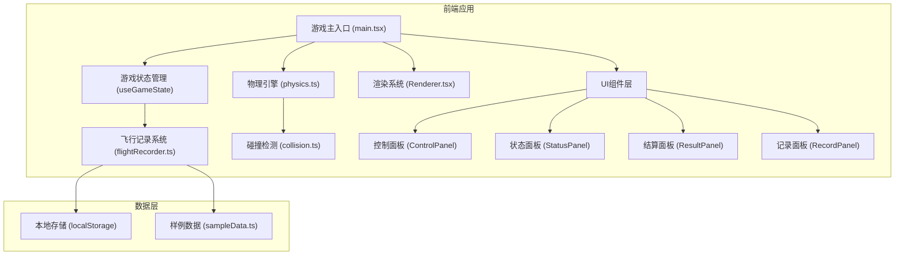

## 1. 架构设计



## 2. 技术选型

- **前端框架**：React@18 + TypeScript
- **构建工具**：Vite@5
- **样式方案**：TailwindCSS@3 + CSS Modules
- **动画库**：Framer Motion
- **状态管理**：React Hooks + useReducer
- **本地存储**：localStorage
- **导出功能**：JSON/CSV 原生导出

## 3. 核心模块定义

### 3.1 游戏状态类型
```typescript
type GamePhase = 'idle' | 'playing' | 'paused' | 'ended' | 'replaying';

interface GameState {
  phase: GamePhase;
  rocket: RocketState;
  environment: EnvironmentState;
  score: number;
  failureReason?: string;
  flightData: FlightFrame[];
}

interface RocketState {
  x: number;
  y: number;
  vx: number;
  vy: number;
  angle: number;
  angularVelocity: number;
  fuel: number;
  maxFuel: number;
  thrust: number;
  maxThrust: number;
}

interface EnvironmentState {
  gravity: number;
  windSpeed: number;
  windDirection: number;
  platformX: number;
  platformY: number;
  platformWidth: number;
}
```

### 3.2 物理引擎接口
```typescript
interface PhysicsEngine {
  update(rocket: RocketState, env: EnvironmentState, dt: number): RocketState;
  checkCollision(rocket: RocketState, env: EnvironmentState): CollisionResult;
}

interface CollisionResult {
  collided: boolean;
  success: boolean;
  impactVelocity: { vx: number; vy: number };
  impactAngle: number;
  onPlatform: boolean;
}
```

### 3.3 飞行记录系统
```typescript
interface FlightFrame {
  timestamp: number;
  rocket: RocketState;
  thrustInput: number;
}

interface FlightRecord {
  id: string;
  startTime: number;
  endTime: number;
  success: boolean;
  score: number;
  failureReason?: string;
  frames: FlightFrame[];
  summary: FlightSummary;
}

interface FlightSummary {
  maxAltitude: number;
  maxVelocity: number;
  fuelUsed: number;
  flightTime: number;
  landingAccuracy: number;
}
```

## 4. 数据模型

### 4.1 样例数据定义
```typescript
// 正常着陆记录
const normalLanding: FlightRecord;

// 边界着陆记录（接近失败但成功）
const borderlineLanding: FlightRecord;

// 失败记录（明显坏数据）
const failedLanding: FlightRecord;
```

### 4.2 评分规则
- 基础分：1000分
- 燃料节约奖励：剩余燃料 × 2分
- 着陆精度奖励：距离平台中心越近分数越高
- 着陆速度惩罚：垂直速度 > 5m/s 扣分
- 横向速度惩罚：水平速度 > 2m/s 扣分
- 姿态角惩罚：角度 > 10° 扣分

## 5. 失败原因检测
| 失败类型 | 检测条件 | 提示信息 |
|---------|----------|----------|
| 推力过猛 | 加速度 > 最大阈值 | 警告：推力过载！火箭结构承受极限已突破 |
| 燃料耗尽 | 燃料 ≤ 0 且未着陆 | 燃料耗尽！失去动力，火箭失控坠落 |
| 横向速度过大 | 水平速度 > 安全阈值 | 横向速度超标！无法稳定着陆 |
| 垂直速度过大 | 下降速度 > 安全阈值 | 下降速度过快！硬着陆风险 |
| 姿态角过大 | 火箭倾角 > 安全阈值 | 姿态失控！火箭倾倒 |
| 偏离平台 | 着陆点不在平台范围内 | 偏离着陆平台！任务失败 |

## 6. 项目目录结构
```
src/
├── components/
│   ├── GameCanvas.tsx        # 游戏画布渲染
│   ├── ControlPanel.tsx      # 控制面板
│   ├── StatusPanel.tsx       # 状态面板
│   ├── ResultPanel.tsx       # 结算面板
│   ├── RecordPanel.tsx       # 记录面板
│   └── Slider.tsx            # 推力滑块组件
├── hooks/
│   ├── useGameState.ts       # 游戏状态管理
│   └── usePhysics.ts         # 物理引擎Hook
├── utils/
│   ├── physics.ts            # 物理计算
│   ├── collision.ts          # 碰撞检测
│   ├── flightRecorder.ts     # 飞行记录
│   ├── scoring.ts            # 评分系统
│   └── export.ts             # 数据导出
├── data/
│   └── sampleData.ts         # 样例数据
├── types/
│   └── game.ts               # 类型定义
├── App.tsx
├── main.tsx
└── index.css
```
