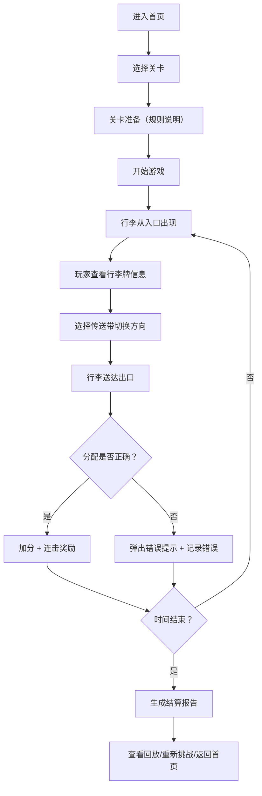
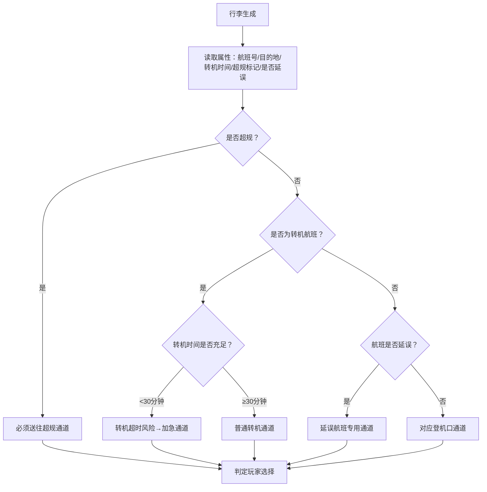

# 航班行李分拣快线 - 产品需求文档

## 1. 产品概述

面向机场地服新人的培训游戏，通过沉浸式分拣操作让新人快速掌握转机行李、超规件和延误航班的分流规则。玩家在时间压力下将行李正确分配到对应传送带，系统实时反馈错误原因，支持关卡回放和报告导出，确保培训效果可追溯、可评估。

### 核心价值
- 解决传统培训依赖表格和截图、学习效率低的问题
- 让新人通过实操掌握转机超时、超规件错分、登机口拥堵等风险点
- 保留每次操作痕迹，支持回放复盘和成绩导出

### 目标用户
- 机场地服部门新入职员工
- 地服主管（培训管理员）

### 产品定位
轻量级、可离线运行的Web培训游戏，一局5-8分钟，快速上手，反复练习。

---

## 2. 核心功能

### 2.1 用户角色

| 角色 | 登录方式 | 核心权限 |
|------|----------|----------|
| 学员 | 直接进入 | 进行游戏练习、查看个人成绩、回放错误操作 |
| 管理员 | 入口切换 | 查看所有学员记录、导出培训报告、重置关卡数据 |

### 2.2 功能模块

1. **首页/关卡选择**：游戏介绍、关卡列表、历史记录入口
2. **游戏主界面**：传送带系统、行李生成区、登机口/超规区/转机区出口
3. **实时反馈面板**：当前得分、剩余时间、错误提示、行李详情
4. **关卡结算页**：得分明细、错误统计、星级评定、操作回放
5. **历史记录页**：所有关卡成绩、筛选查询、报告导出
6. **回放播放器**：逐帧回放操作、时间轴跳转、错误标记高亮

### 2.3 页面详情

| 页面名称 | 模块名称 | 功能描述 |
|----------|----------|----------|
| 首页 | 关卡卡片 | 显示关卡名称、难度、历史最佳成绩、解锁状态 |
| 首页 | 历史记录入口 | 跳转至历史记录页面 |
| 游戏页 | 传送带系统 | 多条平行传送带，可切换分配路径 |
| 游戏页 | 行李生成区 | 随机生成行李，显示行李牌信息（航班号、目的地、转机时间、是否超规） |
| 游戏页 | 出口区域 | 普通登机口、超规通道、转机通道、延误通道 |
| 游戏页 | 时间/分数面板 | 倒计时、当前得分、连击奖励 |
| 游戏页 | 错误提示区 | 弹窗显示错误原因（转机超时/超规走错/登机口拥堵） |
| 结算页 | 得分总览 | 总分、准确率、平均响应时间 |
| 结算页 | 错误列表 | 每个错误的时间点、行李信息、错误类型、正确路径 |
| 结算页 | 回放按钮 | 启动回放入口 |
| 历史记录页 | 成绩列表 | 按时间倒序排列，支持按关卡/日期筛选 |
| 历史记录页 | 导出功能 | 导出CSV/PDF格式的培训报告 |
| 回放页 | 时间轴控制 | 播放/暂停、快进/后退、错误节点跳转 |
| 回放页 | 操作对比 | 显示当时操作与正确操作的对比 |

---

## 3. 核心流程

### 3.1 游戏主流程

### 3.2 行李分拣判定逻辑

---

## 4. 用户界面设计

### 4.1 设计风格

**整体风格**：工业科技风 + 游戏化趣味
- 主色调：航空蓝（#165DFF）作为主色，警示橙（#FF7D00）用于错误提示，成功绿（#00B42A）用于正确反馈
- 辅助色：传送带深灰、行李牌米黄、金属银边框
- 字体：JetBrains Mono（数字/编号）+ 思源黑体（正文）
- 视觉元素：扫描线效果、LED数字显示、传送带动画、行李牌拟物化设计
- 按钮风格：圆角8px，带悬停缩放和点击反馈
- 图标风格：Lucide线性图标，关键状态使用emoji增强辨识度

### 4.2 页面设计概述

| 页面名称 | 模块名称 | UI元素 |
|----------|----------|--------|
| 首页 | Hero区域 | 大标题"航班行李分拣快线"、动态传送带背景、开始按钮 |
| 首页 | 关卡网格 | 3列卡片布局，卡片含难度标签、星级评分、最佳成绩 |
| 游戏页 | 主游戏区 | 俯视视角，4条水平传送带，左侧入口，右侧4个出口 |
| 游戏页 | 信息侧边栏 | 实时时间（LED风格）、分数滚动、行李详情卡 |
| 游戏页 | 错误弹窗 | 橙色边框闪烁、错误原因文字、正确路径提示、3秒后自动消失 |
| 结算页 | 成绩看板 | 大字号总分、星级动画、准确率环形图 |
| 结算页 | 错误时间线 | 垂直时间轴，每个节点可点击查看详情 |
| 历史记录页 | 表格 | 日期/关卡/得分/准确率/错误数/操作列 |
| 回放页 | 播放器 | 底部时间轴，带错误标记点，播放控制按钮 |

### 4.3 响应式

- **桌面端优先**：游戏核心操作区最小宽度1280px，保证传送带和操作区域充足
- **平板适配**：1024px以上可正常游戏，侧边栏改为顶部悬浮
- **移动端**：仅支持查看历史记录和报告，不支持游戏操作

### 4.4 动效设计

- 行李在传送带上滚动：CSS transform 位移动画
- 传送带切换：轨道滑动效果，方向指示箭头闪烁
- 正确分配：绿色光晕扩散，行李缩小消失
- 错误分配：橙色震动效果，错误标识飞入侧边栏
- 倒计时紧张：最后10秒数字变红并闪烁
- 结算页星级：逐个点亮动画，带粒子特效

---

## 5. 数据与材料来源

所有游戏内容基于真实地服培训材料设计：

| 材料来源 | 游戏中的体现 |
|----------|--------------|
| 行李牌 | 显示航班号、目的地、转机时间、行李重量、特殊标记 |
| 传送带系统 | 4条可切换路径的传送带，模拟机场实际布局 |
| 登机口 | A/B/C/D四个登机口，对应不同航班 |
| 超规件通道 | 独立出口，处理超大/超重行李 |
| 转机时间规则 | <30分钟为加急转机，≥30分钟为普通转机 |
| 分拣报告 | 游戏结束后生成，包含错误统计和改进建议 |

### 关卡设计

| 关卡 | 难度 | 时长 | 行李数量 | 核心训练点 |
|------|------|------|----------|------------|
| 1. 新手入门 | ★ | 3分钟 | 15件 | 基础分拣逻辑，认识行李牌 |
| 2. 超规识别 | ★★ | 4分钟 | 20件 | 超规件判断与分流 |
| 3. 转机压力 | ★★★ | 5分钟 | 25件 | 转机时间判断，加急通道使用 |
| 4. 延误应对 | ★★★ | 5分钟 | 25件 | 延误航班识别与特殊处理 |
| 5. 综合挑战 | ★★★★★ | 6分钟 | 35件 | 全场景混合，高时间压力 |

---

## 6. 关键规则说明

### 6.1 错误类型与提示

| 错误类型 | 触发条件 | 提示内容 | 扣分 |
|----------|----------|----------|------|
| 转机超时 | 转机时间<30分钟但未走加急通道 | "⚠️ 转机时间仅XX分钟，应走加急转机通道！" | -10分 |
| 超规走错线 | 超规行李送入普通通道 | "⚠️ 该行李为超规件（XXkg），应走超规通道！" | -15分 |
| 登机口错误 | 送错登机口 | "⚠️ 航班XXXX对应登机口X，当前送往登机口X！" | -10分 |
| 登机口拥堵 | 短时间内大量行李送入同一登机口 | "⚠️ 登机口X已拥堵，请分流到其他登机口！" | -5分/件 |
| 延误未处理 | 延误航班行李未走延误通道 | "⚠️ 航班XXXX已延误，应走延误通道！" | -10分 |

### 6.2 评分规则

- 基础分：每件正确分配 +10分
- 连击奖励：连续正确5件 +5分，10件 +15分，20件 +30分
- 速度奖励：3秒内完成分配额外 +2分
- 错误扣分：按错误类型扣5-15分
- 最终星级：准确率≥95%★★★，≥85%★★，≥70%★

### 6.3 数据持久化

- 所有游戏记录存储在 localStorage
- 每次操作记录包含：时间戳、行李ID、操作、正确路径、得分变化
- 支持清空历史记录功能
- 报告导出包含：学员信息、关卡信息、得分、错误明细、改进建议
